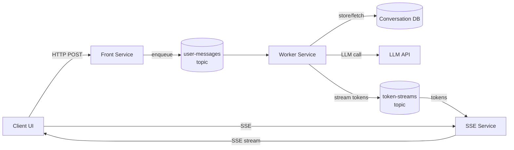
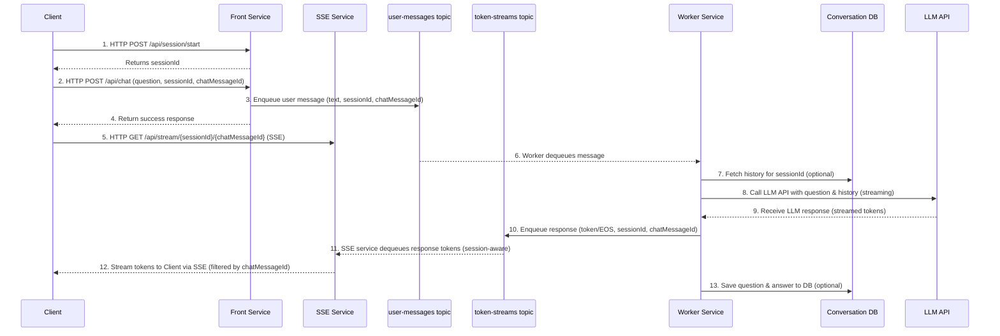

# Scalable chat using SSE and async workers

## Overview  
This architecture enables a scalable, reliable, and secure chat application using **Server-Sent Events (SSE)** for real-time streaming responses and **asynchronous worker processes** for heavy lifting. The design decouples the user-facing front-end from the back-end computational work via a message queue, allowing each component to scale and fail independently without disrupting the whole system.

**Key components:**  
- **Client Application (Browser/App):** Sends user questions to the front service and connects to the SSE service for streaming responses via Server-Sent Events. Maintains a session ID to identify the conversation thread.  
- **Front Service (Message Handler):** A lightweight service that accepts client questions over HTTP and manages sessions. It queues messages for processing but does not handle streaming responses directly.  
- **SSE Service (Streaming Service):** A dedicated service that handles Server-Sent Events connections and streams tokens back to clients. This service can be scaled independently based on streaming demand.  
- **Message Queue Service:** A persistent FIFO queue (with partitions or sessions by conversation ID) that brokers requests and responses between the front service and worker service. Ensures ordering of messages for each conversation thread.  
- **Worker Service (Async Workers):** A pool of one or more back-end worker processes that consume tasks from the queue. Each worker retrieves the necessary context (conversation history) and calls the Large Language Model (LLM) API to generate a response. The response is streamed back (token by token) via the queue to the SSE service.  
- **Conversation Store (CosmosDB or Equivalent):** A database for storing conversation history (optional if the LLM API inherently manages context). This provides persistence and the ability to review or use past interactions when generating new answers.  
- **LLM API (e.g., Azure OpenAI Service):** An external service that generates the chat response. Supports streaming output and might offer built-in conversation memory if provided with a session or thread ID.

Below is a pair of diagrams illustrating the system:

### 1. Architecture overview

### 2. Request / response walkthrough

*Figures: High-level architecture (top) and step-by-step data flow (bottom).*

1.  **Client → Front (Session Start):** The client sends an HTTP `POST` request to `/api/session/start`. The Front Service returns a unique `sessionId`.
2.  **Client → Front (Chat Request):** The client sends the user's question, the `sessionId`, and a client-generated `chatMessageId` to the Front Service via an HTTP `POST` request to `/api/chat`.
3.  **Front → user-messages topic (Request):** The Front Service packages the question (`text`), `sessionId`, and `chatMessageId` into a message. It places this message onto the `user-messages` topic in Azure Service Bus, using the `sessionId` as the Service Bus message's `session_id` property (for session-aware processing by the queue or worker).
4.  **Client → SSE Service (Stream Connection):** The client establishes an SSE connection to the SSE Service via HTTP `GET` request to `/api/stream/{sessionId}/{chatMessageId}` to receive the streaming response.
5.  **user-messages topic → Worker:** A Worker Service instance picks up the message from its subscription on the `user-messages` topic.
6.  **Worker → DB (History fetch):** (Optional) The worker retrieves the conversation history for the `sessionId` from the Conversation Store.
6.  **Worker → LLM API:** The worker calls the LLM API, sending the user’s question and relevant context. The request is made in a **streaming mode**.
7.  **LLM API → Worker (Streaming):** The LLM processes the prompt and streams back the generated answer token by token.
8.  **Worker → token-streams topic (Response stream):** As the worker receives tokens from the LLM, it places them onto the `token-streams` topic in Azure Service Bus. Each message contains the `token` (or an `end_of_stream` signal), the original `sessionId`, and `chatMessageId`.
9.  **token-streams topic → SSE Service (Response):** The SSE Service, listening to its subscription on the `token-streams` topic (session-aware, using `sessionId` to receive messages for active client sessions), dequeues the response tokens. Only messages for the specified `sessionId` are delivered to the receiver, ensuring efficient routing and isolation between sessions.
10. **SSE Service → Client (SSE Stream):** The SSE Service streams the tokens to the correct client via the SSE connection previously established for the `sessionId`. It uses the `chatMessageId` from the token message to ensure tokens are routed to the correct message response stream on the client side, sending `data: {"token": "..."}` for each token and `data: __END__` upon receiving the `end_of_stream` signal for that specific `chatMessageId`.
11. **Worker → DB (Save Q&A):** (Optional) The worker saves the question and answer to the Conversation Store for persistence.

*Note: We use `sessionId` as the Service Bus session key for all chat-related messages. This allows the SSE service to open a session receiver for a specific session and only receive messages for that session, without filtering or processing unrelated messages. This approach enables stateless, horizontally scalable services, as any SSE service instance can handle any session. The `chatMessageId` is used to correlate individual questions and responses within a session, especially when a user sends multiple questions in the same session. The front service is lightweight and only handles message queuing, while the SSE service handles all streaming concerns. This design achieves both scalability and simplicity through clear separation of concerns.*

## Graceful Shutdown and Container Lifecycle

The LLM worker service implements graceful shutdown to handle scale-down events properly, ensuring user requests are not lost and partial responses are completed during scaling operations. The worker uses a 4-minute timeout and is configured with matching container termination grace periods.

For detailed implementation information, see the [LLM Worker README](src/llm_worker/README.md#graceful-shutdown-and-container-lifecycle).

## Scalability and Performance

**Stateless, Scalable Services:** Both the front service and SSE service do not maintain conversational state themselves; they rely on the session ID and the back-end queue. This statelessness means we can run many instances behind load balancers. The front service handles HTTP requests for message queuing and can be scaled based on incoming request volume. The SSE service handles persistent streaming connections and can be scaled independently based on the number of concurrent streams needed. Even the same session can be handled by different service instances across questions and streaming connections. This allows efficient use of resources and easy scaling—if traffic increases, we simply add more service instances. The SSE connections are handled in an asynchronous, non-blocking manner to support large numbers of concurrent streams. Both services should be implemented using I/O efficient frameworks (e.g., Python asyncio, Node.js, or reactive Java/Spring WebFlux) to avoid creating a thread per connection.

**Concurrent SSE Streams:** SSE uses a single HTTP response that remains open. Each front instance must handle possibly thousands of open HTTP responses. With event-driven or asynchronous programming, this is feasible. We also plan for **keep-alive** or ping messages if needed to keep connections from timing out (some proxies might drop idle connections, so sending a comment line `":heartbeat\n\n"` periodically can help). The client’s browser typically auto-reconnects if the SSE connection drops; our front should handle reconnection logic carefully. (For instance, we could implement Last-Event-ID to let a reconnecting client indicate where it left off, but in our case, each SSE is tied to one question which either completes or fails, so simple retry of the question might be the fallback.)

**Message Queue and Throughput:** The queue ensures backpressure and decoupling. If workers are slower than incoming requests, the queue will buffer tasks until workers catch up, rather than overwhelming the workers. The chosen queue service should support high throughput for small messages. Azure Service Bus is a good candidate, enabling **Session-based** processing to ensure ordered handling per conversation. Each conversation’s messages (requests and response chunks) carry a session ID, and the workers use the Service Bus session lock to receive one session at a time in FIFO order. This prevents interleaving of two responses for the same session. The system can handle many sessions in parallel because multiple workers can process different sessions concurrently.

**Horizontal Scaling of Workers:** We can scale out the worker service instances to match the load. If the queue backlog grows or CPU usage is high, new worker instances can be added (manually or via auto-scale rules) to increase throughput. Since each worker is stateless and takes tasks from the queue, additional instances linearly increase capacity (up to the limits of the LLM API’s throughput). Similarly, if load decreases, workers can scale in to save resources. Each worker should be efficient: use connection pooling for the LLM API if possible, and stream processing. We also consider the LLM API rate limits and maybe allocate one API key per worker or a shared rate limiting mechanism to avoid hitting those limits.

**Efficient Streaming and Batching:** To minimize overhead, the system might batch a few tokens per message from worker to front. For example, instead of 100 separate messages for 100 tokens, it could send 10 messages of 10 tokens each. This reduces the number of queue operations and network calls while still keeping latency low (each chunk might amount to a few hundred milliseconds of text). We will fine-tune this batch size based on performance testing. The end-user experience should remain a smooth stream of text. Also, the moment the worker gets the first token from the LLM, it forwards it—it doesn’t wait for the full completion—providing instant feedback to the user.

**Alternatives (WebSocket/PubSub):** In case SSE connections become a bottleneck, an alternative is to use a WebSocket-based approach. A bidirectional WebSocket could handle both sending the question and receiving the answer on the same connection, potentially simplifying client logic. However, SSE is chosen for its simplicity (unidirectional nature fits our use-case of server-push). If needed, cloud services like **Azure Web PubSub (SignalR)** could be introduced to offload the management of persistent connections. In such a setup, the front end could publish messages to the WebPubSub service, which would then deal with delivering them to clients, allowing our application servers to remain stateless and purely focus on business logic. This can enhance scalability further, at the cost of additional complexity and cloud service usage.

**Capacity Planning:** Each component’s capacity will be measured. We will identify the max number of SSE connections a front instance can handle (for example, if using Node.js, this might be very high as long as memory is sufficient). We will also measure how many tokens per second a single worker can process from the LLM (depending on model speed and network). The queue’s capacity (in terms of message ingress/egress per second) should exceed the expected peak QPS times average message count per question. With these, we can plan how many instances of each component are needed for a target load (say 1000 concurrent chats with responses streaming at 50 tokens/sec each). If any single piece hits limits (for instance, the LLM service has a request rate limit), we will plan for mitigation (like request queuing or scaling that aspect if possible).

## Reliability and Resilience

**Independent Failure Domains:** Because the front, queue, and workers are separate, a failure in one does not directly crash others. For example, if a worker process goes down, its in-process task can be retried by another worker (after that worker’s queue lock expires). If an entire worker node crashes, the queue message returns to queue (not lost) and can be picked up. Our design uses **at-least-once delivery** from the queue, so workers must tolerate the possibility of seeing the same message twice (e.g., if a worker dies after partially processing a message). Idempotency can be achieved by having a unique ID per user question (maybe the session ID + a timestamp or sequence) and checking in the DB if it was already answered. In practice, duplicate processing should be rare, but it’s a safety net.

**FIFO Guarantee per Session:** It’s important that while the system is distributed, each conversation’s messages are processed in order. As noted, using queue session partitioning ensures that. We also avoid concurrent processing of two questions from the same session: the client UI should not allow the user to send a new question until the answer to the previous is done (or they explicitly start a new thread). If the user does manage to send multiple rapid questions, they will queue up for that session in order. This avoids confusing cross-talk in a single chat.

**Handling Partial Failures:** In a streaming scenario, what if the front service instance sending the SSE fails mid-answer (e.g., the server crashes or network issue)? The client’s SSE connection would drop. The client should detect this (onerror event for EventSource). We do not have an easy way to resume mid-answer in this architecture (since the SSE connection is tied to that front instance). However, the user could potentially refresh or re-send the question. To make the system more robust, we could implement a simple retry logic: if a question was asked but no full answer delivered, the client could retry after a short delay. The worker might still be running the query though. Alternatively, the front service could be made more fault-tolerant (running on reliable infrastructure, perhaps with a supervisor that restarts it quickly). In cluster deployments, front instances could perhaps share state via an external service and allow another instance to take over—though implementing that is complex and often not needed if we ensure the front-ends are stable and lightweight. 

For the worker side, if a worker crashes mid-generation, the client SSE will also stall (no new tokens). We might have to time out and inform the user. One idea: the worker could periodically send a heartbeat token like “…”. If those stop, the front could detect worker failure. Automatic recovery of an ongoing LLM call is not straightforward (you can’t easily continue an OpenAI stream where it left off). So the pragmatic approach is failure awareness and prompting the user to retry. These edge cases will be communicated to the user with a friendly error message on rare occasions (“Sorry, something went wrong. Please ask again.”).

**Data Consistency:** The conversation store should eventually reflect the complete sequence of interactions. We will design the writes to avoid losing data. For instance, the worker could save the user’s question in the DB as soon as it starts processing it (so we have a record even if the answer fails). The answer can be saved once fully generated (or even incrementally appended as it streams). We must ensure that if a question is answered in parts, we don’t mark it complete until it’s actually complete. A transaction or batch save of Q&A together would be ideal. CosmosDB supports transactional batch for items in the same partition (our partition is session ID, and a question and answer could be saved as two items or a single combined item). We might simply log them separately with a field to indicate which question they belong to. Consistency between what was sent to the user and what’s stored is important for audit, so perhaps the front service, after streaming the final token, sends a small acknowledgment message to the worker to confirm completion, then the worker writes the answer to DB flagged as complete. If that ack doesn’t happen, the worker knows the delivery was interrupted.

**High Availability:** Each component can be run in redundant fashion: multiple front servers, a cluster for the queue (Azure Service Bus is a managed HA service), and multiple workers. We will deploy in at least two availability zones so that even if one datacenter zone goes down, the service remains up. The statelessness of front and workers simplifies failover – any healthy instance can serve any request. CosmosDB is inherently replicated and can be configured for multi-region access if needed, ensuring the data tier isn’t a single point of failure. If we use Azure OpenAI, we rely on Azure’s SLA for that external API; we can mitigate by having a fallback (perhaps an alternative LLM provider or a cached response) if that API is not responding, depending on how critical the application is.

**Auto-Scaling and Queue Depth Management:** We will use metrics to auto-scale the system. For example, if the queue length (number of pending questions) grows beyond a threshold, automatically spin up more worker instances to clear the backlog. Conversely, if workers are idle and queue is empty, scale them down after some delay. The front-end can scale based on CPU or memory (which correlates with number of open SSE connections). We must also handle sudden surges – e.g., if 1000 users all ask a question at once, the queue will accumulate those messages instantly. Workers will pick them up as they can; the queue will buffer the rest. The users might experience some waiting time if load exceeds capacity, but the system should still function (maybe the responses come a bit delayed). To users, it might just appear the answer is thinking longer. In extreme cases, we could have the front detect an overload (say queue length or wait time too high) and respond immediately with a “please try later” error to new requests to shed load—this is a design decision for protecting the system under duress.

**Monitoring and Recovery:** We will set up health checks for front and worker services. If any goes down, orchestrators (like Kubernetes or Azure App Service) will restart them. We’ll also utilize logging and monitoring (discussed later) to quickly detect issues like a stuck queue or failed messages, so engineers can intervene if needed. Running simulated failover tests (killing a worker or front instance) will verify that the overall system continues to operate as expected.

## Security Considerations

**Authentication & Authorization:** The system must ensure that only authorized users can access the chat service and their respective sessions. We will integrate an authentication mechanism at the front service (for example, JWT bearer tokens, cookies with secure sessions, or API keys). The front service will validate the user’s identity on each question request. Similarly, the session ID provided by the client should map to that user’s session – the server should verify that the session ID was indeed created for the authenticated user, to prevent any chance of one user guessing another’s session ID and hijacking their conversation. If a session ID is not recognized or doesn’t belong to the user, the request is rejected. We might use a secure random GUID for session IDs to make guessing practically impossible and possibly tie it to a server-side session store for additional verification.

**Transport Security:** All client-server communication will occur over **HTTPS**. SSE is essentially an HTTP response, so it will be delivered securely over TLS. This protects the content of questions and answers from eavesdropping or man-in-the-middle attacks. Within our back-end, if the components communicate (front to queue, queue to worker, etc.), those either happen over secure protocols or within a protected VNet. For cloud services: Azure Service Bus uses TLS for sending/receiving messages; CosmosDB connections are encrypted; calls to Azure OpenAI API are over HTTPS. We will enforce usage of these secure endpoints and not allow fallbacks to unencrypted channels.

**Data Encryption and Access Control:** Any persistent data, such as chat history in CosmosDB, is encrypted at rest by the cloud provider. We ensure that encryption is enabled and keys are managed properly (using customer-managed keys if required for compliance, or platform-managed keys otherwise). Access to the database is locked down — only the worker service (or a specific backend role) should be able to read/write conversation data. Using Azure’s role-based access and connection strings securely stored (e.g., in Azure Key Vault), we avoid exposing secrets. The front service likely doesn’t need direct DB access, further narrowing the data access surface.

**Least Privilege for Services:** Each component will run with minimal privileges. For example, the front service only needs permission to send messages to the queue (not to read from it or access the DB or call the LLM API directly). The worker service needs read from queue, read/write to DB, and call LLM API – but it doesn’t need to talk directly to clients. By segmenting these, even if one component is compromised, the blast radius is limited. We also isolate the network—front-end servers might sit in a DMZ subnet that only allows outgoing traffic to the queue and not to the DB directly, etc.

**Validation and Sanitization:** All user inputs (questions) are treated as untrusted data. While the primary content is natural language, we must still consider security: for example, a user could try to craft a prompt to trick the system or output malicious content. On the system side, we ensure that any logging of user input is done carefully to avoid injection into log analysis tools. If we display the user’s question back in any UI (not in this scenario, but perhaps in admin consoles), we would escape HTML to prevent XSS. The conversation content is text, so the main risk is prompt injection affecting the behavior of the LLM. We might implement some basic filters or moderation on the input using Azure OpenAI’s content filters or our own rules (for instance, disallow certain sensitive data from being asked or ensure no high-risk requests are processed).

**API Security:** The call to the LLM API uses an API key or token that must be kept secret. That key will reside on the worker service side, likely in an environment variable or a secure configuration. It should *never* be exposed to the client or included in any client-side code. We will use Azure Key Vault or similar to store it and load it at runtime securely. Additionally, calls to external APIs should verify SSL certificates (default in HTTPS libraries, to avoid any interception).

**Auditing and Monitoring for Security:** Beyond just functional monitoring, we will set up auditing. For example, log all requests with user ID and session ID (but perhaps without full content to avoid sensitive info in logs, or store content logs in a secure store) so that we have an audit trail of who asked what and when. This can be important for detecting abuse or reviewing security incidents. We will also monitor unusual patterns, e.g., one user sending an extremely high number of requests in a short time (possible automated attack or misuse) — we could then throttle or block such clients automatically. 

**Content Security:** When the LLM responds, it might return content that violates policies (e.g., disallowed info or unsafe content). We can utilize the Azure OpenAI content filtering: the worker can inspect a special flag in the response or use an OpenAI endpoint to check the content. If a response is flagged (e.g., it contains sensitive data or hate speech), the worker could truncate the stream and send a polite error message to the user instead of the offending content. This ensures the system doesn’t become a conduit for disallowed information. Such filtering adds reliability and trust in the system’s outputs.

**Compliance Considerations:** If this chat system handles user data, we must comply with data protection regulations (GDPR, etc.) by perhaps allowing deletion of data (so we might have a mechanism to delete or anonymize conversation history on request). Security is not just technical but also procedural: we’ll maintain least necessary data and have retention policies (maybe CosmosDB data expires after N days if not needed, unless the service is meant to keep long histories).

## Monitoring and Logging

**End-to-End Tracing:** We assign each user question interaction a correlation ID (the session ID plus perhaps a sequence number). This ID is passed along from the front (when enqueuing) to the queue message, to the worker, and used in log statements. This way, if a user reports an issue with a specific query, we can trace what happened through the system.

**Metrics to Track:** We will collect key metrics such as:
- Number of active SSE connections (per front instance and total).
- Request rate (questions per second).
- Queue length and age of the oldest message.
- Processing time per question (end-to-end latency from user question to final token).
- Breakdown of latency: queue wait time, LLM API time, streaming duration.
- Tokens per second being sent.
- Worker utilization: CPU, memory, and perhaps external API call stats.
- Error counts (how many times an LLM call failed, how often we had to retry, any exceptions in code).

**Dashboards and Alerts:** Using tools like Azure Monitor or Application Insights, we’ll create dashboards for these metrics. For example, an ops dashboard might show current queue length, active connections, average latency, etc. We will set up alerts for abnormal situations, e.g., 
- Alert if queue length stays high for several minutes (potential under-scaling or outage in workers/LLM).
- Alert if SSE connection count is at maximum (maybe need to scale front).
- Alert if error rate (per-minute) exceeds a threshold (might indicate a systemic problem).
- Alert if no traffic at all (system might be down entirely).

**Logging:** Each component will emit logs. The front logs when it receives a request, including session ID and user ID (no PII beyond that), and when it starts and finishes streaming a response. If there’s an error (like connection dropped), it logs that. The worker logs the start of processing for a session ID, what it’s sending to LLM (maybe just the size or summary, not full content unless needed for debugging), and any errors or exceptions. When the response is done, log completion. We also log important decisions, e.g., if the content filter aborts a response, log that event. All logs will have timestamps and the correlation IDs. These can be aggregated in a centralized log store for analysis.

**Testing and Load Simulation:** We plan to continuously test the system. Automated tests will simulate conversations to ensure all pieces work together. Load testing (using tools that can simulate, say, 1000 concurrent clients streaming) will be done in a pre-production environment to observe scaling behavior and tweak auto-scaling thresholds. We will also do fault-injection testing: e.g., intentionally have a worker crash to confirm the message requeues, or drop the connection to see the client experience, making sure our timeouts and retries are reasonable.

**Maintenance and Updates:** With monitoring in place, we’ll operate the system and perform regular maintenance. Rolling updates can be done with zero downtime by updating one component at a time (since multiple instances and queue decoupling allow that). We’ll ensure new versions of workers are compatible with data from old versions for safe deployments, etc. Security patches on servers will be applied promptly.

