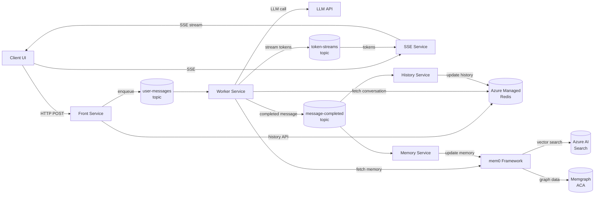
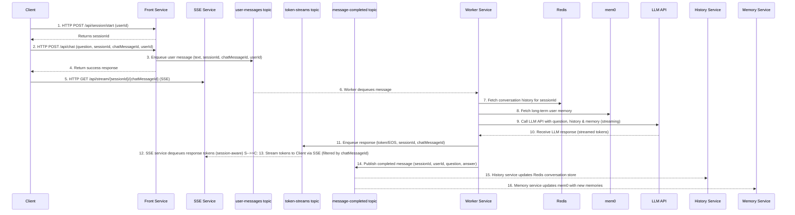

# Scalable chat using SSE and async workers

## Overview  
This architecture enables a scalable, reliable, and secure chat application using **Server-Sent Events (SSE)** for real-time streaming responses and **asynchronous worker processes** for heavy lifting. The design decouples the user-facing front-end from the back-end computational work via a message queue, allowing each component to scale and fail independently without disrupting the whole system.

**Key components:**  
- **Client Application (Browser/App):** Sends user questions to the front service and connects to the SSE service for streaming responses via Server-Sent Events. Maintains a session ID to identify the conversation thread and user ID for authentication.  
- **Front Service (Message Handler):** A lightweight service that accepts client questions over HTTP, manages sessions, and provides conversation history API. It queues messages for processing but does not handle streaming responses directly. Handles user authentication and session management.  
- **SSE Service (Streaming Service):** A dedicated service that handles Server-Sent Events connections and streams tokens back to clients. This service can be scaled independently based on streaming demand.  
- **Message Queue Service:** A persistent FIFO queue (with partitions or sessions by conversation ID) that brokers requests and responses between services. Includes multiple topics: `user-messages`, `token-streams`, and `message-completed`.  
- **Worker Service (Async Workers):** A pool of one or more back-end worker processes that consume tasks from the queue. Each worker retrieves conversation history from Redis and long-term memory from mem0, calls the LLM API, and publishes completed conversations for memory processing.  
- **Azure Managed Redis (Conversation Store):** Primary storage for short-term conversation history with 7-day TTL. Stores conversations as JSON documents with dual indexing strategy for optimal performance.  
- **History Service:** Dedicated service for managing conversation history in Redis, triggered by completed conversation messages. Updates both session-based and user-based indexes.  
- **Memory Service:** Service that processes completed conversations to extract and store long-term user memories using the mem0 framework. Subscribes to conversation completion events.  
- **Long-term Memory Stack:**
  - **mem0:** Framework for managing user memories and semantic understanding
  - **Azure AI Search:** Vector store for semantic similarity and memory retrieval  
  - **Memgraph (Azure Container Apps):** Graph database for relationship modeling between memories  
- **LLM API (e.g., Azure OpenAI Service):** An external service that generates the chat response. Supports streaming output and receives both conversation context and long-term user memories.

Below is a pair of diagrams illustrating the system:

### 1. Architecture overview

```mermaid
flowchart LR
    Client[Client UI] -->|HTTP POST| Front[Front Service]
    Client -->|SSE| SSE[SSE Service]
    Front -->|enqueue| UserMsgTopic[(user-messages<br/>topic)]
    Front -->|history API| Redis[(Azure Managed<br/>Redis)]
    UserMsgTopic --> Worker[Worker Service]
    Worker -->|fetch conversation| Redis
    Worker -->|fetch memory| Mem0[mem0 Framework]
    Worker -->|LLM call| LLM[LLM&nbsp;API]
    Worker -->|stream tokens| TokenTopic[(token-streams<br/>topic)]
    Worker -->|completed message| CompletedTopic[(message-completed<br/>topic)]
    TokenTopic -->|tokens| SSE
    CompletedTopic --> HistoryService[History Service]
    CompletedTopic --> MemoryService[Memory Service]
    HistoryService -->|update history| Redis
    MemoryService -->|update memory| Mem0
    Mem0 -->|vector search| AISearch[(Azure AI<br/>Search)]
    Mem0 -->|graph data| Memgraph[(Memgraph<br/>ACA)]
    SSE -->|SSE stream| Client
```

### 2. Request / response walkthrough

```mermaid
sequenceDiagram
    participant C as Client
    participant F as Front Service
    participant S as SSE Service
    participant UM as user-messages topic
    participant TS as token-streams topic
    participant CC as message-completed topic
    participant W as Worker Service
    participant R as Redis
    participant M as mem0
    participant L as LLM API
    participant HS as History Service
    participant MS as Memory Service

    C->>F: 1. HTTP POST /api/session/start (userId)
    F-->>C: Returns sessionId
    C->>F: 2. HTTP POST /api/chat (question, sessionId, chatMessageId, userId)
    F->>UM: 3. Enqueue user message (text, sessionId, chatMessageId, userId)
    F-->>C: 4. Return success response
    C->>S: 5. HTTP GET /api/stream/{sessionId}/{chatMessageId} (SSE)
    UM-->>W: 6. Worker dequeues message
    W->>R: 7. Fetch conversation history for sessionId
    W->>M: 8. Fetch long-term user memory
    W->>L: 9. Call LLM API with question, history & memory (streaming)
    L-->>W: 10. Receive LLM response (streamed tokens)
    W->>TS: 11. Enqueue response (token/EOS, sessionId, chatMessageId)
    TS-->>S: 12. SSE service dequeues response tokens (session-aware)    S-->>C: 13. Stream tokens to Client via SSE (filtered by chatMessageId)
    W->>CC: 14. Publish completed message (sessionId, userId, question, answer)
    CC-->>HS: 15. History service updates Redis conversation store
    CC-->>MS: 16. Memory service updates mem0 with new memories
```

*Figures: High-level architecture (top) and step-by-step data flow (bottom).*

1.  **Client → Front (Session Start):** The client sends an HTTP `POST` request to `/api/session/start`. The Front Service returns a unique `sessionId`.
2.  **Client → Front (Chat Request):** The client sends the user's question, the `sessionId`, and a client-generated `chatMessageId` to the Front Service via an HTTP `POST` request to `/api/chat`.
3.  **Front → user-messages topic (Request):** The Front Service packages the question (`text`), `sessionId`, and `chatMessageId` into a message. It places this message onto the `user-messages` topic in Azure Service Bus, using the `sessionId` as the Service Bus message's `session_id` property (for session-aware processing by the queue or worker).
4.  **Client → SSE Service (Stream Connection):** The client establishes an SSE connection to the SSE Service via HTTP `GET` request to `/api/stream/{sessionId}/{chatMessageId}` to receive the streaming response.
5.  **user-messages topic → Worker:** A Worker Service instance picks up the message from its subscription on the `user-messages` topic.
6.  **Worker → DB (History fetch):** (Optional) The worker retrieves the conversation history for the `sessionId` from the Conversation Store.
6.  **Worker → LLM API:** The worker calls the LLM API, sending the user’s question and relevant context. The request is made in a **streaming mode**.
7.  **LLM API → Worker (Streaming):** The LLM processes the prompt and streams back the generated answer token by token.
8.  **Worker → token-streams topic (Response stream):** As the worker receives tokens from the LLM, it places them onto the `token-streams` topic in Azure Service Bus. Each message contains the `token` (or an `end_of_stream` signal), the original `sessionId`, and `chatMessageId`.
9.  **token-streams topic → SSE Service (Response):** The SSE Service, listening to its subscription on the `token-streams` topic (session-aware, using `sessionId` to receive messages for active client sessions), dequeues the response tokens. Only messages for the specified `sessionId` are delivered to the receiver, ensuring efficient routing and isolation between sessions.
10. **SSE Service → Client (SSE Stream):** The SSE Service streams the tokens to the correct client via the SSE connection previously established for the `sessionId`. It uses the `chatMessageId` from the token message to ensure tokens are routed to the correct message response stream on the client side, sending `data: {"token": "..."}` for each token and `data: __END__` upon receiving the `end_of_stream` signal for that specific `chatMessageId`.
11. **Worker → DB (Save Q&A):** (Optional) The worker saves the question and answer to the Conversation Store for persistence.

*Note: We use `sessionId` as the Service Bus session key for all chat-related messages. This allows the SSE service to open a session receiver for a specific session and only receive messages for that session, without filtering or processing unrelated messages. This approach enables stateless, horizontally scalable services, as any SSE service instance can handle any session. The `chatMessageId` is used to correlate individual questions and responses within a session, especially when a user sends multiple questions in the same session. The front service is lightweight and only handles message queuing, while the SSE service handles all streaming concerns. This design achieves both scalability and simplicity through clear separation of concerns.*

## Memory Architecture

### User Management and Authentication

**User Identity Management:** The system implements a user-centric design where each user has a unique `userId` that persists across sessions. In the initial implementation, we will use hardcoded users for development:

```json
{
  "users": [
    {"userId": "user_001", "name": "Alice Johnson", "email": "alice@example.com"},
    {"userId": "user_002", "name": "Bob Smith", "email": "bob@example.com"},
    {"userId": "user_003", "name": "Carol White", "email": "carol@example.com"}
  ]
}
```

**Future Authentication:** The system is designed to integrate with **Azure Entra ID (formerly Azure AD) via OIDC** for production use. The front service will validate JWT tokens and extract the user identity, mapping to our internal `userId` system. Session management will tie sessions to authenticated users, ensuring proper authorization and data isolation.

**Session-User Relationship:** Each session is associated with a specific user. When a client starts a session via `/api/session/start`, they must provide their `userId`. The front service validates the user exists and creates a session tied to that user. This enables:
- Proper conversation history retrieval for the UI
- User-specific memory and personalization
- Security isolation between users
- Audit trails and usage analytics per user

### Azure Managed Redis Storage Strategy

**Dual Indexing Approach:** To optimize for both LLM worker performance (session-based lookup) and UI history display (user-based retrieval), we implement a dual indexing strategy in Redis:

#### 1. Session-Based Storage (Primary)
```
Key: session:{sessionId}
TTL: 7 days
Structure: {
  "sessionId": "sess_abc123",
  "userId": "user_001", 
  "createdAt": "2025-06-05T10:00:00Z",
  "lastActivity": "2025-06-05T11:30:00Z",
  "messages": [
    {
      "messageId": "msg_001",
      "role": "user",
      "content": "What is machine learning?",
      "timestamp": "2025-06-05T10:00:00Z"
    },
    {
      "messageId": "msg_002", 
      "role": "assistant",
      "content": "Machine learning is a subset of artificial intelligence...",
      "timestamp": "2025-06-05T10:00:15Z"
    }
  ]
}
```

#### 2. User-Based Index (Secondary)
```
Key: user:{userId}:conversations
TTL: 7 days  
Structure: {
  "userId": "user_001",
  "lastUpdated": "2025-06-05T11:30:00Z",
  "conversations": [
    {
      "sessionId": "sess_abc123",
      "title": "Machine Learning Discussion", 
      "lastMessage": "Machine learning is a subset...",
      "lastActivity": "2025-06-05T11:30:00Z",
      "messageCount": 6
    },
    {
      "sessionId": "sess_def456",
      "title": "Python Programming Help",
      "lastMessage": "Here's how to implement a function...", 
      "lastActivity": "2025-06-05T09:15:00Z",
      "messageCount": 4
    }
  ]
}
```

**Performance Justification:** This approach provides:
- **Fast LLM Worker Lookup:** Single Redis GET by `sessionId` for conversation context (O(1) operation)
- **Efficient UI History:** Single Redis GET by `userId` for conversation list without parsing large documents
- **Manageable Document Size:** Session documents remain focused and bounded by conversation length
- **Scalable Updates:** History service can update both indexes efficiently without impacting worker performance

### Front Service History API

The front service exposes REST endpoints for conversation history management:

```
GET /api/users/{userId}/conversations
- Returns list of recent conversations for UI display
- Includes conversation metadata (title, last message, activity time)
- Supports pagination and filtering

GET /api/conversations/{sessionId}/messages  
- Returns full message history for a specific conversation
- Used when user selects a conversation to continue or review
- Includes all messages with timestamps and metadata

POST /api/conversations/{sessionId}/title
- Updates conversation title (extracted from first message or user-provided)
- Updates both session document and user index
```

### Long-term Memory with mem0

**mem0 Integration:** The system integrates mem0 for sophisticated user memory management, enabling personalized experiences across conversations:

#### Memory Components:
- **Azure AI Search:** Vector store for semantic similarity search of memories
- **Memgraph (Azure Container Apps):** Graph database for modeling relationships between memories, topics, and user preferences
- **mem0 Framework:** Orchestrates memory extraction, storage, and retrieval

#### Memory Processing Flow:
1. **Memory Extraction:** When a conversation completes, the Memory Service processes the conversation through mem0
2. **Entity Recognition:** Extract entities, preferences, facts, and relationships from the conversation
3. **Memory Storage:** Store structured memories in Azure AI Search with vector embeddings
4. **Graph Relationships:** Model connections between memories, topics, and user context in Memgraph
5. **Memory Retrieval:** During new conversations, mem0 retrieves relevant memories based on semantic similarity and graph traversal

#### Memory Types:
```json
{
  "memories": [
    {
      "type": "preference",
      "content": "User prefers Python over JavaScript for data analysis",
      "confidence": 0.9,
      "source_session": "sess_abc123",
      "created_at": "2025-06-05T10:30:00Z"
    },
    {
      "type": "fact", 
      "content": "User is a data scientist working at TechCorp",
      "confidence": 0.95,
      "source_session": "sess_def456", 
      "created_at": "2025-06-04T15:20:00Z"
    },
    {
      "type": "context",
      "content": "User is currently learning machine learning algorithms",
      "confidence": 0.8,
      "source_session": "sess_abc123",
      "created_at": "2025-06-05T10:00:00Z"
    }
  ]
}
```

### Message Flow with Memory

**Enhanced Worker Processing:** The LLM worker now performs memory-augmented generation:

1. **Conversation Context Retrieval:** Fetch session history from Redis (O(1) lookup)
2. **Memory Context Retrieval:** Query mem0 for relevant user memories based on current question
3. **Context Synthesis:** Combine conversation history and long-term memories into unified context
4. **LLM Generation:** Send enhanced context to LLM for personalized response generation
5. **Response Streaming:** Stream tokens back to user via existing SSE infrastructure
6. **Conversation Completion:** Publish completed conversation to trigger memory and history updates

**Memory Context Example:**
```
System Context: "Based on your previous conversations, I know you prefer Python for data analysis and are currently learning ML algorithms. You work as a data scientist at TechCorp."

User Question: "Can you recommend a good library for clustering?"

Enhanced Response: "Given your preference for Python and your current ML learning journey, I'd recommend scikit-learn for clustering. Since you're at TechCorp, you might also want to consider..."
```

#### History Service
- **Purpose:** Dedicated service for managing conversation history in Redis
- **Triggers:** Subscribes to `message-completed` topic
- **Functions:**
  - Update session-based conversation document
  - Update user-based conversation index  
  - Generate conversation titles and summaries
  - Manage TTL and cleanup policies
- **Scaling:** Stateless service that can scale based on conversation completion rate

#### Memory Service  
- **Purpose:** Processes completed conversations for long-term memory extraction
- **Triggers:** Subscribes to `message-completed` topic
- **Functions:**
  - Interface with mem0 for memory extraction
  - Store memories in Azure AI Search and Memgraph
  - Handle memory conflicts and updates
  - Provide memory retrieval API for workers
- **Scaling:** Can scale based on memory processing workload; includes queuing for heavy processing

### Data Flow Summary

```
1. User starts session → Front Service validates user → Redis session created
2. User sends message → Worker fetches conversation + memories → Enhanced LLM call
3. Response streams to user → Conversation marked complete → Published to completion topic
4. History Service updates Redis indexes → Memory Service extracts memories via mem0
5. Future conversations benefit from personalized context and enhanced user experience
```

This architecture provides:
- **Fast Performance:** O(1) conversation lookups for workers
- **Rich UI Experience:** Easy access to conversation history and titles
- **Personalized Interactions:** Long-term memory enables contextual, personalized responses
- **Scalable Design:** Each service can scale independently based on workload
- **Future-Ready:** Designed for enterprise authentication and compliance requirements
  
