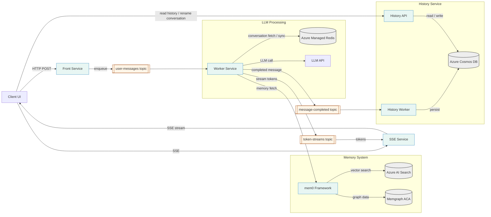
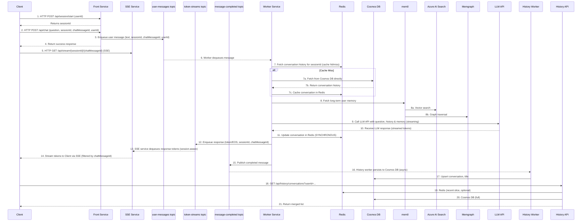

# Scalable chat using SSE and async workers

## Overview  
This architecture enables a scalable, reliable, and secure chat application using **Server-Sent Events (SSE)** for real-time streaming responses and **asynchronous worker processes** for heavy lifting. The design decouples the user-facing front-end from the back-end computational work via a message queue, allowing each component to scale and fail independently without disrupting the whole system.

**Key components:**  
- **Client Application (Browser/App):** Sends user questions to the front service and connects to the SSE service for streaming responses via Server-Sent Events. Maintains a session ID to identify the conversation thread and user ID for authentication.  
- **Front Service (Message Handler):** A lightweight service that accepts client questions over HTTP, manages sessions, and provides conversation history API. It queues messages for processing but does not handle streaming responses directly. Handles user authentication and session management.  
- **SSE Service (Streaming Service):** A dedicated service that handles Server-Sent Events connections and streams tokens back to clients. This service can be scaled independently based on streaming demand.  
- **Message Queue Service:** A persistent FIFO queue (with partitions or sessions by conversation ID) that brokers requests and responses between services. Includes multiple topics: `user-messages`, `token-streams`, and `message-completed`.  
- **Worker Service (Async Workers):** A pool of one or more back-end worker processes that consume tasks from the queue. Each worker retrieves conversation history from Redis and long-term memory from mem0, calls the LLM API, and synchronously updates Redis with new messages for immediate consistency. Also publishes completed conversations for memory processing and long-term storage.  
- **Azure Managed Redis (Hot Cache):** Fast lookup storage for active conversation history with 24-hour TTL. Workers write directly to Redis synchronously to ensure immediate consistency for ongoing conversations. Optimized for LLM worker performance with dual indexing strategy.  
- **Azure Cosmos DB (Long-term Store):** Persistent storage for conversation history with configurable retention. Provides multi-region capabilities and serves as the authoritative source for historical conversations beyond the Redis cache window.
- **History Worker:** Listens to `message-completed` events and **persists** conversations to Cosmos DB, generates titles.
- **History API:** Stateless REST service that **serves history to the web client** (`GET /conversations`, `GET /messages`, `PUT /title`). Reads recent data from Redis, full history from Cosmos DB.
- **Memory Service:** Service that processes completed conversations to extract and store long-term user memories using the mem0 framework. Subscribes to conversation completion events.  
- **Long-term Memory Stack:**
  - **mem0:** Framework for managing user memories and semantic understanding
  - **Azure AI Search:** Vector store for semantic similarity and memory retrieval  
  - **Memgraph (Azure Container Apps):** Graph database for relationship modeling between memories  
- **LLM API (e.g., Azure OpenAI Service):** An external service that generates the chat response. Supports streaming output and receives both conversation context and long-term user memories.

Below is a pair of diagrams illustrating the system:

### 1. Architecture overview

```mermaid
flowchart LR
    Client[Client UI] -->|HTTP POST| Front[Front Service]
    Client -->|SSE| SSE[SSE Service]

    Front -->|enqueue| UserMsgTopic[[user-messages topic]]
    UserMsgTopic --> Worker[Worker Service]

    subgraph LLMProcessing["LLM Processing"]
        Worker
        Redis[(Azure Managed Redis)]
        LLM[LLM API]
    end
    Worker -->|conversation fetch / sync| Redis
    Worker -->|LLM call| LLM

    subgraph MemorySystem["Memory System"]
        Mem0[mem0 Framework]
        AISearch[(Azure AI Search)]
        Memgraph[(Memgraph ACA)]
    end
    Worker -->|memory fetch| Mem0
    Mem0 -->|vector search| AISearch
    Mem0 -->|graph data| Memgraph

    Worker -->|stream tokens| TokenTopic[[token-streams topic]]
    Worker -->|completed message| CompletedTopic[[message-completed topic]]
    TokenTopic -->|tokens| SSE
    SSE -->|SSE stream| Client

    subgraph HistoryService["History Service"]
        HistoryWorker[History Worker]
        HistoryAPI[History API]
        CosmosDB[(Azure Cosmos DB)]
    end
    CompletedTopic --> HistoryWorker
    HistoryWorker -->|persist| CosmosDB
    Client -->|read history / rename conversation| HistoryAPI
    HistoryAPI -->|read / write| CosmosDB

    classDef service fill:#E8F6F3,stroke:#2E86C1,stroke-width:1px;
    classDef storage fill:#EEEEEE,stroke:#000000,stroke-width:1px;
    classDef queue   fill:#FEF5E7,stroke:#A04000,stroke-width:1px;

    class Front,SSE,Worker,HistoryAPI,HistoryWorker,Mem0 service;
    class Redis,CosmosDB,AISearch,Memgraph storage;
    class UserMsgTopic,TokenTopic,CompletedTopic queue;
```

### 2. Request / response walkthrough

```mermaid
sequenceDiagram
    participant C as Client
    participant F as Front Service
    participant S as SSE Service
    participant UM as user-messages topic
    participant TS as token-streams topic
    participant CC as message-completed topic
    participant W as Worker Service
    participant R as Redis
    participant CD as Cosmos DB
    participant M  as mem0
    %% new participants
    participant AS as Azure AI Search
    participant G  as Memgraph
    participant L as LLM API
    participant HW as History Worker
    participant HA as History API

    C->>F: 1. HTTP POST /api/session/start (userId)
    F-->>C: Returns sessionId
    C->>F: 2. HTTP POST /api/chat (question, sessionId, chatMessageId, userId)
    F->>UM: 3. Enqueue user message (text, sessionId, chatMessageId, userId)
    F-->>C: 4. Return success response
    C->>S: 5. HTTP GET /api/stream/{sessionId}/{chatMessageId} (SSE)
    UM-->>W: 6. Worker dequeues message
    W->>R: 7. Fetch conversation history for sessionId (cache hit/miss)
    alt Cache Miss
        W->>CD: 7a. Fetch from Cosmos DB directly
        CD-->>W: 7b. Return conversation history
        W->>R: 7c. Cache conversation in Redis
    end
    W->>M: 8. Fetch long-term user memory
    M->>AS: 8a. Vector search
    M->>G: 8b. Graph traversal
    W->>L: 9. Call LLM API with question, history & memory (streaming)
    L-->>W: 10. Receive LLM response (streamed tokens)
    W->>R: 11. Update conversation in Redis (SYNCHRONOUS)
    W->>TS: 12. Enqueue response (token/EOS, sessionId, chatMessageId)
    TS-->>S: 13. SSE service dequeues response tokens (session-aware)
    S-->>C: 14. Stream tokens to Client via SSE (filtered by chatMessageId)
    W->>CC: 15. Publish completed message
    CC-->>HW: 16. History worker persists to Cosmos DB (async)
    HW->>CD: 17. Upsert conversation, title
    %% client history access (out-of-band)
    C->>HA: 18. GET /api/history/conversations?userId=...
    HA->>R: 19. Redis (recent slice, optional)
    HA->>CD: 20. Cosmos DB (full)
    HA-->>C: 21. Return merged list
```

*Figures: High-level architecture (top) and step-by-step data flow (bottom).*

1.  **Client → Front (Session Start):** The client sends an HTTP `POST` request to `/api/session/start`. The Front Service returns a unique `sessionId`.
2.  **Client → Front (Chat Request):** The client sends the user's question, the `sessionId`, and a client-generated `chatMessageId` to the Front Service via an HTTP `POST` request to `/api/chat`.
3.  **Front → user-messages topic (Request):** The Front Service packages the question (`text`), `sessionId`, and `chatMessageId` into a message. It places this message onto the `user-messages` topic in Azure Service Bus, using the `sessionId` as the Service Bus message's `session_id` property (for session-aware processing by the queue or worker).
4.  **Client → SSE Service (Stream Connection):** The client establishes an SSE connection to the SSE Service via HTTP `GET` request to `/api/stream/{sessionId}/{chatMessageId}` to receive the streaming response.
5.  **user-messages topic → Worker:** A Worker Service instance picks up the message from its subscription on the `user-messages` topic.
6.  **Worker → DB (History fetch):** (Optional) The worker retrieves the conversation history for the `sessionId` from the Conversation Store.
6.  **Worker → LLM API:** The worker calls the LLM API, sending the user’s question and relevant context. The request is made in a **streaming mode**.
7.  **LLM API → Worker (Streaming):** The LLM processes the prompt and streams back the generated answer token by token.
8.  **Worker → token-streams topic (Response stream):** As the worker receives tokens from the LLM, it places them onto the `token-streams` topic in Azure Service Bus. Each message contains the `token` (or an `end_of_stream` signal), the original `sessionId`, and `chatMessageId`.
9.  **token-streams topic → SSE Service (Response):** The SSE Service, listening to its subscription on the `token-streams` topic (session-aware, using `sessionId` to receive messages for active client sessions), dequeues the response tokens. Only messages for the specified `sessionId` are delivered to the receiver, ensuring efficient routing and isolation between sessions.
10. **SSE Service → Client (SSE Stream):** The SSE Service streams the tokens to the correct client via the SSE connection previously established for the `sessionId`. It uses the `chatMessageId` from the token message to ensure tokens are routed to the correct message response stream on the client side, sending `data: {"token": "..."}` for each token and `data: __END__` upon receiving the `end_of_stream` signal for that specific `chatMessageId`.
11. **Worker → DB (Save Q&A):** (Optional) The worker saves the question and answer to the Conversation Store for persistence.

*Note: We use `sessionId` as the Service Bus session key for all chat-related messages. This allows the SSE service to open a session receiver for a specific session and only receive messages for that session, without filtering or processing unrelated messages. This approach enables stateless, horizontally scalable services, as any SSE service instance can handle any session. The `chatMessageId` is used to correlate individual questions and responses within a session, especially when a user sends multiple questions in the same session. The front service is lightweight and only handles message queuing, while the SSE service handles all streaming concerns. The worker service writes to Redis synchronously for immediate consistency and publishes to the message-completed topic for asynchronous long-term persistence. This design achieves both scalability and simplicity through clear separation of concerns.*

## Hierarchical Storage Architecture

### Storage Strategy Overview

The system implements a **hierarchical storage approach** that balances performance and cost:

- **Redis (Hot Cache):** 24-hour TTL for active conversations, optimized for worker performance  
- **Cosmos DB (Long-term Store):** Persistent storage with configurable retention, multi-region capabilities

### Data Consistency Model

**Synchronous Redis Updates:** Workers write conversation updates directly to Redis immediately after LLM responses to ensure consistency for ongoing conversations.

**Asynchronous Cosmos DB Persistence:** Completed conversations are persisted to Cosmos DB via the History Service through the message-completed topic, where eventual consistency is acceptable for historical data.

### Front Service APIs

The Front Service exposes the following REST endpoints:

#### Client-Facing APIs (Web UI)
```
GET /api/users/{userId}/conversations
- Returns paginated list of user's conversations for UI display
- Includes metadata: title, last message, activity time, message count
- Sources data from both Redis (recent) and Cosmos DB (historical)

GET /api/conversations/{sessionId}/messages
- Returns complete message history for a specific conversation
- Used when user selects a conversation to continue or review
- Attempts Redis first, falls back to Cosmos DB for cache misses

PUT /api/conversations/{sessionId}/title
- Updates conversation title (user-initiated rename)
- Updates both Redis cache and triggers Cosmos DB update
```

#### Internal APIs (History Service)
```
POST /internal/conversations/{sessionId}/messages
- Adds new messages to a conversation (used by History Service)
- Updates conversation metadata and indexes
- Handles both Redis and Cosmos DB synchronization

GET /internal/conversations/{sessionId}
- Retrieves conversation from long-term storage (cache miss scenarios)
- Used by workers when Redis cache doesn't contain the conversation
```

### History Service Responsibilities

**History Worker**  
- Trigger: `message-completed` topic  
- Tasks: upsert conversation, generate title.

**History API**  
- Stateless, horizontally scalable  
- Serves conversation lists & messages, processes title updates  
- Aggregates Redis (24 h hot cache) + Cosmos DB (authoritative store).

## Memory Architecture

### User Management and Authentication

**User Identity Management:** The system implements a user-centric design where each user has a unique `userId` that persists across sessions. In the initial implementation, we will use hardcoded users for development:

```json
{
  "users": [
    {"userId": "user_001", "name": "Alice Johnson", "email": "alice@example.com"},
    {"userId": "user_002", "name": "Bob Smith", "email": "bob@example.com"},
    {"userId": "user_003", "name": "Carol White", "email": "carol@example.com"}
  ]
}
```

**Future Authentication:** The system is designed to integrate with **Azure Entra ID (formerly Azure AD) via OIDC** for production use. The front service will validate JWT tokens and extract the user identity, mapping to our internal `userId` system. Session management will tie sessions to authenticated users, ensuring proper authorization and data isolation.

**Session-User Relationship:** Each session is associated with a specific user. When a client starts a session via `/api/session/start`, they must provide their `userId`. The front service validates the user exists and creates a session tied to that user. This enables:
- Proper conversation history retrieval for the UI
- User-specific memory and personalization
- Security isolation between users
- Audit trails and usage analytics per user

### Azure Managed Redis (Hot Cache)

**Purpose:** High-performance cache for active conversations with 24-hour TTL. Optimized for LLM worker performance.

#### Storage Strategy

#### 1. Session-Based Storage (Primary)
```
Key: session:{sessionId}
TTL: 24 hours
Structure: {
  "sessionId": "sess_abc123",
  "userId": "user_001", 
  "createdAt": "2025-06-05T10:00:00Z",
  "lastActivity": "2025-06-05T11:30:00Z",
  "title": "Machine Learning Discussion",
  "messages": [
    {
      "messageId": "msg_001",
      "role": "user",
      "content": "What is machine learning?",
      "timestamp": "2025-06-05T10:00:00Z"
    },
    {
      "messageId": "msg_002", 
      "role": "assistant",
      "content": "Machine learning is a subset of artificial intelligence...",
      "timestamp": "2025-06-05T10:00:15Z"
    }
  ]
}
```

#### 2. User-Based Index (Secondary)
```
Key: user:{userId}:conversations
TTL: 24 hours  
Structure: {
  "userId": "user_001",
  "lastUpdated": "2025-06-05T11:30:00Z",
  "conversations": [
    {
      "sessionId": "sess_abc123",
      "title": "Machine Learning Discussion", 
      "lastMessage": "Machine learning is a subset...",
      "lastActivity": "2025-06-05T11:30:00Z",
      "messageCount": 6
    }
  ]
}
```

### Azure Cosmos DB (Long-term Store)

**Purpose:** Persistent storage for all conversations with configurable retention and multi-region capabilities.

#### Document Structure
```
{
  "id": "sess_abc123",
  "partitionKey": "user_001", 
  "userId": "user_001",
  "sessionId": "sess_abc123",
  "title": "Machine Learning Discussion",
  "createdAt": "2025-06-05T10:00:00Z",
  "lastActivity": "2025-06-05T11:30:00Z",
  "status": "completed",
  "messages": [
    // Same message structure as Redis
  ],
  "metadata": {
    "messageCount": 6,
    "duration": "00:30:00"
  }
}
```

**Performance Benefits:**
- **Fast LLM Worker Lookup:** Single Redis GET by `sessionId` for conversation context (O(1) operation)
- **Efficient UI History:** Combined Redis + Cosmos DB queries for comprehensive conversation lists
- **Cache Hit Optimization:** ~80-90% of active conversations served from Redis cache
- **Scalable Architecture:** Independent scaling of hot cache and persistent storage

### Long-term History APIs  
The former “Front Service History API” section is now owned by **History API**:

```
GET  /api/history/users/{userId}/conversations
GET  /api/history/conversations/{sessionId}/messages
PUT  /api/history/conversations/{sessionId}/title
```
• Reads recent conversations from Redis, otherwise Cosmos DB.  
• Title updates are written to Cosmos DB and, if present, the Redis cache.

### Long-term Memory with mem0

**mem0 Integration:** The system integrates mem0 for sophisticated user memory management, enabling personalized experiences across conversations:

#### Memory Components:
- **Azure AI Search:** Vector store for semantic similarity search of memories
- **Memgraph (Azure Container Apps):** Graph database for modeling relationships between memories, topics, and user preferences
- **mem0 Framework:** Orchestrates memory extraction, storage, and retrieval

### Enhanced Worker Processing with Hierarchical Storage

The LLM worker now performs memory-augmented generation with hierarchical storage access:

1. **Conversation Context Retrieval:** 
   - First, attempt Redis cache lookup by `sessionId` (O(1) operation)
   - On cache miss, directly query Cosmos DB for conversation history
   - Cache the retrieved conversation in Redis for future requests

2. **Memory Context Retrieval:** Query mem0 for relevant user memories based on current question

3. **Context Synthesis:** Combine conversation history and long-term memories into unified context

4. **LLM Generation:** Send enhanced context to LLM for personalized response generation

5. **Synchronous Redis Update:** Immediately update conversation in Redis for consistency

6. **Response Streaming:** Stream tokens back to user via existing SSE infrastructure

7. **Asynchronous Persistence:** Publish completed conversation to trigger Cosmos DB storage and memory updates

**Memory Context Example:**
```
System Context: "Based on your previous conversations, I know you prefer Python for data analysis and are currently learning ML algorithms. You work as a data scientist at TechCorp."

User Question: "Can you recommend a good library for clustering?"

Enhanced Response: "Given your preference for Python and your current ML learning journey, I'd recommend scikit-learn for clustering. Since you're at TechCorp, you might also want to consider..."
```

#### History Service
- **Purpose:** Manages conversation persistence in Cosmos DB for long-term storage
- **Triggers:** Subscribes to `message-completed` topic for asynchronous persistence
- **Functions:**
  - Persist completed conversations to Cosmos DB
  - Generate conversation titles using LLM summarization
  - Provide historical conversation data for UI display
- **Scaling:** Stateless service that scales based on conversation completion rate

#### Memory Service  
- **Purpose:** Processes completed conversations for long-term memory extraction
- **Triggers:** Subscribes to `message-completed` topic
- **Functions:**
  - Interface with mem0 for memory extraction
  - Store memories in Azure AI Search and Memgraph
  - Handle memory conflicts and updates
  - Provide memory retrieval API for workers
- **Scaling:** Can scale based on memory processing workload; includes queuing for heavy processing

### Data Flow Summary

```
1. User starts session → Front Service validates user → Redis session created
2. User sends message → Worker fetches conversation (Redis cache/Cosmos DB fallback) + memories
3. Worker calls LLM → Streams response → Synchronously updates Redis cache
4. Completed conversation published → History Service persists to Cosmos DB asynchronously
5. Memory Service extracts memories → Future conversations benefit from enhanced context
```

This architecture provides:
- **High Performance:** Sub-millisecond Redis lookups for active conversations
- **Global Scale:** Multi-region Cosmos DB for enterprise deployment
- **Cost Optimization:** Hot cache reduces storage costs while maintaining performance
- **Rich UI Experience:** Fast access to both recent and historical conversations  
- **Personalized Interactions:** Long-term memory enables contextual, personalized responses
- **Scalable Design:** Each service scales independently based on workload
- **Enterprise Ready:** Designed for compliance, audit trails, and multi-region deployment

