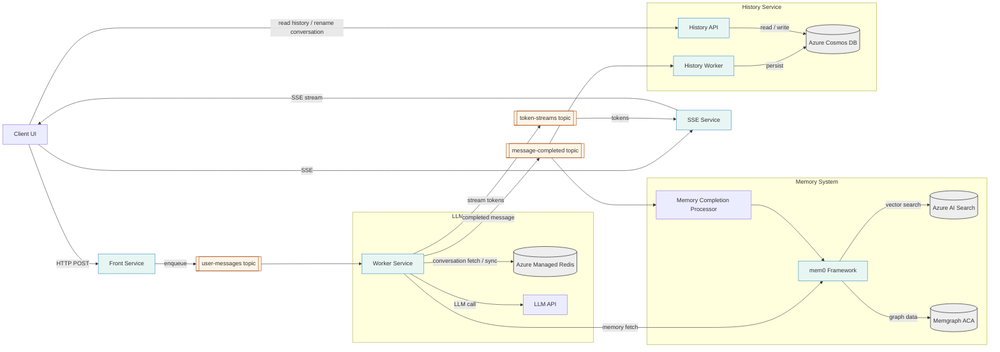
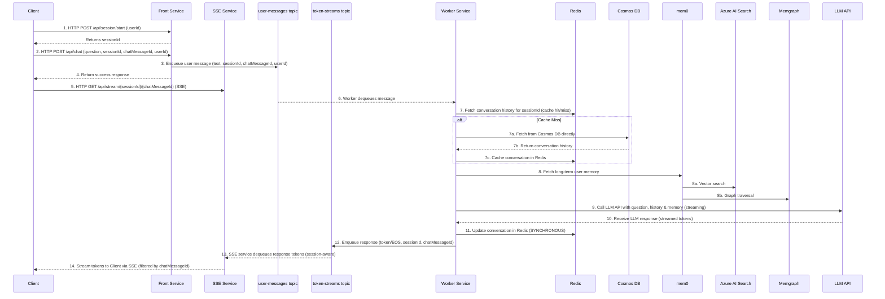
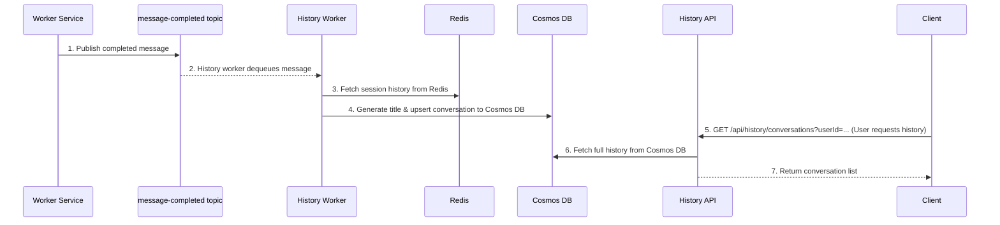
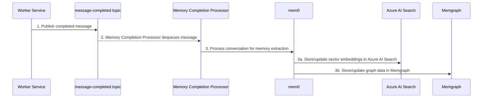

# Scalable chat using SSE and async workers

## Overview  
This architecture enables a scalable, reliable, and secure chat application using **Server-Sent Events (SSE)** for real-time streaming responses and **asynchronous worker processes** for heavy lifting. The design decouples the user-facing front-end from the back-end computational work via a message queue, allowing each component to scale and fail independently without disrupting the whole system.

**Key components:**  
- **Client Application (Browser/App):** Sends user questions to the front service and connects to the SSE service for streaming responses via Server-Sent Events. Maintains a session ID to identify the conversation thread and user ID for authentication.  
- **Front Service (Message Handler):** A lightweight service that accepts client questions over HTTP, manages sessions, and provides conversation history API. It queues messages for processing but does not handle streaming responses directly. Handles user authentication and session management.  
- **SSE Service (Streaming Service):** A dedicated service that handles Server-Sent Events connections and streams tokens back to clients. This service can be scaled independently based on streaming demand.  
- **Message Queue Service:** A persistent FIFO queue (with partitions or sessions by conversation ID) that brokers requests and responses between services. Includes multiple topics: `user-messages`, `token-streams`, and `message-completed`.  
- **Worker Service (Async Workers):** A pool of one or more back-end worker processes that consume tasks from the queue. Each worker retrieves conversation history from Redis and long-term memory from mem0, calls the LLM API, and synchronously updates Redis with new messages for immediate consistency. Also publishes completed conversations for memory processing and long-term storage.  
- **Azure Managed Redis (Hot Cache):** Fast lookup storage for active conversation history with 24-hour TTL. Workers write directly to Redis synchronously to ensure immediate consistency for ongoing conversations. Optimized for LLM worker performance with dual indexing strategy.  
- **Azure Cosmos DB (Long-term Store):** Persistent storage for conversation history with configurable retention. Provides multi-region capabilities and serves as the authoritative source for historical conversations beyond the Redis cache window.
- **History Worker:** Listens to `message-completed` events and **persists** conversations to Cosmos DB, generates titles.
- **History API:** Stateless REST service that **serves history to the web client** (`GET /conversations`, `GET /messages`, `PUT /title`). Reads recent data from Redis, full history from Cosmos DB.
- **Memory Service:** Service that processes completed conversations to extract and store long-term user memories using the mem0 framework. Subscribes to conversation completion events.  
- **Long-term Memory Stack:**
  - **mem0:** Framework for managing user memories and semantic understanding
  - **Azure AI Search:** Vector store for semantic similarity and memory retrieval  
  - **Memgraph (Azure Container Apps):** Graph database for relationship modeling between memories  
- **LLM API (e.g., Azure OpenAI Service):** An external service that generates the chat response. Supports streaming output and receives both conversation context and long-term user memories.

Below is a pair of diagrams illustrating the system:

### 1. Architecture overview

```mermaid
flowchart LR
    Client[Client UI] -->|HTTP POST| Front[Front Service]
    Client -->|SSE| SSE[SSE Service]

    Front -->|enqueue| UserMsgTopic[[user-messages topic]]
    UserMsgTopic --> Worker[Worker Service]

    subgraph LLMProcessing["LLM Processing"]
        Worker
        Redis[(Azure Managed Redis)]
        LLM[LLM API]
    end
    Worker -->|conversation fetch / sync| Redis
    Worker -->|LLM call| LLM

    subgraph MemorySystem["Memory System"]
        MemoryCompletionProcessor[Memory Completion Processor]
        Mem0[mem0 Framework]
        AISearch[(Azure AI Search)]
        Memgraph[(Memgraph ACA)]
    end
    Worker -->|memory fetch| Mem0
    Mem0 -->|vector search| AISearch
    Mem0 -->|graph data| Memgraph
    CompletedTopic --> MemoryCompletionProcessor
    MemoryCompletionProcessor --> Mem0

    Worker -->|stream tokens| TokenTopic[[token-streams topic]]
    Worker -->|completed message| CompletedTopic[[message-completed topic]]
    TokenTopic -->|tokens| SSE
    SSE -->|SSE stream| Client

    subgraph HistoryService["History Service"]
        HistoryWorker[History Worker]
        HistoryAPI[History API]
        CosmosDB[(Azure Cosmos DB)]
    end
    CompletedTopic --> HistoryWorker
    HistoryWorker -->|persist| CosmosDB
    Client -->|read history / rename conversation| HistoryAPI
    HistoryAPI -->|read / write| CosmosDB

    classDef service fill:#E8F6F3,stroke:#2E86C1,stroke-width:1px;
    classDef storage fill:#EEEEEE,stroke:#000000,stroke-width:1px;
    classDef queue   fill:#FEF5E7,stroke:#A04000,stroke-width:1px;

    class Front,SSE,Worker,HistoryAPI,HistoryWorker,Mem0 service;
    class Redis,CosmosDB,AISearch,Memgraph storage;
    class UserMsgTopic,TokenTopic,CompletedTopic queue;
```

### 2. Request / response walkthrough

```mermaid
sequenceDiagram
    participant C as Client
    participant F as Front Service
    participant S as SSE Service
    participant UM as user-messages topic
    participant TS as token-streams topic
    participant W as Worker Service
    participant R as Redis
    participant CD as Cosmos DB
    participant M  as mem0
    participant AS as Azure AI Search
    participant G  as Memgraph
    participant L as LLM API

    C->>F: 1. HTTP POST /api/session/start (userId)
    F-->>C: Returns sessionId
    C->>F: 2. HTTP POST /api/chat (question, sessionId, chatMessageId, userId)
    F->>UM: 3. Enqueue user message (text, sessionId, chatMessageId, userId)
    F-->>C: 4. Return success response
    C->>S: 5. HTTP GET /api/stream/{sessionId}/{chatMessageId} (SSE)
    UM-->>W: 6. Worker dequeues message
    W->>R: 7. Fetch conversation history for sessionId (cache hit/miss)
    alt Cache Miss
        W->>CD: 7a. Fetch from Cosmos DB directly
        CD-->>W: 7b. Return conversation history
        W->>R: 7c. Cache conversation in Redis
    end
    W->>M: 8. Fetch long-term user memory
    M->>AS: 8a. Vector search
    M->>G: 8b. Graph traversal
    W->>L: 9. Call LLM API with question, history & memory (streaming)
    L-->>W: 10. Receive LLM response (streamed tokens)
    W->>R: 11. Update conversation in Redis (SYNCHRONOUS)
    W->>TS: 12. Enqueue response (token/EOS, sessionId, chatMessageId)
    TS-->>S: 13. SSE service dequeues response tokens (session-aware)
    S-->>C: 14. Stream tokens to Client via SSE (filtered by chatMessageId)
```

*Figures: High-level architecture (top) and step-by-step data flow (bottom).*

1.  **Client → Front (Session Start):** The client sends an HTTP `POST` request to `/api/session/start`. The Front Service returns a unique `sessionId`.
2.  **Client → Front (Chat Request):** The client sends the user's question, the `sessionId`, user id `userId`, and a client-generated `chatMessageId` to the Front Service via an HTTP `POST` request to `/api/chat`.
3.  **Front → user-messages topic (Request):** The Front Service packages the question (`text`), `sessionId`, `userId` and `chatMessageId` into a message. It places this message onto the `user-messages` topic in Azure Service Bus, using the `sessionId` as the Service Bus message's `session_id` property.
4.  **Front → Client (Success Response):** The Front Service returns a success response to the client, confirming the message has been queued.
5.  **Client → SSE Service (Stream Connection):** The client establishes an SSE connection to the SSE Service via HTTP `GET` request to `/api/stream/{sessionId}/{chatMessageId}` to receive the streaming response.
6.  **user-messages topic → Worker:** A Worker Service instance picks up the message from its subscription on the `user-messages` topic.
7.  **Worker → Redis/Cosmos DB (History fetch):** The worker retrieves the conversation history for the `sessionId`. It first attempts to fetch from Redis (hot cache). If it's a cache miss (7a), it fetches from Cosmos DB (7b) and then caches it in Redis (7c).
8.  **Worker → mem0 (Memory fetch):** The worker fetches long-term user memory from the mem0 service. mem0 in turn might query Azure AI Search (8a) for vector similarity and Memgraph (8b) for graph-based relationships.
9.  **Worker → LLM API:** The worker calls the LLM API, sending the user’s question, retrieved conversation history, and relevant long-term memories. The request is made in a **streaming mode**.
10. **LLM API → Worker (Streaming):** The LLM processes the prompt and streams back the generated answer token by token.
11. **Worker → Redis (Update short-term history):** The worker synchronously saves the new question and the assistant's response to Redis to ensure immediate consistency for the ongoing conversation.
12. **Worker → token-streams topic (Response stream):** As the worker receives tokens from the LLM, it places them onto the `token-streams` topic. Each message contains the `token` (or an `end_of_stream` signal), the original `sessionId`, and `chatMessageId`.
13. **token-streams topic → SSE Service (Response):** The SSE Service, listening to its subscription on the `token-streams` topic (session-aware, using `sessionId`), dequeues the response tokens.
14. **SSE Service → Client (SSE Stream):** The SSE Service streams the tokens to the correct client via the SSE connection. It uses the `chatMessageId` to ensure tokens are routed to the correct message response stream on the client side.

After the main user flow is complete, the Worker service also publishes a `message-completed` event. This event triggers asynchronous processing for long-term history persistence and memory consolidation, detailed in the following sections.

### 3. History System - Asynchronous Persistence
This diagram illustrates how conversation history is persisted long-term after a chat interaction is completed.

```mermaid
sequenceDiagram
    participant W as Worker Service
    participant CC as message-completed topic
    participant HW as History Worker
    participant R as Redis
    participant CD as Cosmos DB
    participant HA as History API
    participant C as Client

    W->>CC: 1. Publish completed message
    CC-->>HW: 2. History worker dequeues message
    HW->>R: 3. Fetch session history from Redis
    HW->>CD: 4. Generate title & upsert conversation to Cosmos DB
    
    C->>HA: 5. GET /api/history/conversations?userId=... (User requests history)
    HA->>CD: 6. Fetch full history from Cosmos DB
    HA-->>C: 7. Return conversation list
```
1.  **Worker → message-completed topic:** After successfully processing a user message and streaming the response, the Worker service publishes a message to the `message-completed` topic. This message typically contains identifiers like `sessionId` and `userId`.
2.  **message-completed topic → History Worker:** The History Worker, subscribed to the `message-completed` topic, dequeues the message.
3.  **History Worker → Redis (Fetch Session Data):** The History Worker fetches the complete conversation session data from Redis using the `sessionId`.
4.  **History Worker → Cosmos DB (Persist Long-Term):** The History Worker processes the retrieved session data (e.g., generates a conversation title if not already present) and then persists the full conversation into Azure Cosmos DB for long-term storage.
5.  **Client → History API (Request History):** At a later time, the client can request conversation history via the History API (e.g., `GET /api/history/conversations?userId=...`).
6.  **History API → Cosmos DB (Full History):** The History API queries Cosmos DB directly to retrieve the comprehensive conversation history for the user.
7.  **History API → Client (Return History):** The History API returns the list of conversations to the client.

### 4. Memory System - Asynchronous Consolidation
This diagram shows how long-term memories are extracted and stored after a chat interaction.

```mermaid
sequenceDiagram
    participant W as Worker Service
    participant CC as message-completed topic
    participant MCP as Memory Completion Processor
    participant M as mem0
    participant AS as Azure AI Search
    participant G as Memgraph

    W->>CC: 1. Publish completed message
    CC-->>MCP: 2. Memory Completion Processor dequeues message
    MCP->>M: 3. Process conversation for memory extraction
    M->>AS: 3a. Store/update vector embeddings in Azure AI Search
    M->>G: 3b. Store/update graph data in Memgraph
```
1.  **Worker → message-completed topic:** Similar to the history system, the Worker service publishes a message to the `message-completed` topic upon completing a chat interaction.
2.  **message-completed topic → Memory Completion Processor:** The Memory Completion Processor, also subscribed to the `message-completed` topic, dequeues the message.
3.  **Memory Completion Processor → mem0:** The processor sends the completed conversation data to the `mem0` framework. `mem0` analyzes the conversation to extract or update long-term user memories. This involves:
    *   **3a. mem0 → Azure AI Search:** Storing or updating vector embeddings of the memories in Azure AI Search for future semantic retrieval.
    *   **3b. mem0 → Memgraph:** Storing or updating graph-based representations of memories, entities, and their relationships in Memgraph.

*Note: We use `sessionId` as the Service Bus session key for all chat-related messages. This allows the SSE service to open a session receiver for a specific session and only receive messages for that session, without filtering or processing unrelated messages. This approach enables stateless, horizontally scalable services, as any SSE service instance can handle any session. The `chatMessageId` is used to correlate individual questions and responses within a session, especially when a user sends multiple questions in the same session. The front service is lightweight and only handles message queuing, while the SSE service handles all streaming concerns. The worker service writes to Redis synchronously for immediate consistency and publishes to the message-completed topic for asynchronous long-term persistence and memory processing. This design achieves both scalability and simplicity through clear separation of concerns.*

## User Management and Authentication

**User Identity Management:** The system implements a user-centric design where each user has a unique `userId` that persists across sessions. In the initial implementation, we will use hardcoded users for development:

```json
{
  "users": [
    {"userId": "user_001", "name": "Alice Johnson", "email": "alice@example.com"},
    {"userId": "user_002", "name": "Bob Smith", "email": "bob@example.com"},
    {"userId": "user_003", "name": "Carol White", "email": "carol@example.com"}
  ]
}
```

**Future Authentication:** The system is designed to integrate with **Azure Entra ID (formerly Azure AD) via OIDC** for production use. The front service will validate JWT tokens and extract the user identity, mapping to our internal `userId` system. Session management will tie sessions to authenticated users, ensuring proper authorization and data isolation.

**Session-User Relationship:** Each session is associated with a specific user. When a client starts a session via `/api/session/start`, they must provide their `userId`. The front service validates the user exists and creates a session tied to that user. This enables:
- Proper conversation history retrieval for the UI
- User-specific memory and personalization
- Security isolation between users
- Audit trails and usage analytics per user

## Conversational history architecture

The system implements a **hierarchical storage approach** that balances performance and cost:

- **Redis (Hot Cache):** 24-hour TTL for active conversations, optimized for worker performance  
- **Cosmos DB (Long-term Store):** Persistent storage with configurable retention, multi-region capabilities

### Data Consistency Model

**Synchronous Redis Updates:** Workers write conversation updates directly to Redis immediately after LLM responses to ensure consistency for ongoing conversations.

**Asynchronous Cosmos DB Persistence:** Completed conversations are persisted to Cosmos DB via the History Service through the message-completed topic, where eventual consistency is acceptable for historical data.

### Short-term data schema
```
Key: session:{sessionId}
TTL: 24 hours
Structure: {
  "sessionId": "sess_abc123",
  "userId": "user_001", 
  "createdAt": "2025-06-05T10:00:00Z",
  "lastActivity": "2025-06-05T11:30:00Z",
  "title": "Machine Learning Discussion",
  "messages": [
    {
      "messageId": "msg_001",
      "role": "user",
      "content": "What is machine learning?",
      "timestamp": "2025-06-05T10:00:00Z"
    },
    {
      "messageId": "msg_002", 
      "role": "assistant",
      "content": "Machine learning is a subset of artificial intelligence...",
      "timestamp": "2025-06-05T10:00:15Z"
    }
  ]
}
```

### Long-term data schema
```
{
  "sessionId": "sess_abc123",    // This is unique identifier for the conversation
  "userId": "user_001",  // This is partition key
  "title": "Machine Learning Discussion",
  "createdAt": "2025-06-05T10:00:00Z",
  "lastActivity": "2025-06-05T11:30:00Z",
  "messages": [
    {
      "messageId": "msg_001",
      "role": "user",
      "content": "What is machine learning?",
      "timestamp": "2025-06-05T10:00:00Z"
    },
    {
      "messageId": "msg_002", 
      "role": "assistant",
      "content": "Machine learning is a subset of artificial intelligence...",
      "timestamp": "2025-06-05T10:00:15Z"
    }
  ]
}
```

### Long-term History APIs  
History APIs provide access to conversation history and allow users to update conversation titles. They are designed to be stateless and can scale independently of the front service.

```
GET  /api/history/users/{userId}/conversations
GET  /api/history/conversations/{sessionId}
PUT  /api/history/conversations/{sessionId}/title
```

## Memory Architecture
**mem0 Integration:** The system integrates mem0 for sophisticated user memory management, enabling personalized experiences across conversations:

LLM Worker accesses mem0 to retrieve relevant user memories during LLM processing. 
**Memory completion processor** is triggered by the `message-completed` topic to extract and store long-term memories by calling mem0 APIs.

### Memory Components:
- **Azure AI Search:** Vector store for semantic similarity search of memories
- **Memgraph (Azure Container Apps):** Graph database for modeling relationships between memories, topics, and user preferences
- **mem0 Framework:** Orchestrates memory extraction, storage, and retrieval

