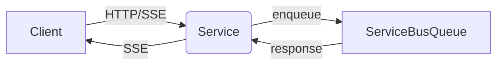

# Scalable Chat Front Service

This service implements the **Front Service** component of the scalable chat architecture.

Key responsibilities:
- Exposes HTTP endpoint to receive user questions and session IDs
- Initiates Server-Sent Events (SSE) stream back to client
- Enqueues incoming questions on Azure Service Bus Queue
- Listens for response tokens from the queue and forwards them to the client via SSE

Configuration:
- Uses `DefaultAzureCredentials` from `azure-identity` for authentication in Azure
- Local development: configuration loaded from `.env` via `python-dotenv`
- Environment variables:
  - `SERVICEBUS_FULLY_QUALIFIED_NAMESPACE` (e.g., `mysb.servicebus.windows.net`)
  - `SERVICEBUS_USER_MESSAGES_TOPIC` (topic to send user questions to workers)
  - `SERVICEBUS_TOKEN_STREAMS_TOPIC` (topic to receive token streams from workers)
  - `SERVICEBUS_TOKEN_STREAMS_SUBSCRIPTION` (subscription for front service to receive token streams)
  - `OS_ENV` (`local` vs `prod`)
  - Optional: other Azure resources connection strings or identifiers

Endpoints:
- `POST /chat` to start a new SSE stream and enqueue a question

The OpenAPI spec is available at `/openapi.json` and UI docs at `/docs`.

Architecture:

