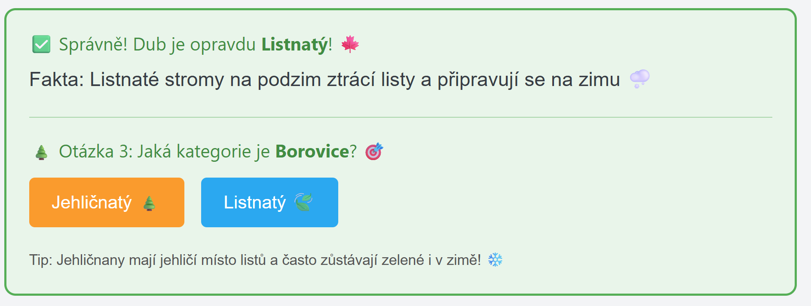

# Dynamically AI-generated UI
In this demo I will explore using server-side rendering with HTMX, Python and LLM to create dynamic UIs based on user input.

## How it Works

This app demonstrates dynamic, AI-generated user interfaces using server-side rendering with HTMX, Python, and Azure OpenAI. The user submits a question or request, and the backend LLM generates an interactive UI snippet (using HTMX) in response. Each interaction with the UI is sent back to the LLM, which can update the UI or continue the conversation, enabling rich, adaptive user experiences.

- **HTMX** is used for dynamic, partial page updates and interactivity.
- **FastHTML** provides a Pythonic way to build HTML and handle routes.
- **Azure OpenAI** powers the LLM that generates UI code and logic on the fly.
- **uv** is used for fast Python package management and running the app.

## Getting Started

1. **Install dependencies** (if not already):
   ```sh
   uv pip install -r requirements.txt
   ```
2. **Configure environment variables**:
   - Copy `.env` and set your Azure OpenAI endpoint and model name:
     ```env
     AZURE_OPENAI_ENDPOINT=your-endpoint-url
     MODEL_NAME=your-model-name
     ```
3. **Run the app**:
   ```sh
   uv run main.py
   ```
   The app will start a local server. Open your browser to the displayed address.

## Code Structure and Comments

- **main.py**: The main FastHTML app. Key parts:
  - **Imports**: Brings in FastHTML, Azure OpenAI, authentication, and utilities.
  - **Globals**: Stores the latest user question and AI-generated snippet for session continuity.
  - **Environment Setup**: Loads `.env` and configures Azure OpenAI client.
  - **Routes**:
    - `/` : Renders the main chat UI (input box, output area, styled with Tailwind).
    - `/userMessage` : Handles new user questions, sends them to the LLM, and returns the generated HTMX snippet.
    - `/process` : Handles all interactive UI events, sending details and context back to the LLM for further UI updates.
  - **Logging**: Provides info and error logs for debugging.

- **prompts/system.jinja2**: The system prompt for the LLM, instructing it to generate fun, interactive HTMX snippets, always targeting `#ai-output` and using `/process` for actions. It enforces UI/UX rules and gives example strategies.

- **prompts/user_interaction_prompt.jinja2**: The user prompt for follow-up interactions, providing the original question and details of the user's last interaction, so the LLM can continue the conversation or UI flow.

- **.env**: Stores your Azure OpenAI endpoint and model name. Example:
  ```env
  AZURE_OPENAI_ENDPOINT=https://your-endpoint.openai.azure.com/
  MODEL_NAME=your-model
  ```

## Images / Screenshots

Below are screenshots from the `images/` folder showing the app in action:

|  |  |
|---|---|
|  |  |
|  |  |
|  |  |
|  |  |
|  |  |
|  |  |
|  |  |

---

Feel free to explore and modify the prompts or UI logic to create your own dynamic, LLM-powered user interfaces!