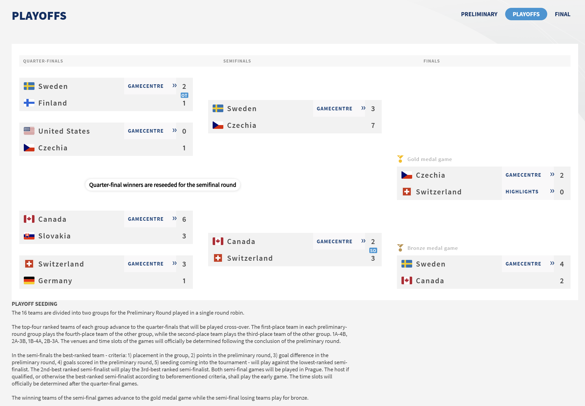
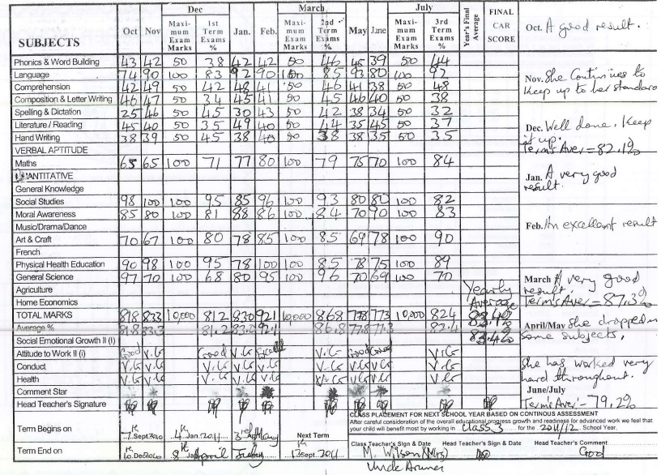
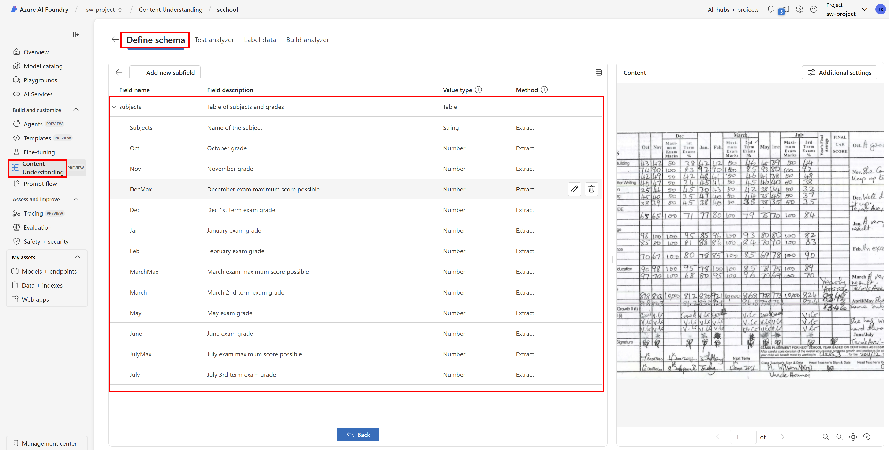
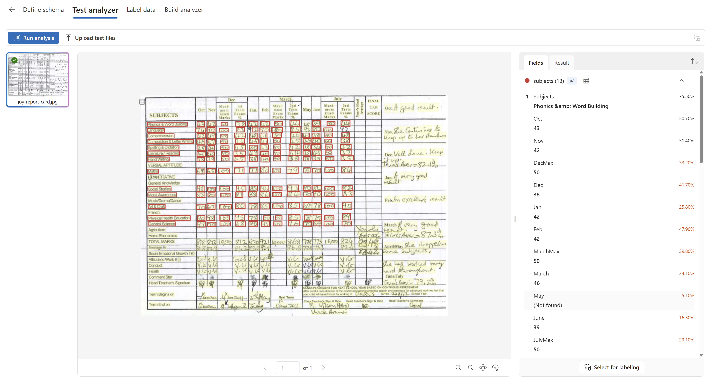
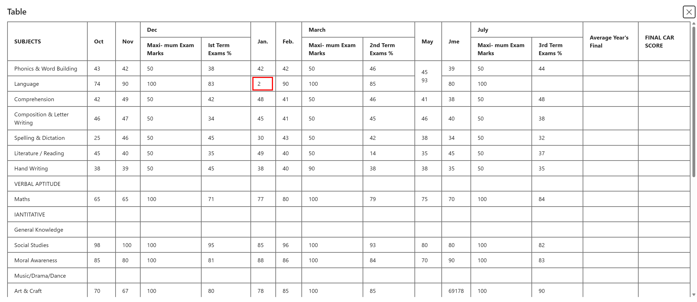

# Story of analyzing data
- [Story of analyzing data](#story-of-analyzing-data)
- [1. Extracting textual data](#1-extracting-textual-data)
- [2. Processing visual data](#2-processing-visual-data)
- [3. Using Code Interpreter tool for data analysis](#3-using-code-interpreter-tool-for-data-analysis)
- [4. Using Code Interpreter tool for data visualization](#4-using-code-interpreter-tool-for-data-visualization)

# 1. Extracting textual data

System prompt:

```
# ROLE:
You are data analyst, writer and text editor.

# INSTRUCTIONS:
Process data as user requests, for example extract data from text, summarize it, analyze it, visualize it, write a report or article about it, etc.
Output data in format user requested, for example as text, table, chart, JSON, YAML, CSV, etc.
```

User Prompt:

```
Extract entities such as people, organizations, locations, dates, etc. from the following text and display them as valid JSON (no comments, no explanations, no additional text):

<document>

</document>
```

Insert content of [reasoning_best_practices.md](../inputs/reasoning_best_practices.md) into <document> tag.

See [example output](../outputs/analyze_entities.json)

User Prompt:

```
Now create new title and summary in Markdown. Be technical, it is for our technical wiki.
```

See [example output](../outputs/analyze_summary_business.md)

```
Now create new title and summary for our blog article. Be business oriented, engaging and easy to read.
```

See [example output](../outputs/analyze_summary_technical.md)

```
Now create new title and very short post for Facebook. You must be very engaging, use emojis and hashtags. Make sure post is short, viral and catchy.
```

See [example output](../outputs/analyze_summary_social.md)

---

User Prompt:

```
Here is table with animals and their features.

<table>

</table>

Always answer only based on data from the table, never add any additional information or context.

What animals are big yet run very fast?

```

User Prompt:

```
Are there any faster than those while being very small? Birds and sea animals do not count.
```

# 2. Processing visual data
Multi-modal LLMs are very good at processing visual information from semantic perspective such as describing scene, objects on image, reasoning about them, or even do very good and flexible OCR. However they are not perfect at exact extraction of data from tables or charts.

We will start with **easy** example.


    


System prompt:

```
You will be presented with visual inputs and your task is to carefully analyze the image and extract data from it in order to answer user's questions.
```

User prompt (attach both images):

```
Here are results from world championship in hockey 2024. 
Extract information about performance of Czech team and comment on it's progress throughout the tournament.
Use only data from images, do not add any additional information or context.
```

See [example output](../outputs/analyze_hockey.md)

Here is **difficult example** that current LLMs struggle with.



Even with very specific guidance and description of columns model makes a lot of mistake (see Language row).

System prompt:

```
Extract data from a scanned handwritten table provided as an image, and accurately convert it into a well-structured Markdown table. Ensure each item is precise and formatted correctly, paying close attention to the accuracy of every single detail in the table.

# Important Details

- The input will be a scanned image of a handwritten table.
- Carefully interpret all handwritten text, avoiding inaccuracies or omissions.
- Ensure column and row headers, as well as all cell values, are faithfully transcribed into the Markdown table.

# Steps

1. **Analyze the Image**:
   - Interpret the structure of the handwritten table, including the number of columns and rows.
   - Identify headers, labels, and individual data points.

2. **Extract Data**:
   - Carefully transcribe the content within each cell of the handwritten table, ensuring complete accuracy.
   - Handle any potential ambiguities in handwriting by being cautious and approximating only when absolutely necessary. In unclear cases, add a placeholder like `[unclear]` with a note for verification.

3. **Convert to Markdown**:
   - Format the extracted data into a proper Markdown table, ensuring alignment and proper syntax (e.g., `|` for cells, `---` for separation of headers).
   - Double-check alignment to ensure the table appears correctly in Markdown when rendered.

4. **Verify**:
   - Cross-check the final Markdown output with the original image to confirm all values are accurate and properly transcribed.
   - Highlight any potential uncertainties for the user to address.

# Output Format

The output should be a Markdown table formatted as follows:

```
| Header 1       | Header 2       | Header 3       |
|-----------------|----------------|----------------|
| Row 1, Column 1 | Row 1, Column 2 | Row 1, Column 3 |
| Row 2, Column 1 | [unclear]       | Row 2, Column 3 |
```

- Each table header and cell value should match the handwritten table, except for ambiguities where `[unclear]` is used.
- If no data is unclear, no placeholder is needed.

# Example

**Input**: 
An image contains a handwritten table with the following details:
```
| Name       | Age | City       |
|------------|-----|------------|
| Alice      | 24  | New York   |
| Bob        | 30  | [unclear]  |
```

**Output**:
```
| Name        | Age | City       |
|-------------|-----|------------|
| Alice       | 24  | New York   |
| Bob         | 30  | [unclear]  |
```

# Notes

- For ambiguous or illegible handwriting, always flag uncertainties with `[unclear]` to avoid errors.
- The model must strictly follow Markdown syntax to ensure compatibility with rendering tools.
- The task prioritizes accuracy and completeness over speed.

# Columns description:
{
	"scenario": "document",
	"fieldSchema": {
		"fields": {
			"subjects": {
				"type": "array",
				"items": {
					"type": "object",
					"method": "extract",
					"properties": {
						"Subjects": {
							"type": "string",
							"method": "extract",
							"description": "Name of the subject"
						},
						"Oct": {
							"type": "number",
							"method": "extract",
							"description": "October grade"
						},
						"Nov": {
							"type": "number",
							"method": "extract",
							"description": "November grade"
						},
						"DecMax": {
							"type": "number",
							"method": "extract",
							"description": "December exam maximum score possible"
						},
						"Dec": {
							"type": "number",
							"method": "extract",
							"description": "Dec 1st term exam grade"
						},
						"Jan": {
							"type": "number",
							"method": "extract",
							"description": "January exam grade"
						},
						"Feb": {
							"type": "number",
							"method": "extract",
							"description": "February exam grade"
						},
						"MarchMax": {
							"type": "number",
							"method": "extract",
							"description": "March exam maximum score possible"
						},
						"March": {
							"type": "number",
							"method": "extract",
							"description": "March 2nd term exam grade"
						},
						"May": {
							"type": "number",
							"method": "extract",
							"description": "May exam grade"
						},
						"June": {
							"type": "number",
							"method": "extract",
							"description": "June exam grade"
						},
						"JulyMax": {
							"type": "number",
							"method": "extract",
							"description": "July exam maximum score possible"
						},
						"July": {
							"type": "number",
							"method": "extract",
							"description": "July 3rd term exam grade"
						}
					}
				},
				"method": "generate",
				"description": "Table of subjects and grades"
			}
		},
		"definitions": {}
	}
}
```

See [example output](../outputs/analyze_table_llm.md)

This task requires combination of LLM multi-modal capability to understand semantic meaning of visual inputs combined with computer vision models to detect structures, tables, fields, objects and classic Optical Character Recognition (OCR) to extract text from images.Here is example from Content Understanding service in Azure AI Foundry.







# 3. Using Code Interpreter tool for data analysis
Let's how tools can help with efficienty and accuracy of data analysis.

We will work with data from [european_wholesale_electricity_price_data_daily.csv](../inputs/european_wholesale_electricity_price_data_daily.csv) file which is time-series data of daily electricity prices in Europe in CSV format. Overall it is just 3 MB file with about 10 years of daily data for few countries. No problem for any single computer system including Excel. Note with distrbuted architectures like Spark we (as IT 1.0) can process multiple orders of magnitude larger data sets (1TB is no big deal, 1PB is challenge, but ok).

System prompt:

```
You are good at analyzing tabular data
```

User prompt:

```
Based on following data in what country there has been biggest shock (defined as percentage difference) in electricity price over single day?
```

Attach file [european_wholesale_electricity_price_data_daily_100k.csv](../inputs/european_wholesale_electricity_price_data_daily_100k.csv) to end of user prompt.

See [example output](../outputs/analyze_tabular_100k_without_tool.md)

Do this with agent that can use Code Interpreter tool. Attach 100k file to it.

See [example output](../outputs/analyze_tabular_100k_with_tool.md)

Results are similar, yet with tool you have spend much less money and time. Now let's try with 2M token file. Attach [european_wholesale_electricity_price_data_daily_2M.csv](../inputs/european_wholesale_electricity_price_data_daily_2M.csv) to code interpreter in Azure AI Agent.

See [example output](../outputs/analyze_tabular_2M_with_tool.md)

# 4. Using Code Interpreter tool for data visualization
LLMs today cannot produce nice images directly. Best models (like gpt-image-1) can use LLM to produce output in latent space that is than using Unet-style diffusion model to produce final image (note in the past ChatGPT simply took user text input to generate text-based prompt into separate DALL-E model). While this is great for nice pictures of cats, still for accurate data visualizations like charts you might want to use tools.

System prompt:

```
You are good at analyzing tabular data and providing visualizations based on use query.
```

User prompt:

```
Based on following data draw chart comparing electricity prices in Czechia and Germany over last 10 years using 1 month averages.
```
