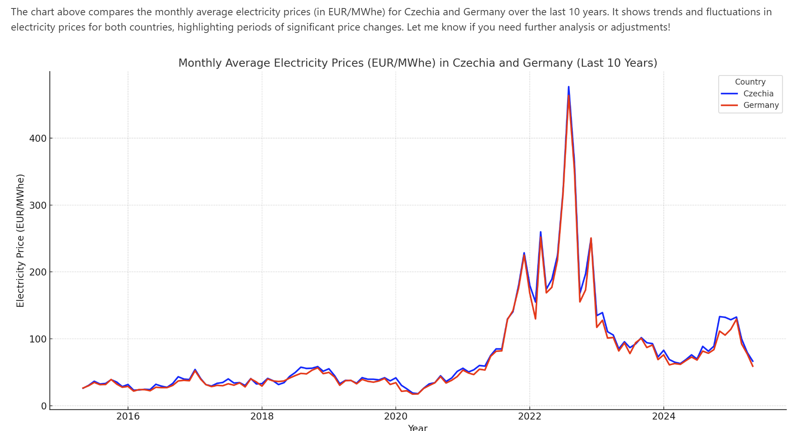

Let me first inspect the uploaded file to understand its structure and contents. Then, I will extract the relevant data for electricity prices in Czechia and Germany over the last 10 years and create a chart comparing their monthly averages.

```python
import pandas as pd

# Load the uploaded file to inspect its structure and contents
file_path = '/mnt/data/assistant-1gkuAVTRsefNu5SqMrBVGS'
data = pd.read_csv(file_path)

# Display the first few rows of the dataset to understand its structure
data.head(), data.info()# Convert the 'Date' column to datetime format for easier manipulation
data['Date'] = pd.to_datetime(data['Date'])

# Filter data for Czechia and Germany
filtered_data = data[data['Country'].isin(['Czechia', 'Germany'])]

# Extract data for the last 10 years (from the most recent date in the dataset)
last_date = filtered_data['Date'].max()
start_date = last_date - pd.DateOffset(years=10)
filtered_data = filtered_data[(filtered_data['Date'] >= start_date) & (filtered_data['Date'] <= last_date)]

# Group by Country and Month-Year to calculate monthly averages
filtered_data['Month-Year'] = filtered_data['Date'].dt.to_period('M')
monthly_avg = filtered_data.groupby(['Country', 'Month-Year'])['Price (EUR/MWhe)'].mean().reset_index()

# Pivot the data for easier plotting
pivot_data = monthly_avg.pivot(index='Month-Year', columns='Country', values='Price (EUR/MWhe)')

# Display the processed data for verification
pivot_data.tail()

import matplotlib.pyplot as plt

# Plot the monthly average electricity prices for Czechia and Germany
plt.figure(figsize=(14, 7))
plt.plot(pivot_data.index.to_timestamp(), pivot_data['Czechia'], label='Czechia', color='blue', linewidth=2)
plt.plot(pivot_data.index.to_timestamp(), pivot_data['Germany'], label='Germany', color='red', linewidth=2)

# Add chart details
plt.title('Monthly Average Electricity Prices (EUR/MWhe) in Czechia and Germany (Last 10 Years)', fontsize=14)
plt.xlabel('Year', fontsize=12)
plt.ylabel('Electricity Price (EUR/MWhe)', fontsize=12)
plt.legend(title='Country', fontsize=10)
plt.grid(True, linestyle='--', alpha=0.6)
plt.tight_layout()

# Show the plot
plt.show()
```

