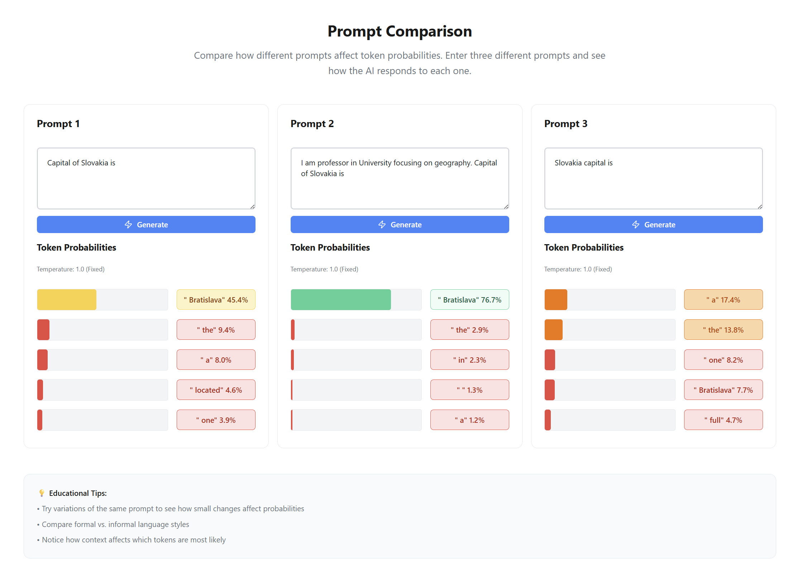
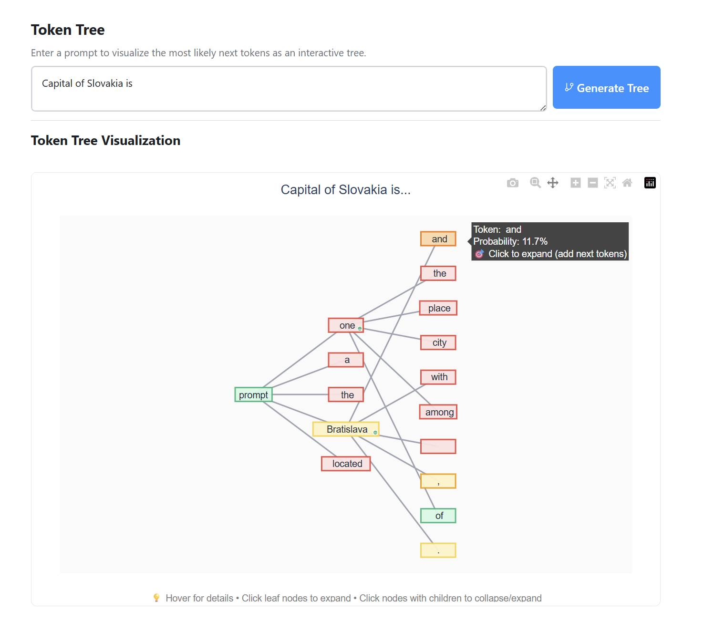

# Token Visualizer

An educational application designed to help students understand autoregressive Large Language Models (LLMs) from the perspective of next token prediction. The application provides interactive visualization of token generation probabilities using a local Gemma 2 model.


## 🎯 Educational Objectives

- **Educational Focus**: Help students understand how LLMs work at the token level
- **Interactive Learning**: Provide hands-on experience with token selection and probability visualization
- **Real-time Feedback**: Show how prompt modifications affect token probabilities
- **Visual Understanding**: Use colors, probabilities, and interactive elements to make abstract concepts concrete

## 🚀 Features

### Mode 1: Interactive Token Generation
Step-by-step token generation where users can select from top 5 probability alternatives at each step.


**Features:**
- Real-time token probability visualization
- Color-coded probability indicators
- Temperature and max tokens configuration
- Token history with backtracking capability
- Educational insights into LLM decision making

### Mode 2: Prompt Comparison
Compare how different prompts affect next-token probabilities side-by-side.



**Features:**
- Three-column comparison layout
- Side-by-side probability analysis
- Fixed temperature for consistent comparison
- Color-coded probability visualization
- Educational prompt engineering insights

### Mode 3: Token Tree Visualization
Advanced tree visualization of multiple token generation paths with interactive branching.



**Features:**
- Interactive tree visualization using Plotly
- Click-to-expand branching paths
- Probability-based color coding
- Network graph representation
- Advanced exploration of generation possibilities

## 🏗️ Architecture

The application consists of two main components:

### Main Application (Reflex Frontend + Backend)
- **Technology**: Python with Reflex Framework
- **Interface**: Web-based interactive UI with modern components
- **Real-time Updates**: Built-in WebSocket communication

### Local LLM Service (FastAPI Microservice)
- **Technology**: Python with FastAPI
- **Model**: Google Gemma 2 2B base model via Hugging Face
- **Inference**: Local GPU/CPU inference (PyTorch)
- **API**: REST API for token generation and probability extraction

> **Detailed architecture:** See [Developer Documentation](docs/DeveloperDocumentation.md)

## 📖 Documentation

### 📚 User Documentation
- **[User Guide](docs/UserGuide.md)** - Detailed tutorials for each mode with educational exercises
- **[Troubleshooting Guide](docs/TroubleshootingGuide.md)** - Solutions for common issues and problems
- **[Configuration Guide](docs/ConfigurationGuide.md)** - Complete configuration reference

### 🔧 Developer Documentation
- **[API Documentation](docs/APIDocumentation.md)** - Complete REST API reference
- **[Developer Guide](docs/DeveloperDocumentation.md)** - Architecture and development setup
- **[Contributing Guidelines](docs/CONTRIBUTING.md)** - Detailed contribution guidelines

### 📋 Project Documentation
- **[Design Document](docs/DesignDocument.md)** - Project architecture and design decisions
- **[Implementation Plan](docs/ImplementationPlan.md)** - Development roadmap and progress

## 🚀 Quick Start

### Prerequisites
- **Python 3.12+**
- **8GB+ RAM** (16GB+ recommended)
- **5GB+ disk space** for model download
- **NVIDIA GPU** (optional but recommended)

### Installation

1. **Install UV package manager**:
   ```bash
   # Windows (PowerShell)
   irm https://astral.sh/uv/install.ps1 | iex
   
   # macOS/Linux
   curl -LsSf https://astral.sh/uv/install.sh | sh
   ```

2. **Clone and setup**:
   ```bash
   git clone <repository-url>
   cd d-ai-token-visualizer
   
   # Install dependencies
   cd token_visualizer && uv sync
   cd ../llm_service && uv sync
   ```

3. **Configure authentication**:
   ```bash
   huggingface-cli login
   ```

4. **Run the application**:
   ```bash
   # Terminal 1: Start LLM service
   cd llm_service
   uv run uvicorn main:app --host 0.0.0.0 --port 8001 --reload
   
   # Terminal 2: Start main application
   cd token_visualizer
   uv run reflex run
   ```

5. **Access the application**:
   - Main App: http://localhost:3000
   - API Documentation: http://localhost:8001/docs

> **Need help?** Check the [User Guide](docs/UserGuide.md) for detailed setup instructions and tutorials.

## 🔧 Common Issues

**LLM Service won't start:** Check GPU memory or try CPU mode with `DEVICE=cpu` in `llm_service/.env`

**Model download fails:** Ensure Hugging Face authentication: `huggingface-cli login`

**Application is slow:** Use GPU instead of CPU for better performance

> **More help:** See the [Troubleshooting Guide](docs/TroubleshootingGuide.md) for comprehensive solutions.

## 🤝 Contributing

We welcome contributions! Whether you're fixing bugs, adding features, or improving documentation - every contribution helps make this educational tool better.

**Quick steps:**
1. Fork the repository
2. Create a feature branch
3. Make your changes
4. Submit a pull request

**Detailed guidelines:** [CONTRIBUTING.md](CONTRIBUTING.md) | [Developer Documentation](docs/CONTRIBUTING.md)

## 📄 License

This project is licensed under the MIT License - see the [LICENSE](LICENSE) file for details.

## � Technical Specifications

| Specification | Details |
|---------------|---------|
| **Model** | Google Gemma 2 2B (~4.5GB download) |
| **Python** | 3.12+ required |
| **Memory** | 8GB+ RAM (16GB+ recommended) |
| **Storage** | 5GB+ free space |
| **GPU** | NVIDIA GPU recommended (CPU fallback available) |

**Performance:** RTX 4090: ~50-80 tokens/sec | RTX 3080: ~30-50 tokens/sec | CPU: ~5-10 tokens/sec

> **Detailed specifications:** [Configuration Guide](docs/ConfigurationGuide.md)

---

## 🙏 Acknowledgments

- **[Google](https://ai.google.dev/)** for the Gemma 2 model
- **[Hugging Face](https://huggingface.co/)** for the Transformers library
- **[Reflex](https://reflex.dev/)** for the web framework
- **[FastAPI](https://fastapi.tiangolo.com/)** for the API framework
- **[Plotly](https://plotly.com/)** for visualization components

**Built for education** 🎓 **Open source** 📖 **Community driven** 🤝