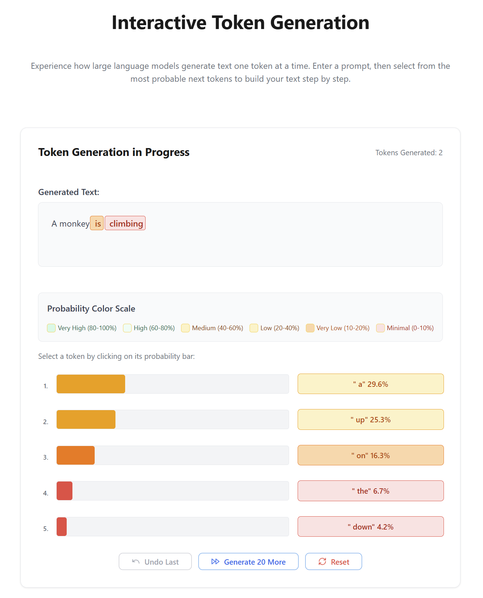
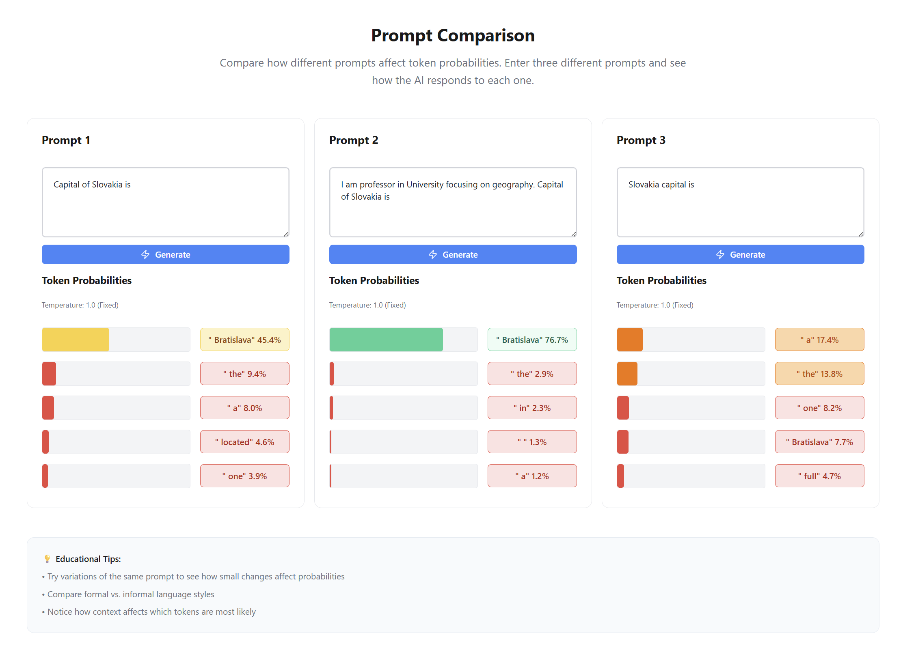
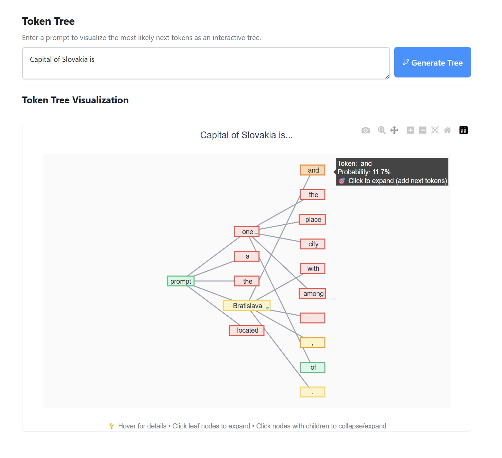

# Token Visualizer User Guide

## Table of Contents

1. [Getting Started](#getting-started)
2. [Interactive Generation Mode](#interactive-generation-mode)
3. [Prompt Comparison Mode](#prompt-comparison-mode)
4. [Token Tree Mode](#token-tree-mode)
5. [Educational Concepts](#educational-concepts)
6. [Tips and Best Practices](#tips-and-best-practices)
7. [Troubleshooting](#troubleshooting)

## Getting Started

### First Time Setup

1. **Launch the Application**
   - Follow the installation instructions in the main README
   - Start both the LLM service and main application
   - Wait for the model to load (this may take 2-5 minutes on first startup)

2. **Verify Everything Works**
   - Navigate to "Configuration Test" in the right sidebar
   - Click "Test LLM Service Connection"
   - Ensure all tests pass (green checkmarks)

3. **Understanding the Interface**
   - **Left Sidebar**: Mode navigation (Interactive, Comparison, Tree)
   - **Main Area**: Current mode interface
   - **Right Sidebar**: Help and configuration access

### First Steps with Token Prediction

Start with this simple exercise:

1. Go to **Interactive Generation Mode**
2. Enter the prompt: `"The capital of France is"`
3. Set temperature to `0.0` (deterministic)
4. Click "Generate Next Token"
5. Observe that "Paris" likely has the highest probability

This demonstrates how LLMs predict the most probable next token based on context.

---

## Interactive Generation Mode

### Overview

This is the primary educational mode where you experience token-by-token generation. You'll see exactly how the model "thinks" about each next token and can guide the generation process.

### Interface Components

1. **Prompt Input Area**
   - Text box to enter your starting prompt
   - Should be clear and engaging (e.g., "Once upon a time" or "The weather today is")

2. **Configuration Controls**
   - **Temperature Slider (0.0 - 2.0)**:
     - `0.0`: Completely deterministic (always picks highest probability)
     - `1.0`: Standard sampling (respects natural probability distribution)
     - `2.0`: Very creative/random (flattens probability distribution)
   - **Max Tokens (1-100)**: How many tokens to generate in sequence

3. **Token Selection Area**
   - Shows top 5 most probable next tokens
   - Color-coded by probability (green = high, red = low)
   - Click any token to select it and continue generation

4. **Generated Text Display**
   - Shows the complete text with color-coded tokens
   - Each token colored by its original probability
   - Hover for detailed probability information

### Step-by-Step Tutorial

#### Exercise 1: Deterministic vs. Random Generation

1. **Setup**:
   - Prompt: `"The weather today is"`
   - Temperature: `0.0`
   - Max tokens: `5`

2. **Generate**: Click "Generate Next Token"
   - Notice the probabilities - likely "sunny", "cloudy", "rainy"
   - Select the highest probability token

3. **Compare with randomness**:
   - Reset and try the same prompt with temperature `2.0`
   - Notice how probabilities are more evenly distributed
   - The model becomes more "creative" but less predictable

#### Exercise 2: Context Influence

1. **Short context**:
   - Prompt: `"The"`
   - Notice very general next tokens ("dog", "cat", "house", etc.)

2. **Longer context**:
   - Prompt: `"The molecular structure of water contains"`
   - Notice more specific, technical tokens ("hydrogen", "oxygen", "two", etc.)

This demonstrates how context constrains and guides predictions.

#### Exercise 3: Creative Writing

1. **Setup**:
   - Prompt: `"In a world where gravity worked backwards"`
   - Temperature: `1.2` (moderately creative)
   - Max tokens: `20`

2. **Interactive selection**:
   - Don't always pick the highest probability
   - Sometimes choose interesting alternatives
   - See how your choices influence future options

### Advanced Features

#### Token History Navigation
- **Reset**: Clear all generated text and start over
- **Backtrack**: Remove recent tokens to try different paths (future feature)

#### Bulk Generation
- Set max tokens > 1 to generate multiple tokens automatically
- Good for seeing overall patterns
- Interactive selection still available for each token

#### Temperature Experimentation
Try these temperature values for different effects:
- `0.0`: Academic/factual writing
- `0.7`: Balanced natural text
- `1.0`: Standard creative writing
- `1.5`: More experimental/artistic
- `2.0`: Highly creative/abstract

---

## Prompt Comparison Mode

### Overview

This mode helps you understand how different prompt formulations affect token prediction. It's perfect for learning prompt engineering and seeing subtle effects of word choice.

### Interface Components

1. **Three Comparison Columns**
   - Each column is independent
   - Enter different prompts to compare
   - Generate button for each column

2. **Results Display**
   - Top 5 next tokens for each prompt
   - Color-coded probabilities
   - Side-by-side comparison layout

### Educational Exercises

#### Exercise 1: Word Order Effects

**Column 1**: `"The weather today is"`
**Column 2**: `"Today the weather is"`
**Column 3**: `"Today's weather is"`

Compare how subtle word order changes affect probabilities.

#### Exercise 2: Formal vs. Informal Language

**Column 1**: `"Please provide information about"`
**Column 2**: `"Tell me about"`
**Column 3**: `"What's up with"`

Notice how formality level influences the model's predictions.

#### Exercise 3: Specificity Levels

**Column 1**: `"Write a"`
**Column 2**: `"Write a story about"`
**Column 3**: `"Write a mystery story about"`

See how specificity constrains and guides the model's options.

#### Exercise 4: Cultural Context

**Column 1**: `"For breakfast, I had"`
**Column 2**: `"For breakfast, I ate"`
**Column 3**: `"This morning I consumed"`

Explore how verb choice affects predictions about food items.

### Best Practices for Comparison

1. **Change One Thing**: Modify only one aspect between columns
2. **Test Hypotheses**: Form predictions about what will change
3. **Document Patterns**: Note consistent differences you observe
4. **Try Edge Cases**: Test unusual or boundary cases

---

## Token Tree Mode

### Overview

The most advanced visualization mode, showing multiple generation paths as an interactive tree. Perfect for understanding the branching nature of text generation.

### Interface Components

1. **Prompt Input**: Starting point for tree generation
2. **Interactive Tree Visualization**: 
   - Nodes represent tokens
   - Colors indicate probabilities
   - Click to expand branches
3. **Generation Controls**: Settings for tree depth and branching

### Understanding the Visualization

#### Node Colors
- **Green**: High probability tokens (80%+)
- **Yellow**: Medium probability tokens (40-80%)
- **Orange**: Lower probability tokens (20-40%)
- **Red**: Low probability tokens (<20%)

#### Tree Structure
- **Root**: Your initial prompt
- **Branches**: Possible continuations
- **Paths**: Complete generation sequences
- **Depth**: How many tokens deep to explore

### Educational Exercises

#### Exercise 1: Simple Branching

1. **Setup**:
   - Prompt: `"The cat"`
   - Generate initial tree

2. **Exploration**:
   - Click on different high-probability tokens
   - See how choices affect future options
   - Notice path dependencies

#### Exercise 2: Story Branching

1. **Setup**:
   - Prompt: `"Once upon a time, there was a"`
   - Generate tree with depth 5-7 tokens

2. **Analysis**:
   - Compare different story beginnings
   - Notice genre influences (fantasy vs. realistic)
   - See how character choices affect plot

#### Exercise 3: Technical vs. Creative

1. **Technical prompt**: `"The algorithm works by"`
2. **Creative prompt**: `"In my dreams, I"`

Compare the branching patterns - technical content often has more constrained, predictable paths.

### Advanced Tree Features

#### Interactive Expansion
- Click any unexpanded node to see its continuations
- Build complex multi-path trees
- Compare parallel generation tracks

#### Path Analysis
- Follow complete paths from root to leaves
- Compare alternative phrasings
- Understand cumulative probability effects

---

## Educational Concepts

### Understanding Token Probabilities

#### What Probabilities Mean
- **High Probability (80%+)**: Very likely according to training data
- **Medium Probability (40-80%)**: Reasonably likely alternatives
- **Low Probability (<20%)**: Uncommon but possible continuations

#### Probability vs. Quality
- High probability ≠ always best choice
- Low probability can be creative and interesting
- Context determines appropriateness

#### Cumulative Effects
- Each token choice affects all future probabilities
- Early choices have cascading consequences
- Generation is path-dependent

### Temperature and Sampling

#### Temperature Values
- **0.0**: Deterministic (always highest probability)
- **0.3-0.7**: Conservative, mostly coherent
- **1.0**: Balanced, natural distribution
- **1.5+**: Creative, more surprising choices

#### When to Use Different Temperatures
- **Factual content**: Low temperature (0.0-0.3)
- **Creative writing**: Medium temperature (0.7-1.2)
- **Experimental art**: High temperature (1.5-2.0)

### Prompt Engineering Insights

#### Context Matters
- Longer context provides more constraint
- Specific context yields more specific predictions
- Recent context has stronger influence

#### Word Choice Effects
- Formal vs. informal language
- Active vs. passive voice  
- Specific vs. general terms

#### Structure Influence
- Sentence fragments vs. complete sentences
- Questions vs. statements
- Lists vs. paragraphs

---

## Tips and Best Practices

### For Educators

#### Classroom Demonstrations
1. **Start Simple**: Use obvious examples like "The capital of France is"
2. **Show Uncertainty**: Demonstrate cases where multiple answers are valid
3. **Explore Bias**: Show how training data affects predictions
4. **Compare Models**: If available, show differences between model sizes

#### Student Exercises
1. **Prediction Games**: Have students guess next tokens before revealing
2. **Creative Challenges**: Use high temperature for creative writing
3. **Prompt Engineering**: Test different ways to ask the same question
4. **Bias Detection**: Look for unexpected or problematic predictions

### For Students

#### Learning Strategy
1. **Start with Interactive Mode**: Get familiar with basic concepts
2. **Experiment with Temperature**: See how it affects creativity
3. **Use Comparison Mode**: Test your prompt engineering hypotheses
4. **Explore with Tree Mode**: Understand complex dependencies

#### Observation Skills
1. **Notice Patterns**: What kinds of tokens often follow others?
2. **Question Probabilities**: Why might the model prefer certain continuations?
3. **Test Boundaries**: What happens with unusual or contradictory prompts?
4. **Compare Contexts**: How does background information change predictions?

### For Researchers

#### Data Collection
1. **Document Patterns**: Systematic exploration of prompt effects
2. **Temperature Studies**: Analyze creativity vs. coherence trade-offs
3. **Bias Research**: Identify systematic biases in predictions
4. **Context Studies**: Measure how context length affects predictions

#### Analysis Techniques
1. **Probability Distributions**: Study how probabilities cluster
2. **Path Analysis**: Compare generation trees for different prompts
3. **Comparative Studies**: Use Comparison Mode for A/B testing
4. **Longitudinal Tracking**: How do predictions change with more context?

---

## Troubleshooting

### Performance Issues

#### Slow Generation
- **Check GPU usage**: Ensure GPU acceleration is working
- **Reduce context length**: Shorter prompts generate faster
- **Lower temperature**: Higher values require more computation
- **Close other applications**: Free up system resources

#### Memory Problems
- **Reduce batch size**: Lower concurrent processing
- **Use CPU mode**: If GPU memory is insufficient
- **Restart service**: Clear accumulated memory usage
- **Check available RAM**: Ensure sufficient system memory

### Interface Issues

#### Tokens Not Displaying
- **Refresh page**: Simple reload often fixes display issues
- **Check service connection**: Verify LLM service is running
- **Clear browser cache**: Remove cached data
- **Try different browser**: Test with Chrome/Firefox/Safari

#### Incorrect Probabilities
- **Verify model loaded**: Check service status page
- **Check temperature setting**: Ensure it's set as expected
- **Restart LLM service**: Reload model completely
- **Check for errors**: Look at service logs

### Educational Troubleshooting

#### Students Confused by Results
- **Start with simple examples**: Use obvious, high-probability cases
- **Explain uncertainty**: Models predict, they don't "know"
- **Show multiple runs**: Same prompt can give different results
- **Discuss training data**: Model reflects what it learned

#### Unexpected or Biased Predictions
- **Teaching opportunity**: Discuss where biases come from
- **Show limitations**: Models have knowledge cutoffs
- **Compare prompts**: Show how framing affects results
- **Encourage critical thinking**: Question model outputs

### Getting Additional Help

1. **Check logs**: Both services provide detailed error messages
2. **Verify setup**: Use Configuration Test page
3. **Update software**: Ensure latest versions
4. **Community resources**: Check documentation and forums
5. **Report issues**: Document bugs for developers

Remember: The goal is learning about how language models work, not getting perfect or unbiased outputs!
