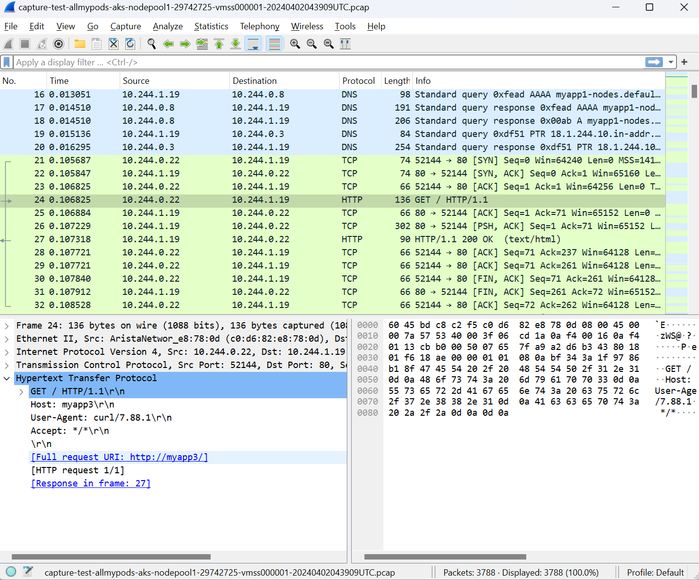

# Using Retina project for network observability in AKS
In this demo I will install Retina manually and connect it with Azure Grafana and Prometheus. Later you will be able to use fully managed Retina as part of AKS platform.

## Create AKS cluster
```bash
# Create Resource Group
az group create --name d-aks-retina --location swedencentral

# Create Azure Grafana
az grafana create -n tomaskubicagrafana -g d-aks-retina

# Create Azure Monitor workpace
az resource create -n tomaskubicamonitorworkspace -g d-aks-retina --namespace microsoft.monitor --resource-type accounts --location swedencentral --properties '{}'

# Create AKS cluster
az aks create -g d-aks-retina \
    -n d-aks-retina \
    -c 2 \
    -x \
    -s Standard_B4ms \
    --enable-azure-monitor-metrics \
    --grafana-resource-id  $(az resource show -n tomaskubicagrafana -g d-aks-retina --resource-type "microsoft.dashboard/grafana" --query id -o tsv) \
    --enable-network-observability \
    --azure-monitor-workspace-resource-id $(az resource show -n tomaskubicamonitorworkspace -g d-aks-retina --resource-type "Microsoft.Monitor/accounts" --query id -o tsv)

# Get AKS credentials
az aks get-credentials -g d-aks-retina -n d-aks-retina --overwrite-existing --admin
```

## Install Retina project on Linux PC
```bash
# Set the version to a specific version here or get latest version from GitHub API.
VERSION=$( curl -sL https://api.github.com/repos/microsoft/retina/releases/latest | jq -r .name)
helm upgrade --install retina oci://ghcr.io/microsoft/retina/charts/retina \
    --version $VERSION \
    --set image.tag=$VERSION \
    --set operator.tag=$VERSION \
    --set operator.enabled=true \
    --set operator.enableRetinaEndpoint=true \
    --set logLevel=info \
    --set enabledPlugin_linux="\[dropreason\,packetforward\,linuxutil\,dns\,packetparser\]" \
    --set enablePodLevel=true \
    --set enableAnnotations=true
```

## Test packet capture
```bash
# Install demo app
kubectl apply -f ./kubernetes/demo_apps.yaml

# Create storage account and container
az storage account create -n daksretinastorage123 -g d-aks-retina -l swedencentral --sku Standard_LRS
az storage container create -n retina-pcap --account-name daksretinastorage123

# Generate read/write container SAS token
end=`date -u -d "120 minutes" '+%Y-%m-%dT%H:%MZ'`
sas=`az storage container generate-sas --account-name daksretinastorage123 -n retina-pcap --https-only --permissions dlrw --expiry $end -o tsv`
container_url="https://daksretinastorage123.blob.core.windows.net/retina-pcap?$sas"

# Store blob URL with SAS as Secret
kubectl create secret generic blob-sas-url --from-literal=blob-upload-url=$container_url

# Start packet capture
kubectl apply -f ./kubernetes/packet_capture_pod.yaml
kubectl apply -f ./kubernetes/packet_capture_allmypods.yaml
```



## Check Pod network metrics in Grafana


