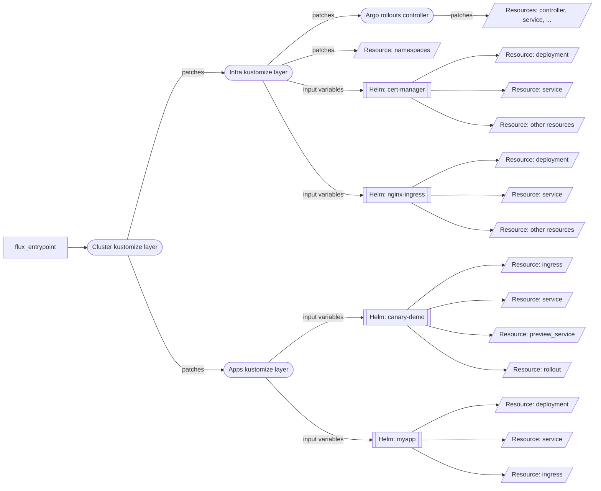

# AKS demo
To get credentials:

```bash
az aks get-credentials -n d-aks -g d-aks --overwrite-existing --admin
```

**GitOps demo**- change d-aks/kubernetes/charts/myapp/templates and increase number of replicas. Showcase it gets pulled by both AKS clusters.




**Argo Rollouts demo** - modify d-aks/charts/canary_demo/templates/canary-rollout.yaml image tag to different color (gree, blue, red). Showcase how:
- On ingress IP demo app is showing 5% of boxes with new color
- ArgoCD UI shows paused deployment
- Argo Rollouts UI shows 5% and waits for input
- Show Ingress configuration for canary
- In Argo Rollout UI advance deployment and see how new version is rolled out gradually
- Discus how metrics can be used to decide whether advance or rollback


