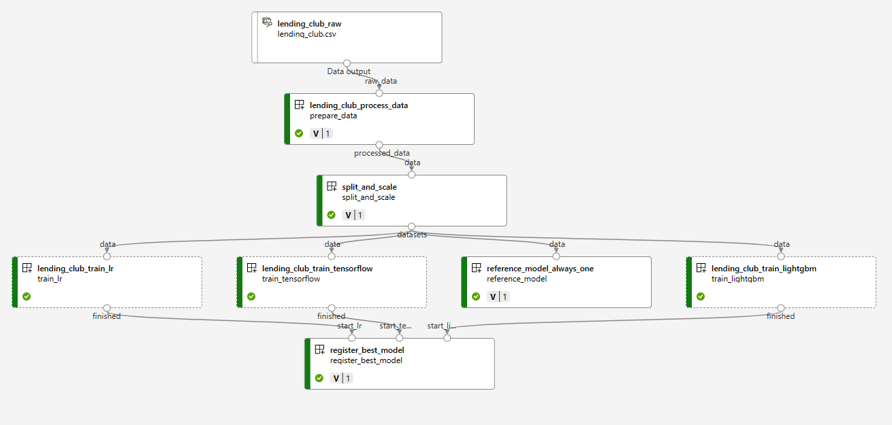

# Azure ML demo

This demo contains ML pipeline:
- CLI v2 is used
- Reusable components are used to process data, split data, train models
- Currently 3 models are implemented and some with hyperparameter tuning:
  - Reference model that always answer "one" on binary classification to set baseline for metrics such as accuracy
  - Classic sklearn Logistic Regression with hyperparameter tuning over solver
  - Tensorflow deep learning model 80-40-20-1 with various dropout rates tried via hyperparameter tuning
- After all runs best model is selected and registered in Azure ML
- Managed compute is used by default for training
- Template includes bring your own AKS cluster scenario - enabled it on input eg. by modifying default.auto.tfvars

## Deploy infrastructure

```bash
cd terraform
terraform init
terraform apply -auto-approve

export rg=$(terraform output -raw resource_group_name)
export aml=$(terraform output -raw azureml_workspace_name)
export aksid=$(terraform output -raw aksid)
export amlidentity=$(terraform output -raw amlidentity)
```

## Install or update Azure ML CLI

```bash
az extension add --upgrade -n ml
```

## Attach AKS to Azure ML workspace

```bash
az ml compute attach --name ml-aks \
    -g d-azurelm \
    --workspace-name $aml \
    --type Kubernetes  \
    --resource-id $aksid \
    --identity-type UserAssigned  \
    --namespace azureml \
    --user-assigned-identities $amlidentity
```

## Deploy Azure ML stuff

```bash
cd ..

# Register data
az ml data create -f data/lending_club_raw.yaml -g $rg -w $aml
az ml data create -f data/lending_club_mltable.yaml -g $rg -w $aml

# Create components
az ml component create -f components/lending_club_process_data/component.yaml -g $rg -w $aml
az ml component create -f components/split_and_scale/component.yaml -g $rg -w $aml
az ml component create -f components/lending_club_train_tensorflow/component.yaml -g $rg -w $aml
az ml component create -f components/lending_club_train_lr/component.yaml -g $rg -w $aml
az ml component create -f components/lending_club_train_lightgbm/component.yaml -g $rg -w $aml
az ml component create -f components/reference_model_always_one/component.yaml -g $rg -w $aml
az ml component create -f components/register_best_model/component.yaml -g $rg -w $aml

# Create pipeline
az ml job create -f pipelines/lending_club_pipeline.yaml -g $rg -w $aml
```

# Destroy infrastructure

```bash
cd terraform
terraform destroy -auto-approve
```

# Additional notes
local_dev folder contains notebooks that I used to develop and test code for components in pipeline before using it in Azure ML.

Here is resulting pipeline visualization.

