# Disastery Recovery options for Azure regions with small or no pair region
While active replication strategies typically allow for selection of any region, they are often more expensive (while providing lower RTO, RPO and better guarantees). Cheaper backup storage based techniques might rely on GRS storage feature that has predefined paired regions. In case of Germany West Central or Sweden Central paired regions are comparably smaller and less featured. Common questions is - if I use GWC or SC region, can I DR to unpaired fully featured region? If so what is price impact? Do I have to use only active replication, is storage based backup restore ruled out? In this demo I am going to showcase various scenarios that will answer this question.

In this demo I am using following regions:
- Germany West Central - big region with small DR-only paired region (similar situation is with Sweden Central)
- Germany North - restricted access DR region for Germany West Central (by default you do not have access to it, contact support to get there)
- Sweden Central - my second region and main DR target

Scenarios include three options:
- DR from GWC to GN (limited set of features and capacity)
- DR from GWC to SC via DR storage in GN (cross-region restore - usually better price, worse RTO)
- DR from GWC to SC using direct replication (better RTO, higher price)

In general:
- Passive storage-based DR is often dependent on GRS storage feature. This make it not available on unpaired regions such as Poland Central or Italy North or replication goes to smaller DR-focused region like Germany North or Sweden South.
- For some backup and restore services cross-region restore is supported (eg. when GWC fails you can restore from GN to Sweden Central), but not for all.
- Passive storage-based DR for databases does not guarantee free capacity in target region. Especially with small DR pair regions such as Germany North or Sweden South there is high chance of capacity issues in case of disaster in main paired region.
- Active replication is often the best option as it provides lower RPO and RTO and capacity guarantee, but it is typically more expensive (usually double the cost). Note however that in some cases replica can be used for reads (eg. ingestion to data lake for analytical processing or PowerBI access to ad-hoc reporting) so resource utilization on primary system can be reduced (therefore potentially reducing costs).
- For VMs using Azure Backup, Azure Site Recovery or 3rd party tools resources in target region are typically not locked. In order to have predictable RTO for critical workloads make sure your minimum capacity needs are guaranteed using On-demand Capacity Reservations (pre-purchase and lock resources in target region).

| Service | Scenario | RPO | RTO | Price example | Description |
|---------|----------|-----|-----|---------------|-------------|
| **Storage account** | | | | | |
| | DR from GWC to GN | <15 min | <1h | 70 USD (RA-GZRS 1TB) | Standard native geo-replication, works for Blobs, Files, Queues and Tables. Read Accessible option you do not need to wait for failover if you are concerned mostly about reads, not writes (eg. for content such as MP4 movies that you mostly read, but do not need to create during disaster, you can just reconfigure your app to read from secondary endpoint and RTO is theoretically close to 0) |
| | DR from GWC to SC | <15 min | 0s | 47 USD (22 USD ZRS GWC + 25 USD LRS GN) | Object replication - just for blobs! For something like Files you need to solve replication yourself. Both are write-enabled so there is theoretically 0 RTO (switch endpoint in application, but be aware of replication lag and potential conflicts with updates) |
| **Azure SQL DB** | | | | | |
| | DR from GWC to GN | <1h | <12h | 540 USD (GP 2core) | Standard native geo-restore, but capacity issues are likely in GN if GWC goes down. RTO heavily depends on DB size and can vary from minutes to hours. |
| | DR from GWC to SC | <1h | <12h | 540 USD (GP 2core) | Standard cross-region geo-restore, same RPO, potentially longer RTO due to cross-region transfer. RTO heavily depends on DB size and can vary from minutes to hours. |
| | Active replication from GWC to SC | <15s | <1m | 1160 USD (GP 2core) | Active geo-replication, best RPO, best RTO, higher price, allocated capacity |
| **Azure DB for PostgreSQL** | | | | | |
| | DR from GWC to GN | <1h | <12h | 155 USD (GP 2core) | Standard native geo-restore, but capacity issues are likely in GN if GWC goes down. RTO heavily depends on DB size and can vary from minutes to hours. |
| | DR from GWC to SC | NA | NA | NA | Not supported |
| | Active replication from GWC to SC | <1h | <12h | 290 USD (GP 2core) | Active geo-replication, best RPO, best RTO, higher price, allocated capacity |
| **Virtual Machines** | | | | | |
| | Backup and restore from GWC to GN | 16h | 1h | 25 USD (1 VM 128 GB disk) | Azure Backup supports 4h RPO, but only with snapshots which are not geo-redundant and transfer to GRS vault cat take up to 12h. RTO depends on disks sizes and for small VMs it will be around 30 minutes, for 1 TB VMs about 70 minutes. |
| | Backup and restore from GWC to SC | 16h | 4h | 28 USD (1 VM 128 GB disk) | Azure Backup supports 4h RPO, but only with snapshots which are not geo-redundant and transfer to GRS vault cat take up to 12h. RTO depends on disks sizes and requires manual steps: recover VM disk in GC, move disk to SC, create VM from this disk so while RTO of single item can be 2h with no problems, doing this for 100s of VMs might take much longer if not well automated. |
| | VM storage replication from GWC to SC | 5m | 10m (2h SLA) | 40 USD (1 VM 128 GB disk SSD Standard) | Azure Site Recovery allows to tradeoff RPO with RTO (eg. taking latest unprocessed restore point give lowest possible RPO, but takes longer to process while taking latest processed restore point gives better RTO, but might not be latest point). Make sure to lock capacity for mission critical workloads with On-demand Capacity Reservation. |

## Deployment
All scenarios are prepared as Infrastructure as Code so you can easily deploy them. You need to have Terraform installed and configured to use Azure. Than you can deploy using following commands:

```bash
cd terraform
terraform init
terraform apply
```

This will deploy all scenarios. If you are interested only in certain services or in indirect or direct scenarios, you can tweek demo.auto.tfvars accordingly.


## Blob storage
Storage Accounts come with built-in geo-replication support, but only to paired region. For Blobs (subset of storage account functionality) we are testing here GRS and alternative object replication.

### DR from GWC to GN
For pair region we can leverage GRS or RZRS or RA versions of it (those are providing secondary endpoints that can be used for reads without failing over). In order to failover write region you can initiate failover yourself or Microsoft will do this automatically if main region is down for long time. Note - there is replication lag so non-zero RPO. Microsoft will always prefer not loosing customer data, so will trade RTO for RPO (if primary region is recoverable in reasonable timeframe it will rather wait to fix it than initiate failover and loose some data). Microsoft cannot understand what data you have, but for you, it might make more sense to get application running even you are risking few recent files are lost (you prefer RTO over RPO) so you might want to initiate failover youself.

To initiate failover go to storage account and select failover.

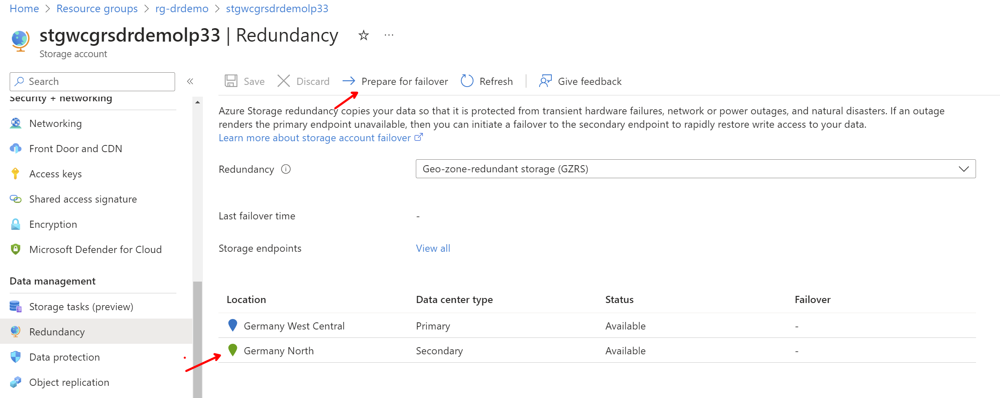

### DR from GWC to SC
GWC and SC and not paired regions so GRS/GZRS cannot be used. For queues, tables or File Shares you will have to use some other techniques to synchronize data between regions. Two obvious approaches are:
- Use some trigger-based replication, eg. using Azure Functions or Logic Apps to copy data between regions
- Write to both regions fro your application (application-aware scenario - write to both queues)

For Blob Storage you can leverage Object Replication features. Terraform has configured this for you and put some example files in it. You can test it by storing object in gwc zrs storage account and it will appear in sc lrs storage account. Typical lag is just few seconds.

Note that secondary account is fully active for both reads and writes so you can achieve 0 RTO, but be aware of potential consistency issues and conflicts if you switch over writes. Prefer append-only architectures as modifications might get lost due to replication lag.


## Azure SQL DB
Azure SQL supports standard backup solution that is primary targeting preventing data loss do to errors, corruptions or ransomware attacks. Nevertheless due to cross-region restore capability together with underlying  GRS storage it can be used as cheap DR solution where longer RTOs and no capacity guarantees are acceptable.

Active replication can be used to replicate data on database level so very low RPO and RTO can be achieved, but overall price is higher. This can be compensated by the fact, that replicas are read capable so PowerBI direct queries or DWH/datalake ingestions can be running from it so primary system can be offloaded and potentially smaller. As DB in secondary location is active there is reserved capacity which means very low and very predictable RTO.

### DR from GWC to GN or SC
In order to restore in you need to wait for geo-backup to be taken and transferred to secondary region. This can take up to 12 hours so RTO can be quite high. Got to Create Azure SQL DB and select you geo backup.

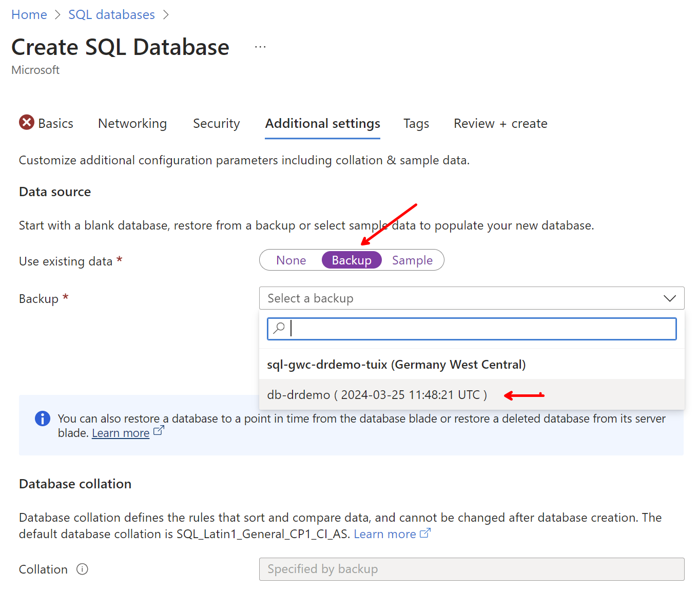

### Active replication from GWC to SC
To initiate failover to replica go to Azure SQL and select replicas and than failover (or forced failover if you are willing to loose some data - eg. in case of disaster).

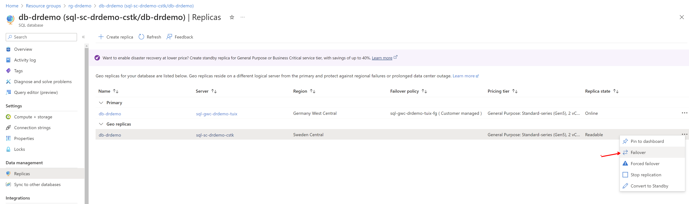

## Azure DB for PostgreSQL
Unlike with Azure SQL DB, Azure DB for PostgreSQL does not support cross-region restore to non-pair region so you need to use active replication for DR scenarios to unpaired region. This is more expensive, but provides better RPO and RTO and also capacity guarantee in target region. Replica can be used for reads so primary system can be offloaded and potentially smaller.

### DR from GWC to GN
You can restore to paired region, but be aware of potential capacity issues in case of disaster in main region and also smaller DR regions like Germany North might not have all services available.

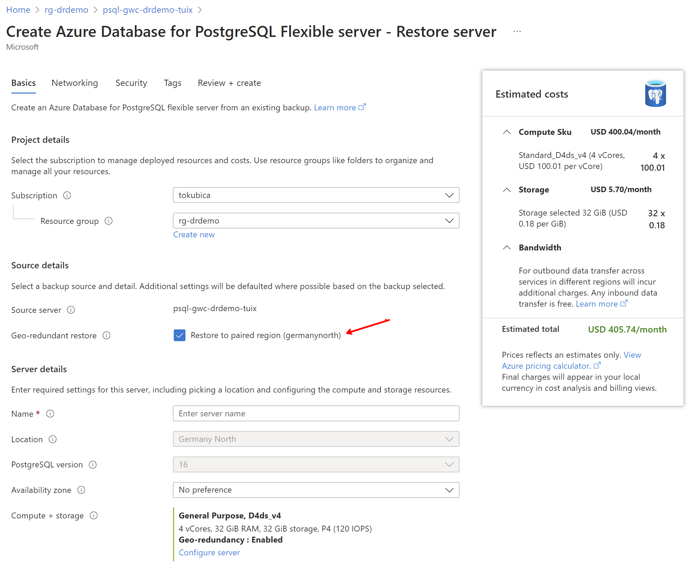

### Active replication from GWC to SC
To initiate failover to replica go to Azure DB for PostgreSQL and select replicas and promote.

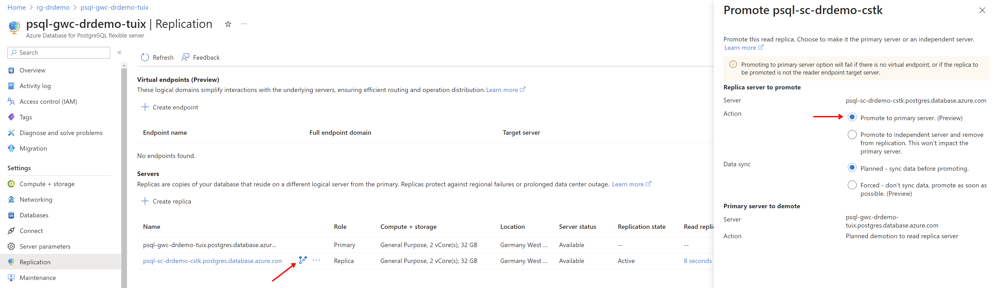

## Virtual Machines
After deployment wait up to 16 hours so your first backup is taken and transferred to secondary region. 

Backup and restore scenarios can be done with Azure Backup. It targets recovery of lost data due to errors, corruptions or ransomware attacks so it is not designed as cross-region DR solution. Nevertheless it can be used in such a way with some limitations, higher RPO and RTO so with single price you can be protected against both data loss and region loss.

VM replication solution with Azure Site Recovery is on other hand targeting specifically cross-AZ or cross-region DR scenarios. It can replicate data directly to your target region of choice and provide consistently lower RTO and RPO compared to Azure Backup and allows for RTO/RPO tradeoffs.This is proper solution for cross-region DR, but paid extra (so typically you want combination of Azure Backup to protect against data loss on logical level and Azure Site Recovery to protect against region loss on physical level).

### Backup and restore to pair region (Germany North)
If you have access to Germany North you can recover your VMs there. You need quota to be unlocked there and also in case of disaster in main region, there might be capacity issues in small pair region (make sure to purchase and lock capacity with On-demand Capacity Reservations for critical workloads). Note recovery from snapshot, which is much faster (lower RTO), is not available for cross-region restore (only backups from vault).

Start restore.

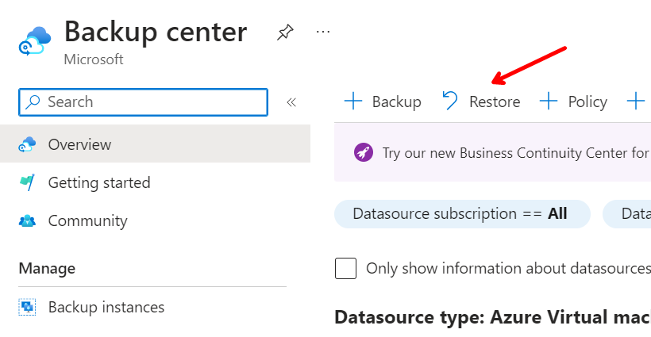

Restore to secondary region.

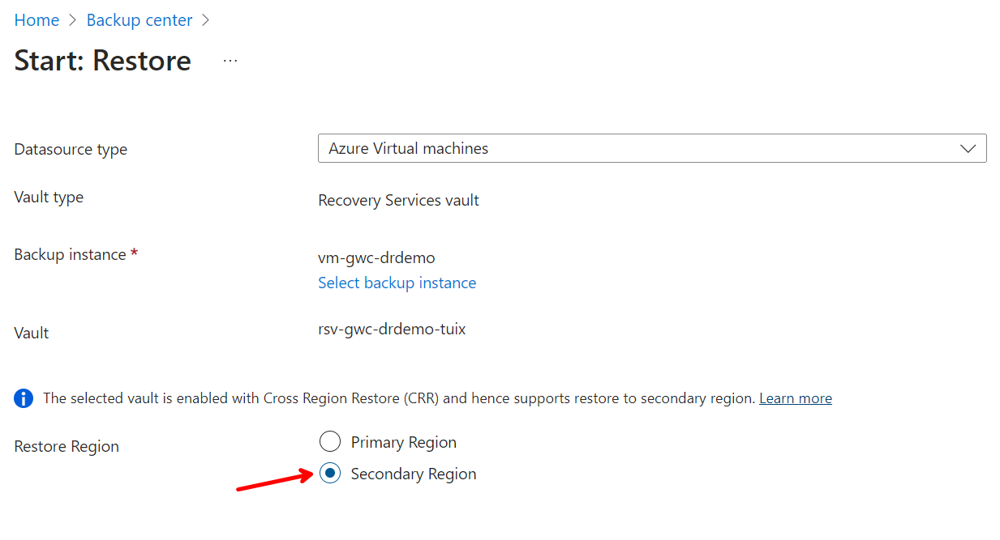

Select backup in Germany North. Note there are no snapshots here (fast RTO from snapshot is available only in primary region) and there might be up to 12 hours delay for backups be visible here.

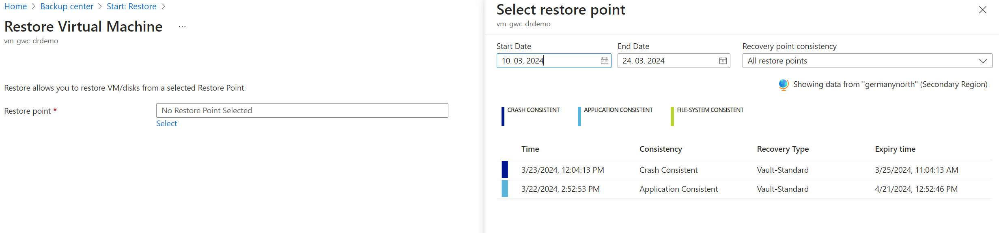

Select option to restore as new VM.

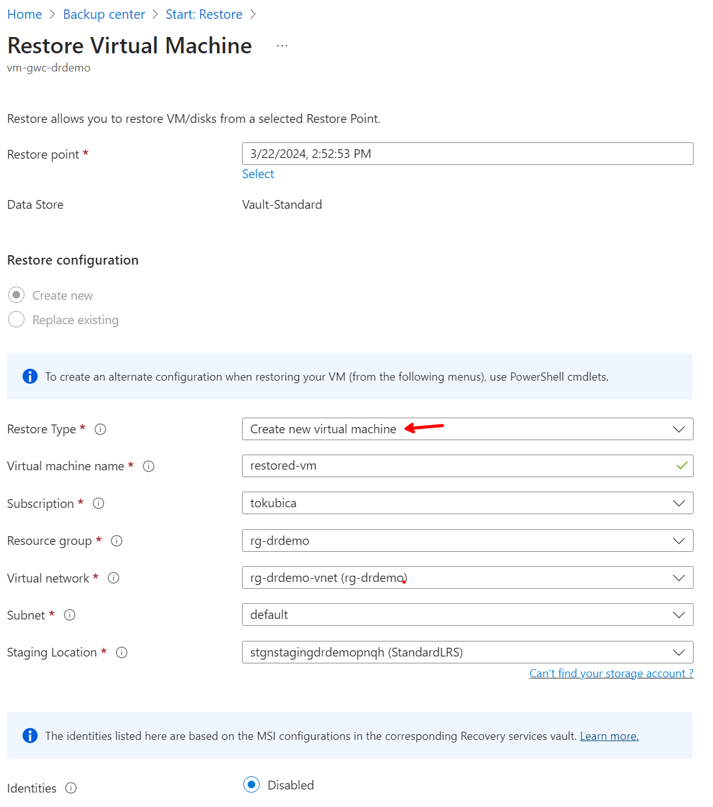


### Backup and restore to target region (Sweden Central)
In this scenario we need to recover storage to German North first and then copy it to Sweden Central. From there we can create VM. For this we do not need any compute capacity in Germany North, but whole proces is slower (worse RTO) and more expensive (inter-region traffic).

Start restore.


Restore to secondary region.


Select backup in Germany North. Note there are no snapshots here (fast RTO from snapshot is available only in primary region) and there might be up to 12 hours delay for backups be visible here.


Now restore only disks.

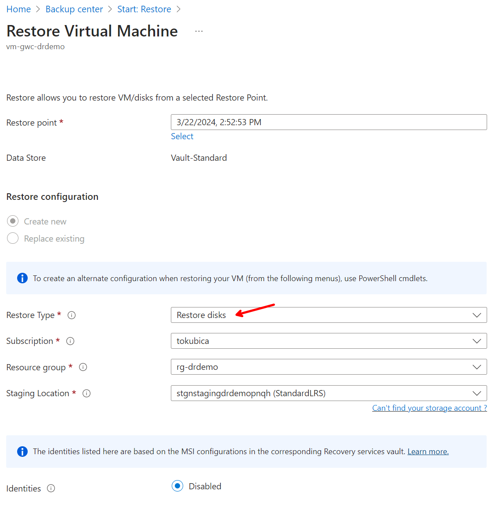

Job get's started.

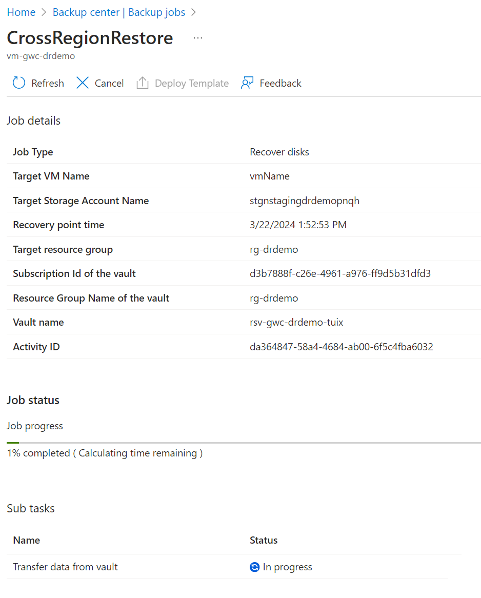

Now we have disk in Germany North.

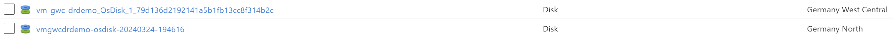

To copy disk to Sweden Central we cannot currently use Azure Portal, but for graphical experience install [Azure Storage Explorer](https://azure.microsoft.com/en-us/features/storage-explorer/) or use CLI:

```bash
sourceDiskName=vmgwcdrdemo-osdisk-20240324-194616
sourceRG=rg-drdemo
targetDiskName=vmgwcdrdemo-restore
targetRG=rg-drdemo
targetLocation=swedencentral
targetOS=Windows

sourceDiskSizeBytes=$(az disk show -g $sourceRG -n $sourceDiskName --query '[diskSizeBytes]' -o tsv)
az disk create -g $targetRG -n $targetDiskName -l $targetLocation --os-type $targetOS --upload-type Upload --upload-size-bytes $(($sourceDiskSizeBytes+512)) --sku standard_lrs --zone 1
targetSASURI=$(az disk grant-access -n $targetDiskName -g $targetRG  --access-level Write --duration-in-seconds 86400 --query [accessSas] -o tsv)
sourceSASURI=$(az disk grant-access -n $sourceDiskName -g $sourceRG --duration-in-seconds 86400 --query [accessSas] -o tsv)

azcopy copy $sourceSASURI $targetSASURI --blob-type PageBlob

az disk revoke-access -n $sourceDiskName -g $sourceRG
az disk revoke-access -n $targetDiskName -g $targetRG
```

No we have disk in target region and can create VM from it.

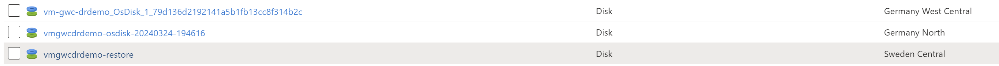

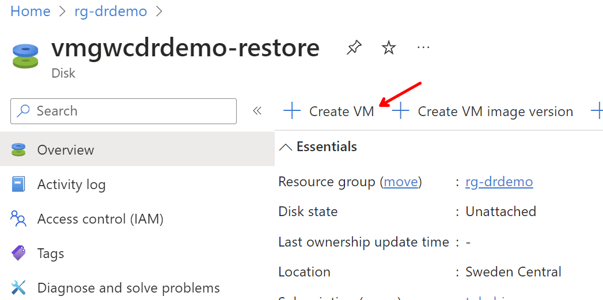

### VM storage replication from GWC to SC
Source VM with Azure Site Recovery replication is deployed as part of Infrastructure as Code. While RTO and RPO is significantly lower compared to Azure Backup, capacity is also not guaranteed. Nevertheless as this is not paired region it is likely not all users from GWC will try to deploy to SC so there is good chance of getting enough resources. But for mission critical workloads you might want to purchase and lock capacity with On-demand Capacity Reservations anyway.