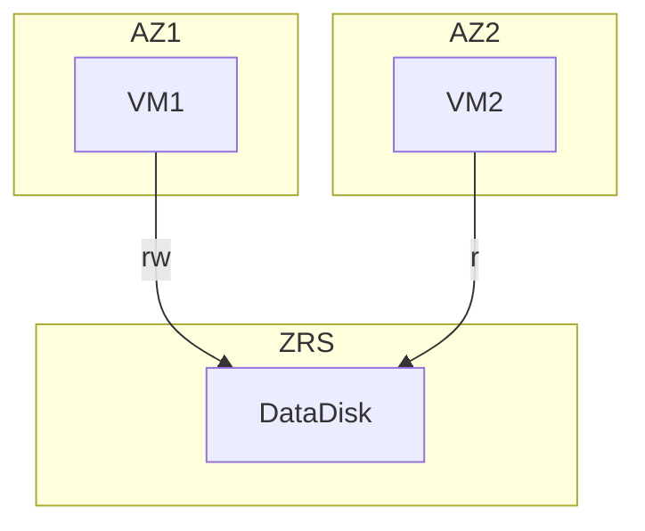

demo / cluster fs, pacemaker

```mermaid
graph TD;

    subgraph AZ1
        VM1
    end
    subgraph AZ2
        VM2
    end

    subgraph ZRS
        DataDisk
    end

    VM1 --rw--> DataDisk
    VM2 --r--> DataDisk
```
