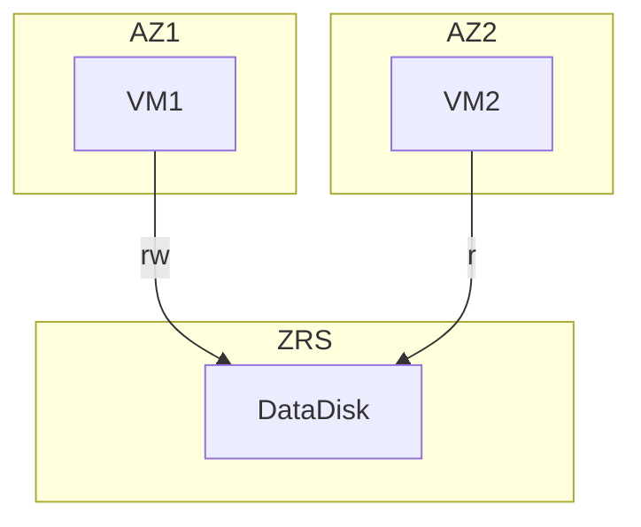

# Demo using shared disk ith gfs2 and pacemaker



## Provision infrastructure

```bash
cd terraform
terraform init
terraform apply -auto-approve
```

## Connect to VMs via console
```bash
az serial-console connect -g d-storage-disk-shared -n vm1
az serial-console connect -g d-storage-disk-shared -n vm2
```

## Manual test using sdd device and sg_persist commands
```bash
# on FIRST node

# Make registration and reservation
sudo sg_persist /dev/sdd  # No reservation keys exist
sudo sg_persist --out --register --param-sark=abc123 /dev/sdd  # Register key abc123
sudo sg_persist --out --reserve --param-rk=abc123 --prout-type=7 /dev/sdd  # Reserve disk for writing
sudo sg_persist -r /dev/sdd  # Check reservation

# Create partition, file system, mount and write data
sudo fdisk /dev/sdd <<EOF
n
p
1
1


w
EOF
sudo mkfs.ext4 /dev/sdd1
sudo mkdir /shareddisk
sudo mount /dev/sdd1 /shareddisk
sudo touch /shareddisk/z1.txt

# On SECOND node
sudo sg_persist /dev/sdd 
sudo sg_persist -r /dev/sdd  # Resource is reserved
sudo sg_persist --out --reserve --param-rk=abc123 --prout-type=7 /dev/sdd  # FAIL, write access is reserved for z1

# Try to mount and read
sudo mkdir /shareddisk
sudo mount -o ro /dev/sdd1 /shareddisk   # FAIL, z2 is not registered

# Make SCSI registration
sudo sg_persist --out --register --param-sark=abc123 /dev/sdd  # Register key abc123

# Try to mount again and rad
sudo mount -o ro /dev/sdd1 /shareddisk   # SUCCESS
sudo ls /shareddisk   # read works

# Remount as read/write and try to write
sudo umount /shareddisk
sudo mount /dev/sdd1 /shareddisk
sudo touch /shareddisk/z2.txt   # Write will eventually fail

# Unmount
sudo umount /shareddisk

# On FIRST node
sudo ls /shareddisk    # no z2.txt, SECOND node was not able to write

# Release write lock
sudo sg_persist --out --release --param-rk=abc123 --prout-type=7 /dev/sdd
sudo sg_persist -r /dev/sdd  # Check reservation

# On SECOND node
sudo sg_persist --out --reserve --param-rk=abc123 --prout-type=7 /dev/sdd  # Reserve disk for writing

# Mount
sudo mount /dev/sdd1 /shareddisk
sudo touch /shareddisk/z2-B.txt   # SUCCESS
ls /shareddisk   # z2-B.txt is there, z2.txt is not
```

## Clustering with pacemaker and gfs2 on sdc device

```bash
# On each node
sudo -i

## Install packages
yum -y install epel-release
yum -y install pacemaker pcs fence-agents-scsi corosync watchdog gfs2-utils.x86_64 lvm2-cluster.x86_64

## Prepare for pacemaker
cp /usr/share/cluster/fence_scsi_check /etc/watchdog.d/
systemctl enable watchdog
systemctl enable pcsd
systemctl enable corosync
systemctl enable pacemaker
systemctl start watchdog
systemctl start pcsd
echo Azure12345678! | passwd --stdin hacluster

# Cluster

## Create cluster and start
pcs cluster auth vm1 vm2 -u hacluster -p Azure12345678!
pcs cluster setup --name mycluster vm1 vm2
pcs cluster start --all
pcs cluster enable --all
pcs property set stonith-enabled=true
pcs property set no-quorum-policy=freeze

## Create SCSI PR fencing
pcs stonith create scsi fence_scsi pcmk_host_list="vm1 vm2" devices="/dev/sdc" meta provides="unfencing"

## Create distributed lock for gfs2
pcs resource create dlm ocf:pacemaker:controld op monitor interval=30s on-fail=fence clone interleave=true ordered=true

# Run on ALL nodes
/sbin/lvmconf --enable-cluster

# Run on SINGLE node
pcs resource create clvmd ocf:heartbeat:clvm op monitor interval=30s on-fail=fence clone interleave=true ordered=true
pcs constraint order start dlm-clone then clvmd-clone
pcs constraint colocation add clvmd-clone with dlm-clone

sudo sg_persist /dev/sdc
sudo sg_persist -r /dev/sdc

pvcreate /dev/sdc
vgcreate -Ay -cy --shared clustervg /dev/sdc 
lvcreate -L8G -n clusterlv clustervg

mkfs.gfs2 -j2 -p lock_dlm -t mycluster:sharedFS /dev/clustervg/clusterlv 

# Run on ALL nodes
mkdir /clusterfs

# Run on SINGLE node
pcs resource create clusterfs Filesystem device="/dev/clustervg/clusterlv" directory="/clusterfs" fstype="gfs2" options="noatime" op monitor interval=10s on-fail=fence clone interleave=true

pcs constraint order start clvmd-clone then clusterfs-clone
pcs constraint colocation add clusterfs-clone with clvmd-clone


## Check STONITH and SCSI PRs
pcs stonith show scsi
stonith_admin -L

sg_persist -n -i -k -d /dev/sdc   # Should see two registrations
sg_persist -s /dev/sdc  

## Restart cluster
pcs cluster stop --all
pcs cluster start --all

```


