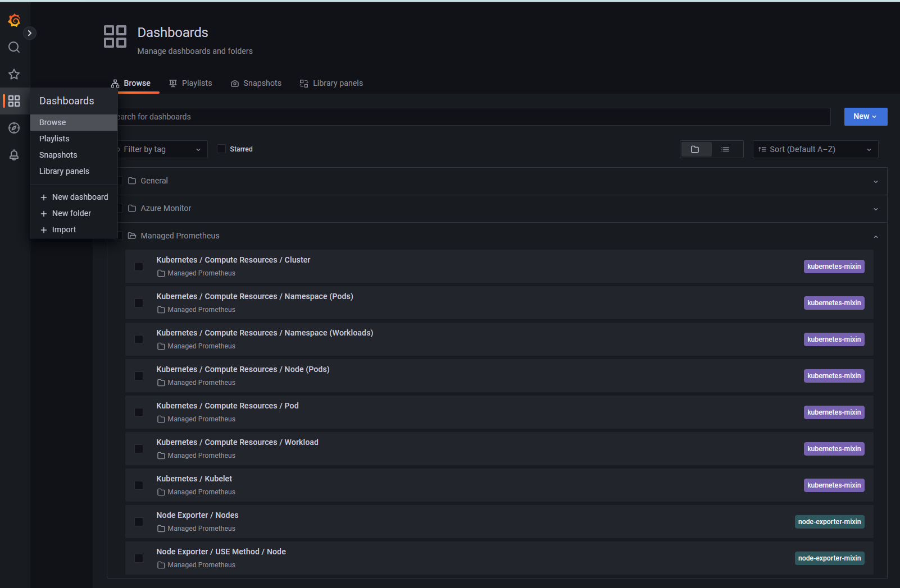
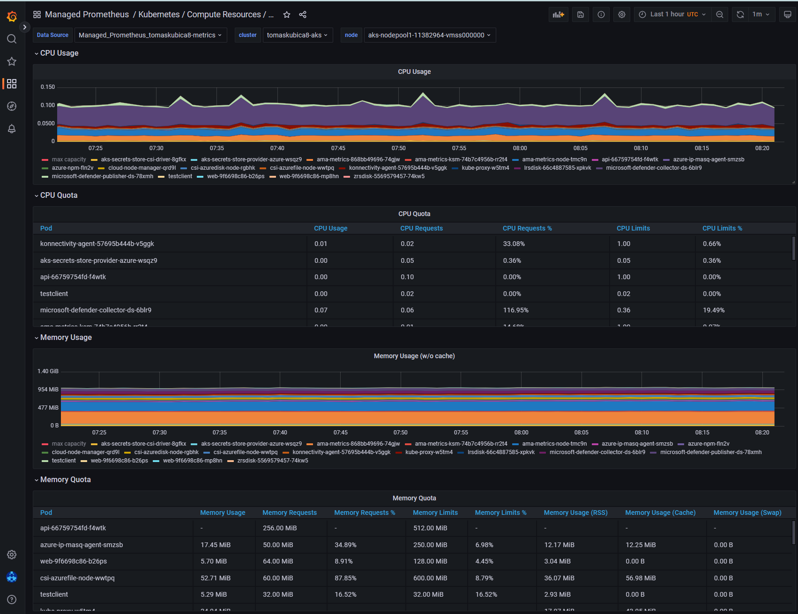
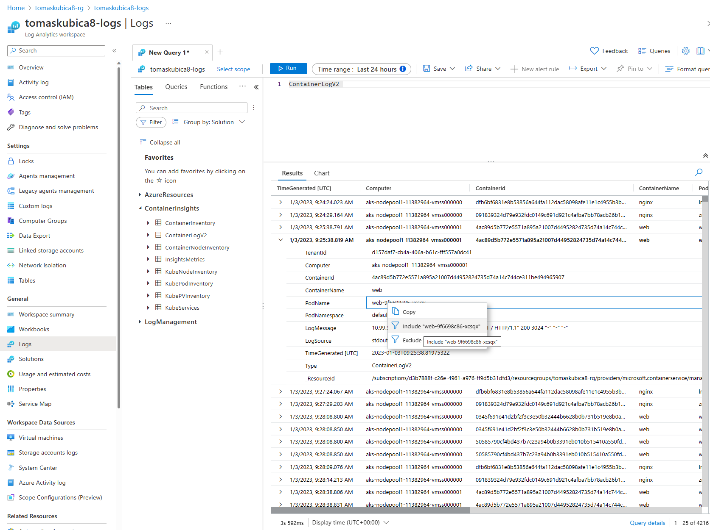
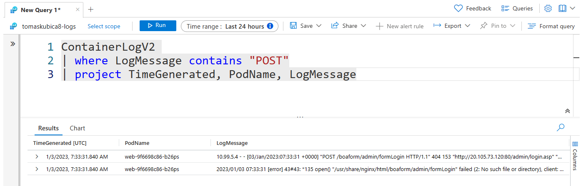
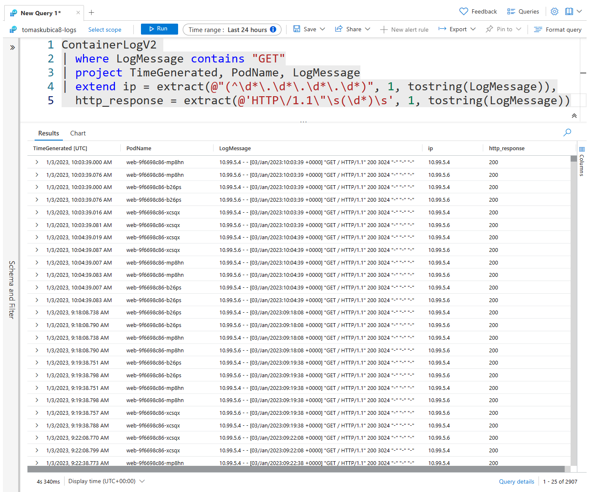
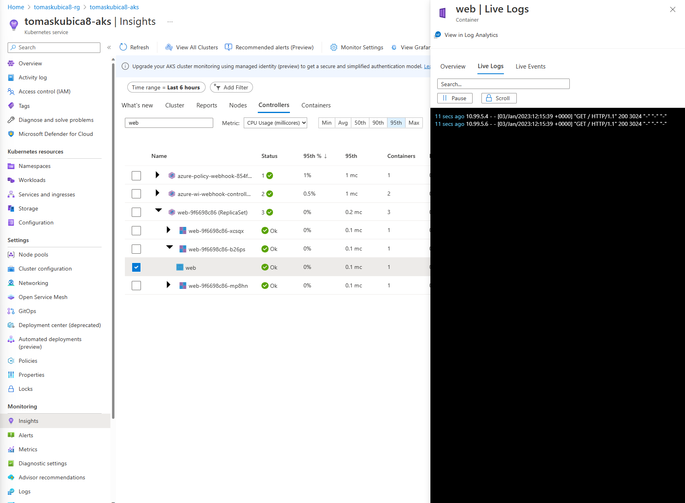
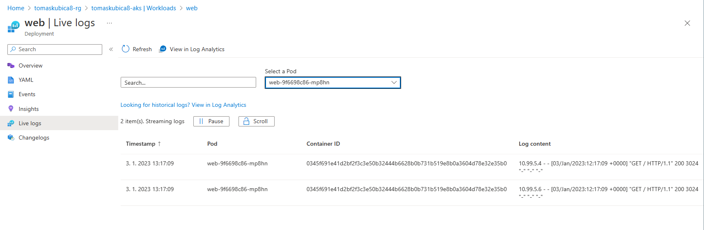

# Lab 9 - Monitoring
In this lab we will enable basic monitoring using open source tool for metrics with Azure managed services (Azure Managed Grafana anf Azure Monitor for Prometheus) and also try built-in Azure Container Insights for logging and Azure-centric UI.

## Metrics using Azure Managed Grafana and Azure Monitor for Prometheus
Create workspace for metrics and for logs

```bash
az resource create -g $prefix-rg -n $prefix-metrics --namespace microsoft.monitor --resource-type accounts -l northeurope -p {}
```

Create Azure Managed Grafana

```bash
az grafana create -g $prefix-rg -n $prefix-grafana -l westeurope    # Do not change for northeurope, not available there yet in preview
```

Enable Prometheus metrics collection on AKS cluster

```bash
# In Bash
az aks update --enable-azuremonitormetrics \
    -n $prefix-aks \
    -g $prefix-rg \
    --azure-monitor-workspace-resource-id $(az resource show -g $prefix-rg -n $prefix-metrics --namespace microsoft.monitor --resource-type accounts --query id -o tsv) \
    --grafana-resource-id  $(az grafana show -g $prefix-rg -n $prefix-grafana --query id -o tsv)

# In PowerShell
az aks update --enable-azuremonitormetrics `
    -n $prefix-aks `
    -g $prefix-rg `
    --azure-monitor-workspace-resource-id $(az resource show -g $prefix-rg -n $prefix-metrics --namespace microsoft.monitor --resource-type accounts --query id -o tsv) `
    --grafana-resource-id  $(az grafana show -g $prefix-rg -n $prefix-grafana --query id -o tsv)
```

Go to Azure portal to find URL to your managed Grafana instance and investigate available dashboards.






## Use Container Insights for logging and telemetry
As of Jan2023 this solution cannot be used just for logging and also captures metrics (something that we covered in previous section using Azure Managed Grafana) and currently cannot be disabled (this will change in near future). For saving costs of logging we will use Basic logs tier.

Create workspace for logs

```bash
az monitor log-analytics workspace create -g $prefix-rg -n $prefix-logs 
```

Enable logs collection on AKS cluster

```bash
# In Bash
kubectl apply -f logs-config.yaml  # Find this file in your resources/kubernetes folder in this repo

az aks enable-addons -a monitoring \
    -n $prefix-aks \
    -g $prefix-rg \
    --workspace-resource-id $(az monitor log-analytics workspace show -g $prefix-rg -n $prefix-logs --query id -o tsv)

# In PowerShell
kubectl apply -f logs-config.yaml  # Find this file in your resources/kubernetes folder in this repo

az aks enable-addons -a monitoring `
    -n $prefix-aks `
    -g $prefix-rg `
    --workspace-resource-id $(az monitor log-analytics workspace show -g $prefix-rg -n $prefix-logs --query id -o tsv)
```

Configure ContainerLogV2 table as Basic Logs (5x cheaper compared to default Analytics Logs with 7 days retention) and enable Archive tier for next 60 days.

```bash
az monitor log-analytics workspace table update -g $prefix-rg --workspace-name $prefix-logs -n ContainerLogV2 --plan Basic --total-retention-time 60
```

Check Logs in your Log Analytics workspace in ContainerLogV2 table. Note you can use right-click to help you build query.



You can also let query to bring you top results and then filter or group data on client side.


Queries allow you to full-text search messages.



Not in scope of todays workshop, but you can build more complex parsing queries such as this:

```
ContainerLogV2 
| where LogMessage contains "GET"
| project TimeGenerated, PodName, LogMessage
| extend ip = extract(@"(^\d*\.\d*\.\d*\.\d*)", 1, tostring(LogMessage)),
  http_response = extract(@'HTTP\/1.1\"\s(\d*)\s', 1, tostring(LogMessage))
```



You can also see live log stream - either in Insights section or if you do not use Azure Monitor you can still see running Pods and get log stream from Kubernetes resources UI in Azure Portal.





# Optional challenge - find failing Pods
Using Grafana or Azure Monitor to find failing Pods. Can you create alerting rule to notify you when Pods are failing?
