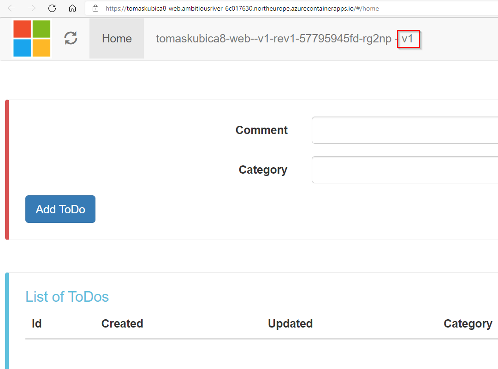
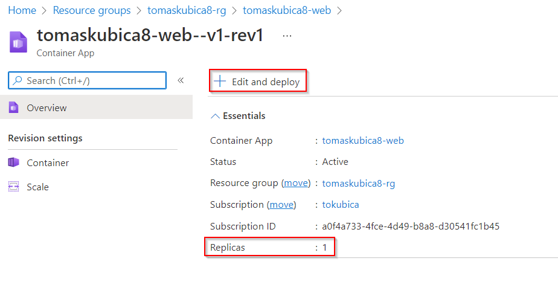
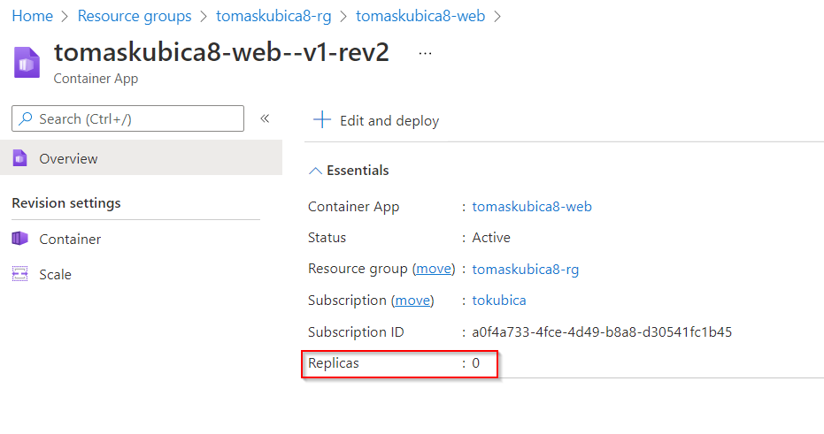
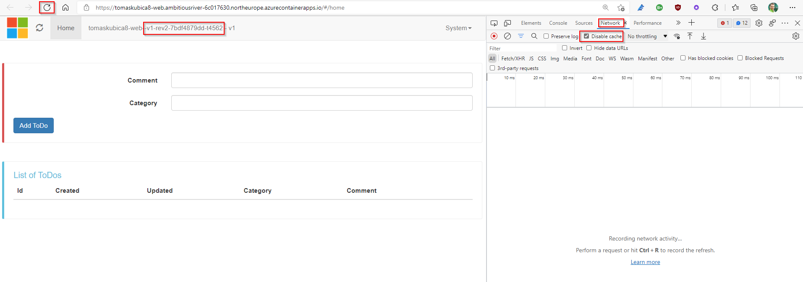
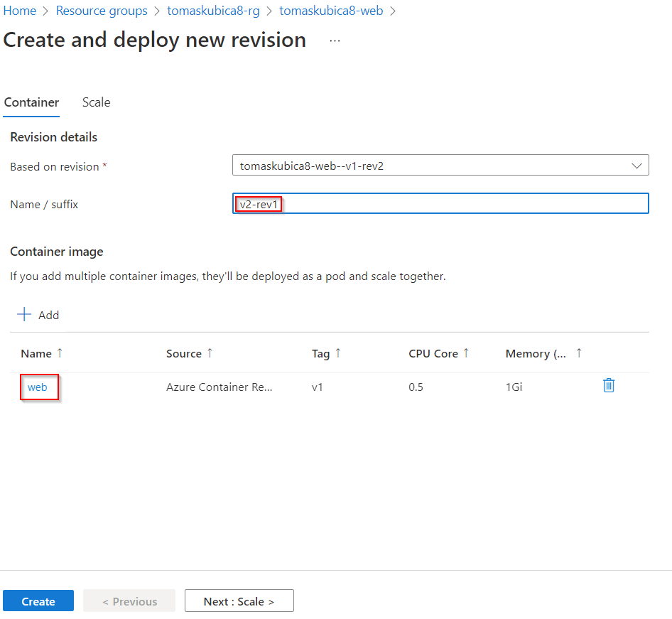
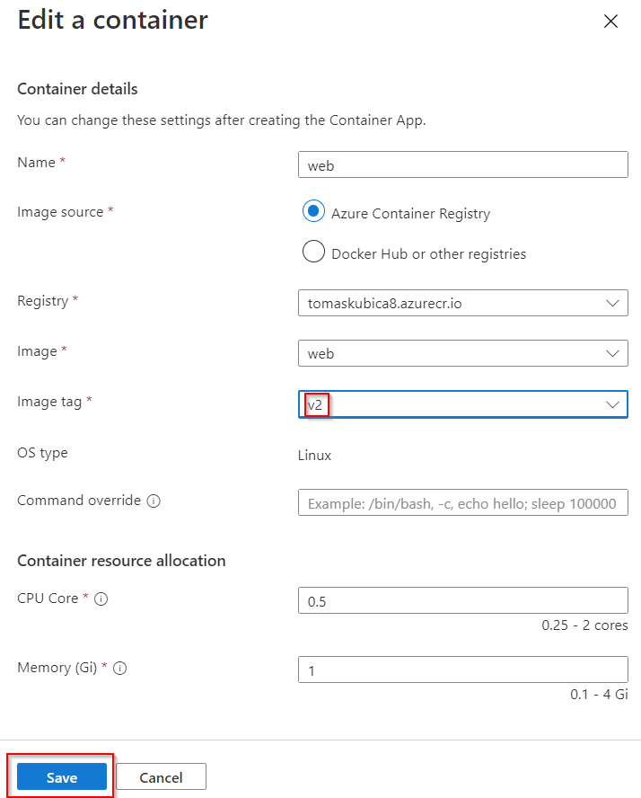
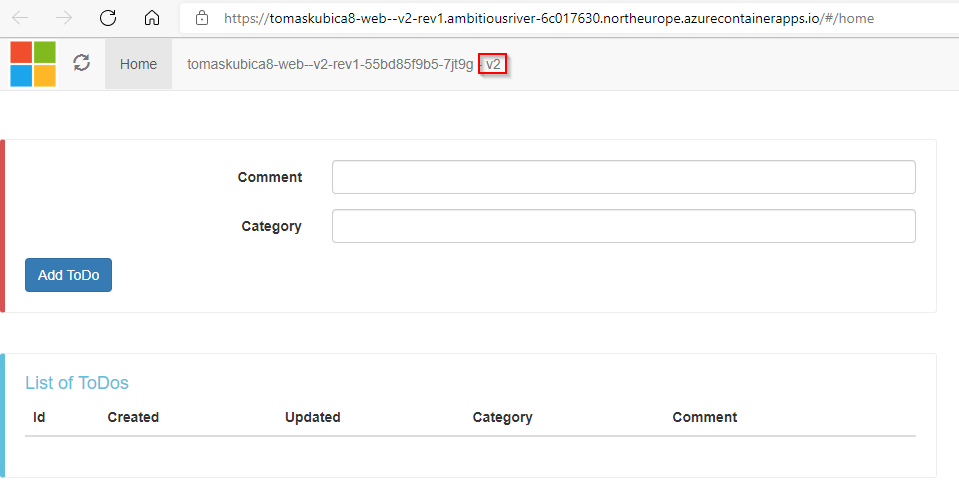
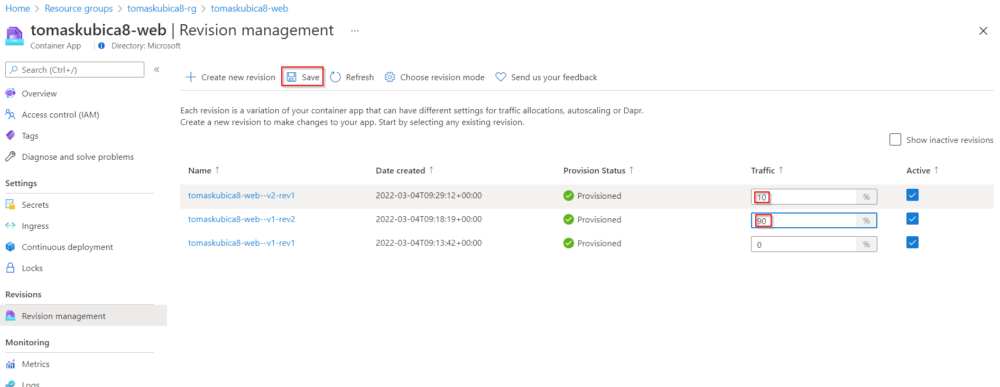
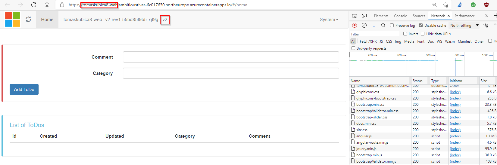
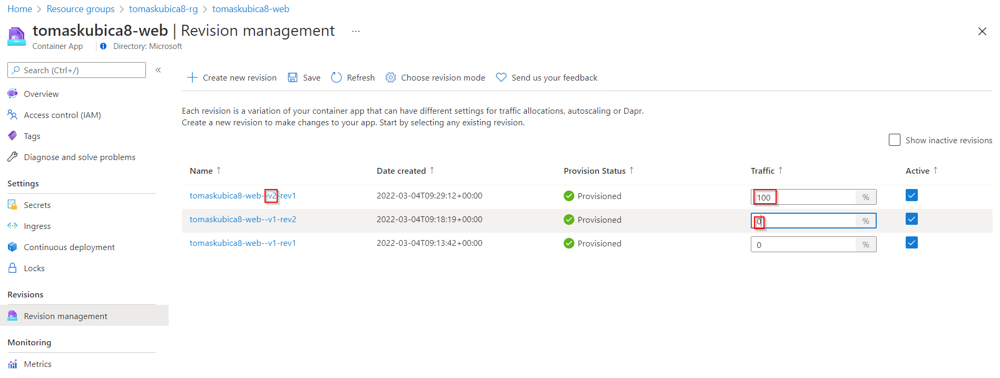

# Understand operational patterns using Azure Container Apps
In this chapter we will learn key patterns for running applications in modern containerized platform without going low level details of Kubernetes. Azure Container Apps is serverless Kubernetes-based platform that is using Kubernetes under covers providing simple way to get value from Kubernetes, KEDA, DAPR and other open source projects without need to actualy learn its details.

Instructor has already deplyed shared environment for our lab - **if you are not instructor, skip this step**.

```bash
cd resources/containerapp

# Deploy shared environment for participants
az group create -n shared-rg -l northeurope
az bicep build -f environment.bicep
az group deployment create -g shared-rg --template-file environment.json
```

If you use bash:

```bash
export prefix="tomaskubica8"
```

If you use powershell:

```powershell
$prefix="tomaskubica8"
```

```bash
cd resources/containerapp

# Deploy container (in bash)
az group deployment create -g $prefix-rg \
    --template-file main.json \
    --parameters prefix=$prefix envId=$(az deployment group show -n environment -g shared-rg --query properties.outputs.envId.value -o tsv)

# Deploy container (in powershell)
az group deployment create -g $prefix-rg `
    --template-file main.json `
    --parameters prefix=$prefix envId=$(az deployment group show -n environment -g shared-rg --query properties.outputs.envId.value -o tsv)
```

This will deploy Azure Container Apps environment and web component of our application - find it in Azure portal.


Click on applicatio URL - our app is running and there is reverse proxy in front of it including TLS certificate etc. Note app itself is not working yet (we have not created api and database - we will do this in later labs).



# Automatic scaling

We are now running single replica.



Let's now create new revision that would keep the same application version, but would scale differently.


We will scale from 0 to 4 replicas (when there is no traffic, app will scale to zero = no costs) based on number of HTTP requests (L7 metric). We will configure this to just one request per second (to easily demonstrate let's make number low).


You will se revision in Azure portal, but there is no traffic sent to it. Both revisions are running, but just older one receives user traffic. We will now switch users to newer revision. This is **green/blue deployment** in action - you do not modify existing envrionment, but you rather spin up new environment and then just switch users to it.


I have even waited few minutes without accessing application at all. It scaled to 0.



No we will initiate some traffic. In order to avoid caching by browser open Developer tools (usualy F12 or CTRL+SHIFT+i) and i network tab disable cache. Hit refresh button multiple times quickly. You should shortly see responses comming from different instances. We have turned app on and also scaled it to more replicas to keep with user demand.



You will se more replicas in your revision.


# Releasing new application version
Let's create new revision.


Name it v2-rev1 and click on container image - we want to modify it.



Point this revision to newer code - container image with tag v2. Save, create.



When accessing your application you can still see just v1. This is expected - we want to create infrastructure for v2, but not server it to users just yet.


Go to v2-rev


You see URL here. Our revision with v2 code is running and we can see it without actually making it visible to your users. This technique is called **A/B testing** as you can run and test newer versions of your application without affecting users.


Here you go - this is v2 application.



With green/blue deployment we could now switch users to v2 after we have tested it. But what about release v2 only to 10% of our users? We could monitor response times, exceptions, user support calls to see whether there are any problems. If not, we can slowly add more users to v2 -> 20%, 30%, 40% and when we are confident new version has not caused issues to our user base make full release (100% to v2). This technique is called **canary release**.



On main application URL hit refresh mutliple times. There is 10% chance you will get v2.



Once we are confident, we can switch to v2 completely.



Later on (especially if we cannot use scale to zero due to warmup latency) we might want to deactivate older revisions - turn them off so there is no cost associated.


We have demonstrated key patterns when working with containers in Azure Container Apps. Now delete your app as in next lab we will create complete solution with Bicep template.