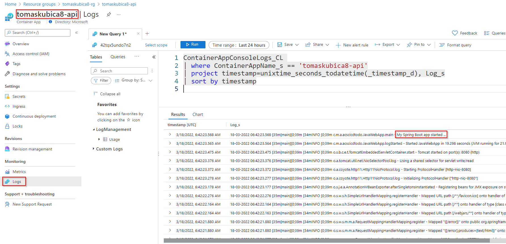

# Deploy complete TODO application and infrastucture with Bicep
In this lab we use our web application together with its API component, database as service and expose this app via Azure Front Door to work as Web Application Firewall, DDoS protection and caching (CDN).

For simplicity we will use single Bicep file without modules. You will build you own solution based on snippets in this guide, but for your reference complete solution is also available in resources/todo folder.

Install ms-azuretools.vscode-bicep extension in your Visual Studio Code to make editor smart.

## Web component

Create new file main.bicep a place following content to it:

```
param prefix string
param envId string

var location = resourceGroup().location

// Get reference to existing registry
resource registry 'Microsoft.ContainerRegistry/registries@2021-09-01' existing = {
  name: prefix
}

// Web component
resource web 'Microsoft.App/containerApps@2022-01-01-preview' = {
  name: '${prefix}-web'
  kind: 'containerapp'
  location: location
  properties: {
    managedEnvironmentId: envId
    configuration: {
      secrets: [
        {
          name: 'container-registry-password'
          value: registry.listCredentials().passwords[0].value
        }
      ]      
      registries: [
        {
          server: '${prefix}.azurecr.io'
          username: registry.listCredentials().username
          passwordSecretRef: 'container-registry-password'
        }
      ]
      ingress: {
        external: true
        targetPort: 8080
      }
    }
    template: {
      containers: [
        {
          image: '${prefix}.azurecr.io/web:v1'
          name: 'web'
        }
      ]
      scale: {
        minReplicas: 1
        maxReplicas: 1
      }
    }
  }
}
```

Note we have used 2 input parameters - prefix (as in our previous lab) and envId (which points to our shared envId). Specifying those directly in CLI is not good practice - we should store complete information about deployed state so parameters should be stored in separate file (typicaly different files per environment as we target single template deployable to multiple environments). Create file yourprefix.parameters.json (in my case tomaskubica8.parameters.json) and modify values there - into envId enter output of command az deployment group show -n environment -g shared-rg --query properties.outputs.envId.value -o tsv

```json
{
    "$schema": "https://schema.management.azure.com/schemas/2019-04-01/deploymentParameters.json#",
    "contentVersion": "1.0.0.0",
    "parameters": {
        "prefix": {
            "value": "placeYourPrefixHere"
        },
        "envId": {
            "value": "placeOutEnvIdHere"
        }
    }
}
```

We can now compile Bicep into ARM template and deploy it to Azure.

```bash
az bicep build -f main.bicep
az deployment group create -g $prefix-rg --template-file main.json --parameters $prefix.parameters.json
```

## Database
For our API component we need PostgreSQL database. We will use platform service in Azure and deploy it using Bicep. For simplicity we will use password with our database, so we will provide it as parameter. As we should never store plaintext passwords in any files we should not add it to our parameters file, but rather create Azure Key Vault, store it there and just reference it during deployment.

```bash
az keyvault create -n $prefix-kv -g $prefix-rg --enabled-for-template-deployment true
az keyvault secret set --vault-name $prefix-kv -n mypassword --value "Azure12345678"
```

Now make password secure parametr in our Bicep - add this to our param section.

```
@secure()
param password string
```

Now in your parameters file (eg. tomaskubica8.parameters.json) you can reference value from your vault (you can get key vault id with command az keyvault show -n $prefix-kv -g $prefix-rg --query id -o tsv):

```json
{
    "$schema": "https://schema.management.azure.com/schemas/2019-04-01/deploymentParameters.json#",
    "contentVersion": "1.0.0.0",
    "parameters": {
        "prefix": {
            "value": "placeYourPrefixHere"
        },
        "envId": {
            "value": "placeOutEnvIdHere"
        },
        "password": {
            "reference": {
                "keyVault": {
                  "id": "yourKeyVaultId"
                },
                "secretName": "mypassword"
              }
        }
    }
}
```

Now as we solved how to securely pass password let's add resources to create database server, firewall rules and todo database into our Bicep file.

```
// Azure Database for PostgreSQL
resource dbServer 'Microsoft.DBforPostgreSQL/flexibleServers@2021-06-01' = {
  name: '${prefix}-db'
  location: location
  sku: {
    name: 'Standard_B1ms'
    tier: 'Burstable'
  }
  properties: {
    administratorLogin: 'psqladmin'
    administratorLoginPassword: password
    version: '13'
    storage: {
      storageSizeGB: 32
    }
  }
}

resource dbFirewall 'Microsoft.DBforPostgreSQL/flexibleServers/firewallRules@2021-06-01' = {
  parent: dbServer
  name: 'allowAllAzureServices'
  properties: {
    endIpAddress: '0.0.0.0'
    startIpAddress: '0.0.0.0'
  }
}

resource dbTodo 'Microsoft.DBforPostgreSQL/flexibleServers/databases@2021-06-01' = {
  parent: dbServer
  name: 'todo'
}
```

Let's deploy this.

```
az bicep build -f main.bicep
az deployment group create -g $prefix-rg --template-file main.json --parameters $prefix.parameters.json
```

# API component
As we have our database ready we can deploy out API component. It expects in environmental variable called POSTGRESQL_URL full connection string (includes URL and credentials). We will use Container App secret to store this information and reference it. Add this to your Bicep file:

```
// API component
resource api 'Microsoft.App/containerApps@2022-01-01-preview' = {
  name: '${prefix}-api'
  kind: 'containerapp'
  location: location
  properties: {
    managedEnvironmentId: envId
    configuration: {
      secrets: [
        {
          name: 'container-registry-password'
          value: registry.listCredentials().passwords[0].value
        }
        {
          name: 'psql-connection-string'
          value: 'jdbc:postgresql://${prefix}-db.postgres.database.azure.com:5432/todo?user=psqladmin&password=${password}&ssl=true'
        }
      ]      
      registries: [
        {
          server: '${prefix}.azurecr.io'
          username: registry.listCredentials().username
          passwordSecretRef: 'container-registry-password'
        }
      ]
      ingress: {
        external: true
        targetPort: 8080
      }
    }
    template: {
      containers: [
        {
          image: '${prefix}.azurecr.io/api:v1'
          name: 'api'
          env: [
            {
              name: 'POSTGRESQL_URL'
              secretRef: 'psql-connection-string'
            }
          ]
        }
      ]
      scale: {
        minReplicas: 1
        maxReplicas: 1
      }
    }
  }
}
```

Let's deploy this.

```
az bicep build -f main.bicep
az deployment group create -g $prefix-rg --template-file main.json --parameters $prefix.parameters.json
```

Our will need additional step (expose via Front Door for L7 routing of APIs), but we can look into logs to prove API works properly. This is query you can use (nodified with your prefix).

```
ContainerAppConsoleLogs_CL 
| where ContainerAppName_s == 'tomaskubica8-api'
| project timestamp=unixtime_seconds_todatetime(_timestamp_d), Log_s
| sort by timestamp
```

If everything is OK you will see My Spring Boot app started message. If not, investigate - you might have miscofigured connection string for example.




## Putting application behing Azure Front Door
**TBD - waiting for CORS support**

