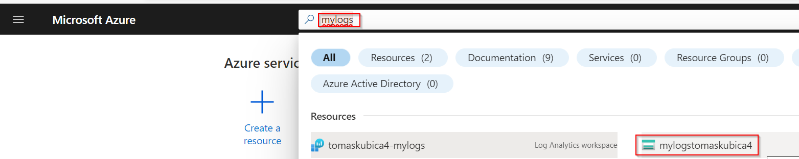
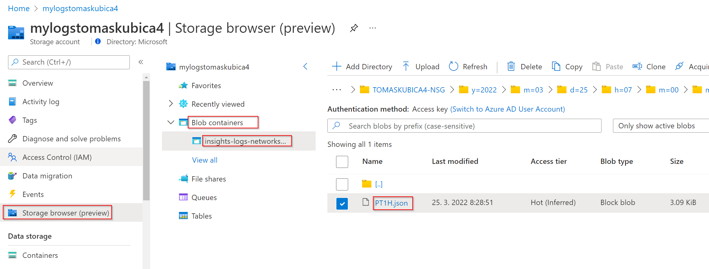
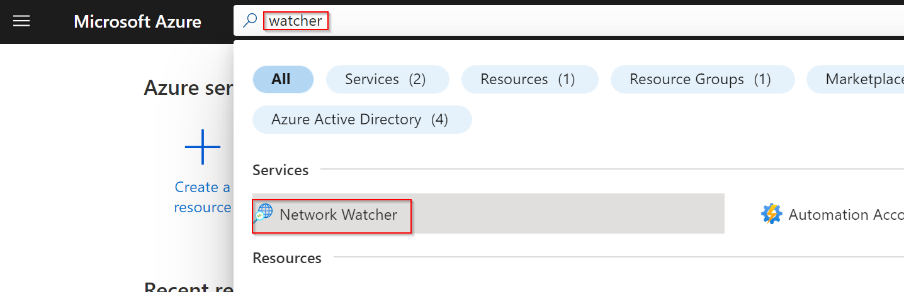
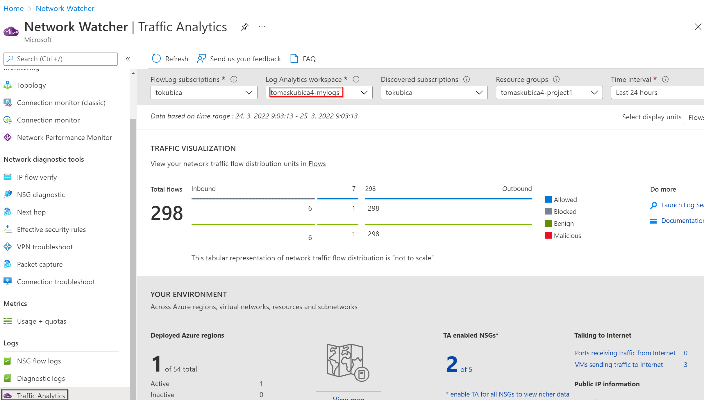
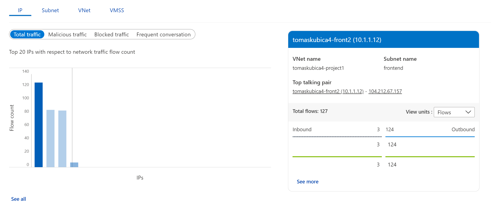
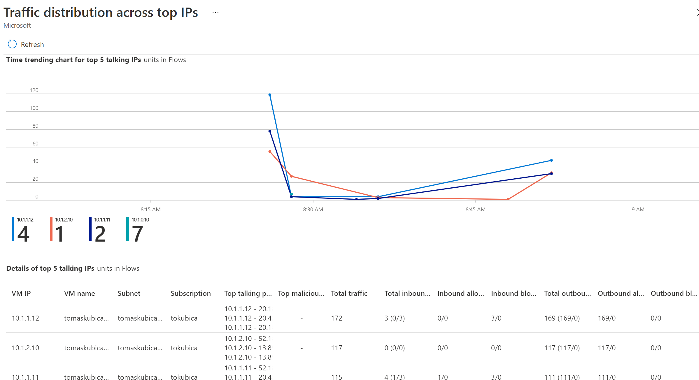

## 03 - Segmentation with network security groups
We will use central firewall between projects and environments, but within project we want to deploy something simple and cheap to enable microsegmentation.

Because we selected traditional subnet structure we can add Network Security Groups to them. To prevent lateral movement let's make sure SSH to machines is only allowed from jump server subnet.

```bash
# Configure prefix (in bash)
export prefix=tomaskubica4

# Configure prefix (in PowerShell)
$prefix="tomaskubica4"

# Create NSG
az network nsg create -n $prefix-nsg -g $prefix-project1
```

```bash
# Add SSH rules (in bash)
az network nsg rule create -n allowSshFromJump \
    -g $prefix-project1 \
    --nsg-name $prefix-nsg \
    --priority 100 \
    --protocol Tcp \
    --source-address-prefixes 10.1.0.0/24 \
    --destination-address-prefixes VirtualNetwork \
    --destination-port-ranges 22 \
    --access Allow

az network nsg rule create -n denySsh \
    -g $prefix-project1 \
    --nsg-name $prefix-nsg \
    --priority 110 \
    --protocol Tcp \
    --destination-address-prefixes VirtualNetwork \
    --destination-port-ranges 22 \
    --access Deny
```

```powershell
# Add SSH rules (in powershell)
az network nsg rule create -n allowSshFromJump `
    -g $prefix-project1 `
    --nsg-name $prefix-nsg `
    --priority 100 `
    --protocol Tcp `
    --source-address-prefixes 10.1.0.0/24 `
    --destination-address-prefixes VirtualNetwork `
    --destination-port-ranges 22 `
    --access Allow

az network nsg rule create -n denySsh `
    -g $prefix-project1 `
    --nsg-name $prefix-nsg `
    --priority 110 `
    --protocol Tcp `
    --destination-address-prefixes VirtualNetwork `
    --destination-port-ranges 22 `
    --access Deny
```

```bash
# Add NSGs to frontend and backend subnets
az network vnet subnet update -n frontend -g $prefix-project1 --vnet-name $prefix-project1 --nsg $prefix-nsg
az network vnet subnet update -n backend  -g $prefix-project1 --vnet-name $prefix-project1 --nsg $prefix-nsg
```

Test things our - you should be able to SSH from jump everywhere, but not from front to back.

```bash
az serial-console connect -n $prefix-jump -g $prefix-project1

# Test connectivity
export prefix=tomaskubica4
ssh $prefix-front1
    export prefix=tomaskubica4
    ssh $prefix-front2   # FAILS!
```

Sometimes we might want to place specific NSGs directly to VM and/or reference other VMs by some group rather than address or range. We will now add NSG to our backend system that will specificaly allow DB port 1433 from individual frontend machines, not whole subnet.

```bash
# Open session to backend and simulate DB by opening port 1433
az serial-console connect -n $prefix-back -g $prefix-project1
while true; do echo "DB here!" | nc -q 1 -vl 1433; done

# In different window open session to front1 and test connectivity
az serial-console connect -n $prefix-front1 -g $prefix-project1
telnet 10.1.2.10 1433   # Then exit with CTRL+] two times (first to get az CLI prompt and second time to get out of telnet) and then type exit

# In different window open session to jump and test connectivity
az serial-console connect -n $prefix-jump -g $prefix-project1
telnet 10.1.2.10 1433   # Then exit with CTRL+] two times (first to get az CLI prompt and second time to get out of telnet) and then type exit

# Create NSG for backend
az network nsg create -n $prefix-nsg-back -g $prefix-project1

# Create ASG (named object)
az network asg create -n $prefix-asg-front -g $prefix-project1

# Place front1 and front2 to ASG
az network nic ip-config update -n ipconfig${prefix}-front1 --nic-name $prefix-front1VMNic -g $prefix-project1 --application-security-groups $prefix-asg-front 
az network nic ip-config update -n ipconfig${prefix}-front2 --nic-name $prefix-front2VMNic -g $prefix-project1 --application-security-groups $prefix-asg-front 
```

```bash
# Add rules to NSG (in bash)
az network nsg rule create -n allowDbFromFront \
    -g $prefix-project1 \
    --nsg-name $prefix-nsg-back \
    --priority 100 \
    --protocol Tcp \
    --source-asgs $prefix-asg-front \
    --destination-address-prefixes VirtualNetwork \
    --destination-port-ranges 1433 \
    --access Allow

az network nsg rule create -n denyDb \
    -g $prefix-project1 \
    --nsg-name $prefix-nsg-back \
    --priority 110 \
    --protocol Tcp \
    --destination-address-prefixes VirtualNetwork \
    --destination-port-ranges 1433 \
    --access Deny
```

```powershell
# Add rules to NSG (in PowerShell)
az network nsg rule create -n allowDbFromFront `
    -g $prefix-project1 `
    --nsg-name $prefix-nsg-back `
    --priority 100 `
    --protocol Tcp `
    --source-asgs $prefix-asg-front `
    --destination-address-prefixes VirtualNetwork `
    --destination-port-ranges 1433 `
    --access Allow

az network nsg rule create -n denyDb `
    -g $prefix-project1 `
    --nsg-name $prefix-nsg-back `
    --priority 110 `
    --protocol Tcp `
    --destination-address-prefixes VirtualNetwork `
    --destination-port-ranges 1433 `
    --access Deny
```

```bash
# Add NSG to backend NIC
az network nic update -n $prefix-backVMNic -g $prefix-project1 --network-security-group $prefix-nsg-back
```

Test it now.

```bash
# From jump
telnet 10.1.2.10 1433   # FAILS

# From front1
telnet 10.1.2.10 1433   # OK
```

Let's add monitoring capabilities. We will start by creating centralized Log Analytics workspace and Storage Account.

```bash
# Create Log Analytics workspace
az monitor log-analytics workspace create -n $prefix-mylogs -g $prefix-central

# Create Storage Account
az storage account create -n mylogs$prefix -g $prefix-central
```

Enable both RAW flow loggin and traffic analytics.

```bash
# Enable flow logging and analytics (in bash)
az network watcher flow-log create -n $prefix-nsg-flows \
    -l northeurope \
    --nsg $prefix-nsg \
    -g $prefix-project1 \
    --enabled true \
    --storage-account $(az storage account show -n mylogs$prefix -g $prefix-central --query id -o tsv) \
    --workspace $(az monitor log-analytics workspace show -n $prefix-mylogs -g $prefix-central --query id -o tsv) \
    --traffic-analytics true \
    --interval 10 \
    --log-version 2 \
    --retention 90
az network watcher flow-log create -n $prefix-nsg-back-flows \
    -l northeurope \
    --nsg $prefix-nsg-back \
    -g $prefix-project1 \
    --enabled true \
    --storage-account $(az storage account show -n mylogs$prefix -g $prefix-central --query id -o tsv) \
    --workspace $(az monitor log-analytics workspace show -n $prefix-mylogs -g $prefix-central --query id -o tsv) \
    --traffic-analytics true \
    --interval 10 \
    --log-version 2 \
    --retention 90        
```

```powershell
# Enable flow logging and analytics (in PowerShell)
az network watcher flow-log create -n $prefix-nsg-flows `
    -l northeurope `
    --nsg $prefix-nsg `
    -g $prefix-project1 `
    --enabled true `
    --storage-account $(az storage account show -n mylogs$prefix -g $prefix-central --query id -o tsv) `
    --workspace $(az monitor log-analytics workspace show -n $prefix-mylogs -g $prefix-central --query id -o tsv) `
    --traffic-analytics true `
    --interval 10 `
    --log-version 2 `
    --retention 90
az network watcher flow-log create -n $prefix-nsg-back-flows `
    -l northeurope `
    --nsg $prefix-nsg-back `
    -g $prefix-project1 `
    --enabled true `
    --storage-account $(az storage account show -n mylogs$prefix -g $prefix-central --query id -o tsv) `
    --workspace $(az monitor log-analytics workspace show -n $prefix-mylogs -g $prefix-central --query id -o tsv) `
    --traffic-analytics true `
    --interval 10 `
    --log-version 2 `
    --retention 90        
```

Generate some traffic and investigate files in storage account.




Network Watcher can analyse this data, provide insights, visualisations and search capabilities. Note it might take 30 minutes for initial analytics to show up so you might want to come back to this later if you want to continue with next lab.






