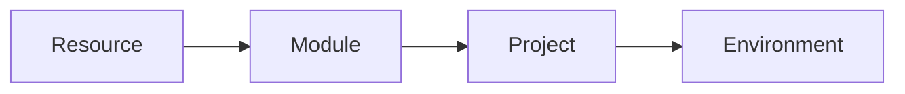
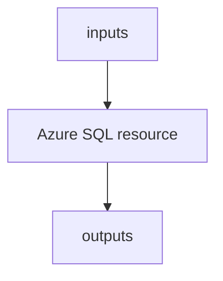
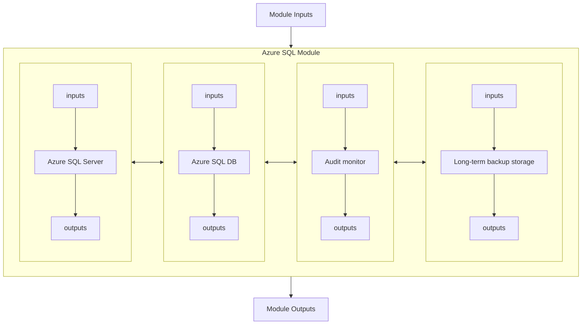
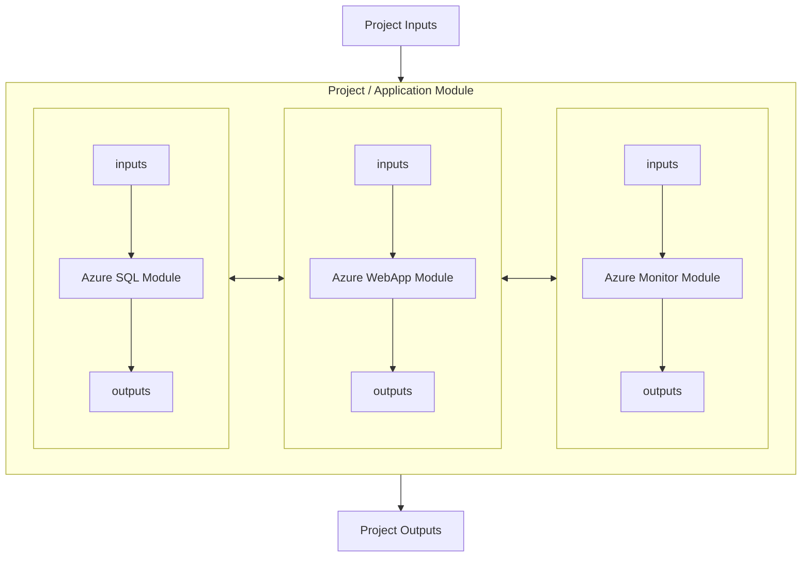
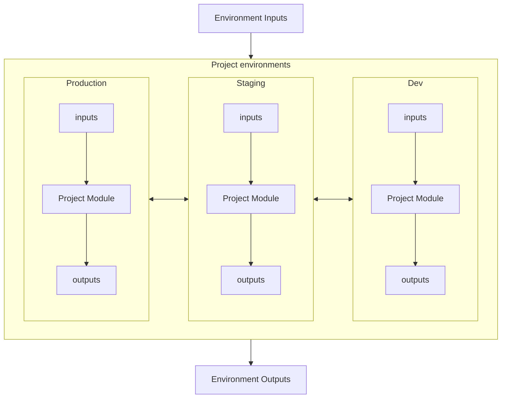
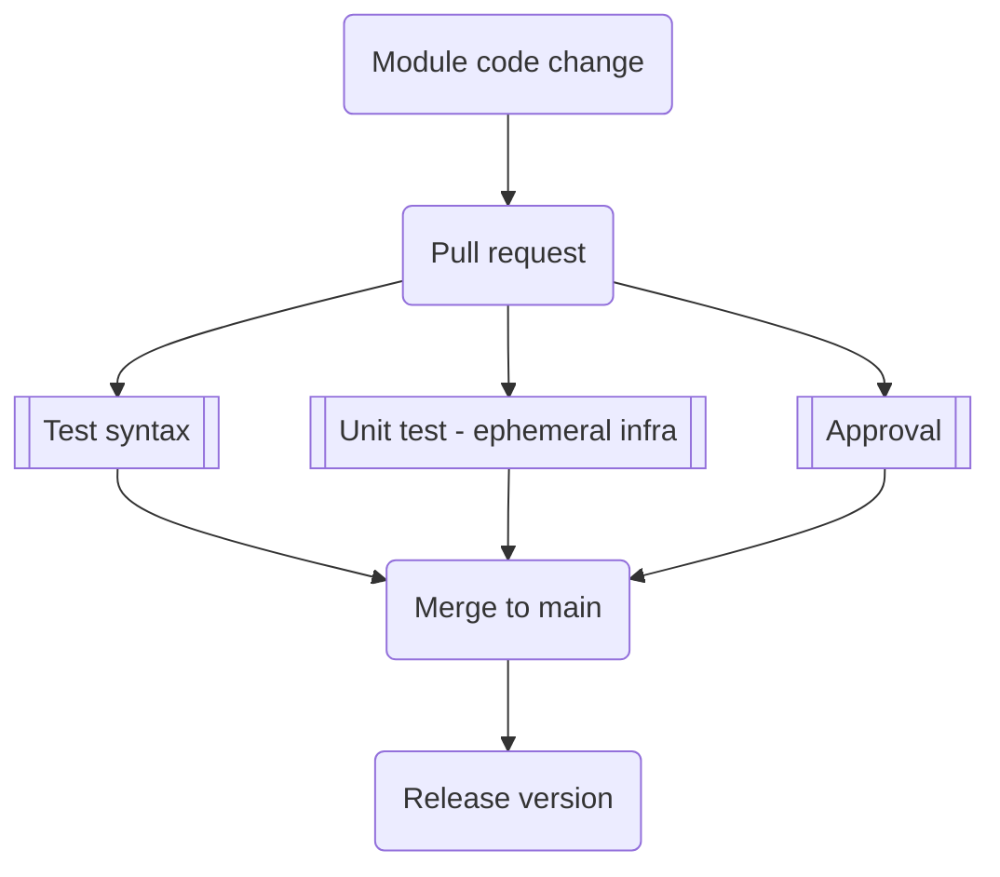
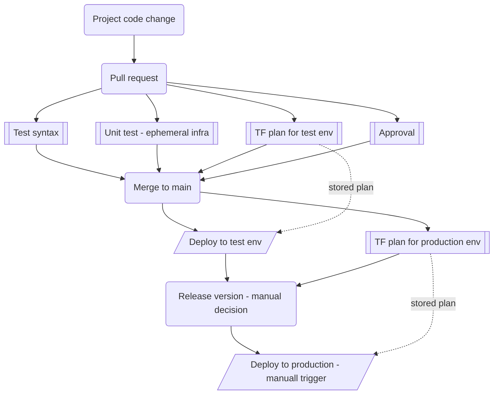

# Infrastructure as Code concepts
- [Infrastructure as Code concepts](#infrastructure-as-code-concepts)
- [Key benefits of Infrastructure as Code](#key-benefits-of-infrastructure-as-code)
- [Layers of abstraction](#layers-of-abstraction)
  - [Individual resource](#individual-resource)
  - [Higher-level abstraction (Module)](#higher-level-abstraction-module)
  - [Unit of deployment](#unit-of-deployment)
  - [Environment](#environment)
- [GitOps processes](#gitops-processes)
  - [Module change flow](#module-change-flow)
  - [Project change flow](#project-change-flow)

# Key benefits of Infrastructure as Code
- Repeatable outcomes regardless who and when executes it (unlike humans copy and pasting)
- Consistent and durable (unlike PDF with screenshots)
- Unit of work that can be handed over with consistent results (unlike "release notes")
- Version controlled (who change what, ability to roll back to good state)
- Change management using Git (approvals, security checks, automated tests)
- Always consistent executable documentation - it can be executed and enforced by robots, rather than read and incosistently executed by humans (or be create after the fact)
- Ability to instantly spin-up new environments (increase agility and saves costs by not running infrastructure then does not need run 24x7)

# Layers of abstraction
Solution should follow **Do Not Repeat Yourself** (DRY) principle. Therefore there should be multiple levels of hierarchical abstractions that captures from company-wide to project-wide best practices and knowledge. In other words avoid copy & paste as much as possible.

- Create reusable modules to deploy standard components with company-prefered configurations and smart defaults for easy start of each team
- Build projects using reusable version-controled modules in a way that is reusable in different environments
- Instanstiate projects in specific environments providing unique set of inputs

## Individual resource

## Higher-level abstraction (Module)
Solution component that is reusable and curated for company needs:
- One or more resources (eg. NIC+DISK+VM)
- Best practices baked in (decisions about certain features already made, eg. always secure)
- Abstracted (eg. single flag to do smart behavior like enableAudit or enableHa)
- Smart defaults (easy to start with)
- Reusable across projects and environments

## Unit of deployment
Resources and modules used together to create specific solution for project/application.
- Using reusable company-wide modules as building blocks
- Project specific topology and decisions
- Project inputs to allow customization between environemtns (project instances)

## Environment
Actual instance of project/application representing specific environment.

# GitOps processes
- No work without reason - always create work item (eg. GitHub Issue) and associate proposed changes with it
- Propose changes using Pull Requests against main branch so your diff is clear
- Run automated tests as part of PRs and merge to validate syntax, ensure deployability (eg. try to deploy in ephemeral manner), gather change plan (diff against real infrastructure), run smoke tests (deploy and validate results), check security policies (ensure security parameters configurations)
- During approval of Pull Request always see planed changes to real infrastructure and store it so only truly approved changes get executed
- Consider trunk-based deployment (prod/staging only) when after merge to main branch, staging evn gets deployed automatically and change plan is stored against production (for potential approval to enroll to production)
- All modules and projects should have semantic versioning - use Git tags (eg. GitHub Release) so users can pin to specific versions and get information about changes.
- There are multiple strategies for repos - you can use single repo for every module and project (easier and clear versioning, streamlined CI/CD), single repo for everything (easier to download and contribute to) or mix (eg. one separate repo for all companuy modules and then repo for each project).
- Reference modules and projects via Git repo a tag, do not copy and paste content.

## Module change flow
Here is flow in GitHub Actions to manage changes is module code.

## Project change flow
Here is flow in GitHub Actions to manage changes is projects.

